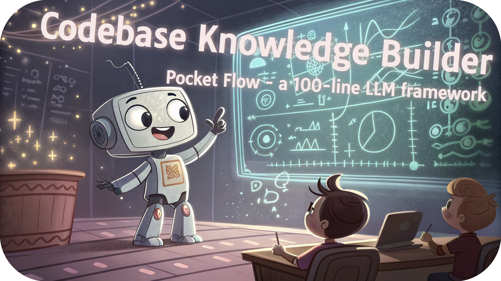
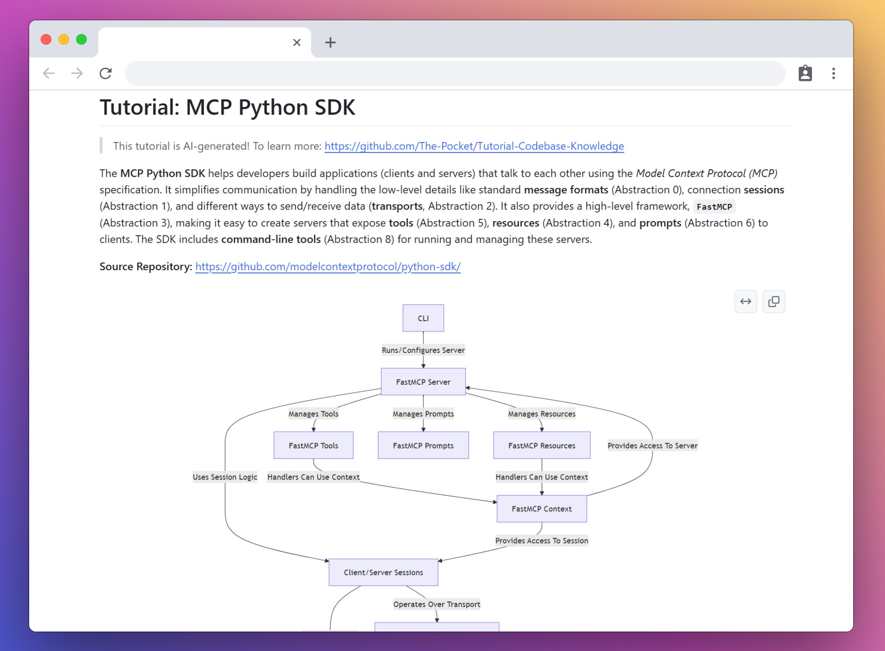
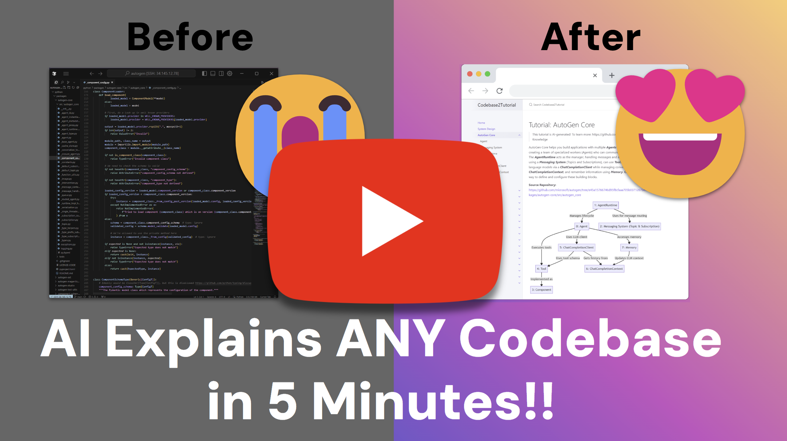

# AI Codebase Knowledge Builder

Generate beginner-friendly tutorials for any codebase using AI!

## Features

- 🔍 **Codebase Analysis**: Automatically identify key abstractions and relationships
- 📊 **Interactive Visualization**: View relationships between components
- 📝 **Tutorial Generation**: Create a multi-chapter tutorial with code examples and diagrams
- 🧠 **Multiple LLM Options**: Use Google Gemini, OpenAI, Claude, or DeepSeek models
- 🌐 **User-Friendly Interface**: Easy-to-use Streamlit web interface for configuration and generation

## 🚀 Getting Started

1. Clone this repository:
   ```bash
   git clone https://github.com/danghung1202/Tutorial-Codebase-Knowledge.git
   cd Tutorial-Codebase-Knowledge
   ```

2. Install dependencies:
   ```bash
   pip install -r requirements.txt
   ```

3. Set up your environment variables in a `.env` file:
   ```
   GEMINI_API_KEY=your_gemini_api_key  # Required for default Gemini model
   OPENAI_API_KEY=your_openai_api_key  # Optional, for OpenAI models
   ANTHROPIC_API_KEY=your_anthropic_api_key  # Optional, for Claude models
   GITHUB_TOKEN=your_github_token  # Optional, for private repositories
   ```

4. Launch the web interface:
   ```bash
   python -m streamlit run Home.py
   ```
   or
   ```bash
   streamlit run Home.py
   ```

   This will open a browser window where you can:
   - Enter a GitHub repository URL or upload a local project
   - Choose your preferred LLM model
   - Configure analysis settings
   - Generate and view your tutorial in real-time

For advanced users who prefer the command line, you can also use:
```bash
# Analyze a GitHub repository
python main.py --repo https://github.com/username/repo --include "*.py" "*.js" --exclude "tests/*"

# Analyze a local directory
python main.py --dir /path/to/your/codebase --include "*.py" --exclude "*test*"

# Generate in different languages
python main.py --repo https://github.com/username/repo --language "Chinese"
```

Common CLI options:
- `--repo` or `--dir` - GitHub repo URL or local directory path
- `-n, --name` - Project name (optional)
- `-t, --token` - GitHub token for private repos
- `-o, --output` - Output directory (default: ./output)
- `-i, --include` - Files to include (e.g., "*.py" "*.js")
- `-e, --exclude` - Files to exclude (e.g., "tests/*")
- `-s, --max-size` - Maximum file size in bytes (default: 100KB)
- `--language` - Tutorial language (default: "english")

## How It Works

1. **Source Analysis**: The tool processes your repository files, filtering by specified patterns
2. **Abstraction Identification**: Using LLMs, the key abstractions in your codebase are identified
3. **Relationship Analysis**: Connections between abstractions are determined
4. **Chapter Ordering**: The abstractions are ordered into a logical tutorial structure
5. **Tutorial Generation**: Detailed chapters are created with explanations, diagrams, and code examples

## Customization

The web interface provides easy access to all customization options:

- **LLM Provider**: Choose between Google Gemini, Anthropic Claude, OpenAI, or DeepSeek
- **Model Parameters**: Select specific models and configure API settings
- **File Filtering**: Include/exclude specific file patterns with an intuitive interface
- **Output Settings**: Customize the output directory and format
- **Language Selection**: Generate tutorials in different languages
- **Real-time Preview**: View the generated content as it's being created

## Output Examples

The generated tutorial includes:

- A markdown index file with project summary and relationship diagram
- Individual chapter markdown files for each abstraction
- Mermaid diagrams visualizing concepts and relationships

## Contributing

Contributions are welcome! Please feel free to submit a Pull Request.

## License

This project is licensed under the MIT License - see the LICENSE file for details.

<h1 align="center">Turns Codebase into Easy Tutorial with AI</h1>


> *Ever stared at a new codebase written by others feeling completely lost? This tutorial shows you how to build an AI agent that analyzes GitHub repositories and creates beginner-friendly tutorials explaining exactly how the code works.*

<p align="center">
  
</p>

This is a tutorial project of [Pocket Flow](https://github.com/The-Pocket/PocketFlow), a 100-line LLM framework. It crawls GitHub repositories and builds a knowledge base from the code. It analyzes entire codebases to identify core abstractions and how they interact, and transforms complex code into beginner-friendly tutorials with clear visualizations.

- Check out the [YouTube Development Tutorial](https://youtu.be/AFY67zOpbSo) for more!

- Check out the [Substack Post Tutorial](https://zacharyhuang.substack.com/p/ai-codebase-knowledge-builder-full) for more!

&nbsp;&nbsp;**🔸 🎉 Reached Hacker News Front Page** (April 2025) with >800 up‑votes:  [Discussion »](https://news.ycombinator.com/item?id=43739456)

## ⭐ Example Results for Popular GitHub Repositories!

<p align="center">
    
</p>

🤯 All these tutorials are generated **entirely by AI** by crawling the GitHub repo!

- [AutoGen Core](https://the-pocket.github.io/Tutorial-Codebase-Knowledge/AutoGen%20Core) - Build AI teams that talk, think, and solve problems together like coworkers!

- [Browser Use](https://the-pocket.github.io/Tutorial-Codebase-Knowledge/Browser%20Use) - Let AI surf the web for you, clicking buttons and filling forms like a digital assistant!

- [Celery](https://the-pocket.github.io/Tutorial-Codebase-Knowledge/Celery) - Supercharge your app with background tasks that run while you sleep!

- [Click](https://the-pocket.github.io/Tutorial-Codebase-Knowledge/Click) - Turn Python functions into slick command-line tools with just a decorator!

- [Codex](https://the-pocket.github.io/Tutorial-Codebase-Knowledge/Codex) - Turn plain English into working code with this AI terminal wizard!

- [Crawl4AI](https://the-pocket.github.io/Tutorial-Codebase-Knowledge/Crawl4AI) - Train your AI to extract exactly what matters from any website!

- [CrewAI](https://the-pocket.github.io/Tutorial-Codebase-Knowledge/CrewAI) - Assemble a dream team of AI specialists to tackle impossible problems!

- [DSPy](https://the-pocket.github.io/Tutorial-Codebase-Knowledge/DSPy) - Build LLM apps like Lego blocks that optimize themselves!

- [FastAPI](https://the-pocket.github.io/Tutorial-Codebase-Knowledge/FastAPI) - Create APIs at lightning speed with automatic docs that clients will love!

- [Flask](https://the-pocket.github.io/Tutorial-Codebase-Knowledge/Flask) - Craft web apps with minimal code that scales from prototype to production!

- [Google A2A](https://the-pocket.github.io/Tutorial-Codebase-Knowledge/Google%20A2A) - The universal language that lets AI agents collaborate across borders!

- [LangGraph](https://the-pocket.github.io/Tutorial-Codebase-Knowledge/LangGraph) - Design AI agents as flowcharts where each step remembers what happened before!

- [LevelDB](https://the-pocket.github.io/Tutorial-Codebase-Knowledge/LevelDB) - Store data at warp speed with Google's engine that powers blockchains!

- [MCP Python SDK](https://the-pocket.github.io/Tutorial-Codebase-Knowledge/MCP%20Python%20SDK) - Build powerful apps that communicate through an elegant protocol without sweating the details!

- [NumPy Core](https://the-pocket.github.io/Tutorial-Codebase-Knowledge/NumPy%20Core) - Master the engine behind data science that makes Python as fast as C!

- [OpenManus](https://the-pocket.github.io/Tutorial-Codebase-Knowledge/OpenManus) - Build AI agents with digital brains that think, learn, and use tools just like humans do!

- [Pydantic Core](https://the-pocket.github.io/Tutorial-Codebase-Knowledge/Pydantic%20Core) - Validate data at rocket speed with just Python type hints!

- [Requests](https://the-pocket.github.io/Tutorial-Codebase-Knowledge/Requests) - Talk to the internet in Python with code so simple it feels like cheating!

- [SmolaAgents](https://the-pocket.github.io/Tutorial-Codebase-Knowledge/SmolaAgents) - Build tiny AI agents that punch way above their weight class!

- Showcase Your AI-Generated Tutorials in [Discussions](https://github.com/The-Pocket/Tutorial-Codebase-Knowledge/discussions)!

## 💡 Development Tutorial

- I built using [**Agentic Coding**](https://zacharyhuang.substack.com/p/agentic-coding-the-most-fun-way-to), the fastest development paradigm, where humans simply [design](docs/design.md) and agents [code](flow.py).

- The secret weapon is [Pocket Flow](https://github.com/The-Pocket/PocketFlow), a 100-line LLM framework that lets Agents (e.g., Cursor AI) build for you

- Check out the Step-by-step YouTube development tutorial:

<br>
<div align="center">
  <a href="https://youtu.be/AFY67zOpbSo" target="_blank">
    
  </a>
</div>
<br>
