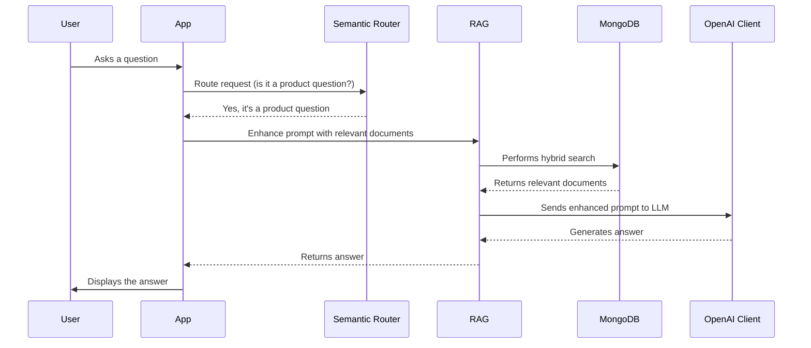

# Chapter 1: RAG (Retrieval-Augmented Generation)

Imagine you're talking to a customer service chatbot about a specific product, like a new phone. You ask, "What's the battery life like on the SuperPhone X?"

A simple chatbot might give a generic answer. But a *smart* chatbot, powered by **RAG (Retrieval-Augmented Generation)**, can provide a much more helpful and accurate response. It finds the exact product specifications and reviews related to battery life and uses that information to answer your question.

That's the power of RAG! It's the core mechanism that allows our `extracted` project to answer questions intelligently by combining information retrieval and text generation.

**What Problem Does RAG Solve?**

RAG solves the problem of chatbots and AI assistants providing generic, inaccurate, or outdated information. It enables them to leverage a wealth of external knowledge to generate informed and context-aware responses.

Think of it like this:

*   **Without RAG:** The chatbot relies only on what it was initially trained on. It's like asking someone who only read one book about a topic to answer a specific question.
*   **With RAG:** The chatbot can search through a vast library of information (your MongoDB database) to find the most relevant documents before answering. It's like having a librarian help the person find the right books to answer the question accurately.

**Key Concepts: Retrieval and Generation**

RAG is composed of two main parts:

1.  **Retrieval:** This is the "librarian" part. It involves searching a knowledge base (in our case, a MongoDB database) to find the most relevant documents or information snippets related to the user's query. In `extracted`, we perform a hybrid search combining vector search (semantic similarity) and keyword search.

2.  **Generation:** This is the "writer" part. It takes the information retrieved in the first step and uses it to generate a coherent and informative answer to the user's query. We leverage a Large Language Model (LLM) like OpenAI's GPT models to perform this generation.

**How Does RAG Work in `extracted`?**

Let's break down how RAG works in our `extracted` project to answer a question about product features:

1.  **User Asks a Question:** You type a question into the chatbot, like "Does the SuperPhone X have a good camera?"
2.  **Query Embedding (via [Embedding Model](06_embedding_model_.md)):** The question is converted into a numerical representation called an embedding. This embedding captures the *meaning* of the question.  This is covered in detail in the [Embedding Model](06_embedding_model_.md) chapter.
3.  **Retrieval from MongoDB (via `rag/core.py`):** The system uses the query embedding to search the MongoDB database for relevant product information. It performs a hybrid search, combining:
    *   **Vector Search:** Finds documents with embeddings similar to the query embedding, identifying documents with similar meanings.
    *   **Keyword Search:** Finds documents that contain the keywords from the query.
4.  **Rank Fusion:** The results from both search methods are combined using a technique called "weighted reciprocal rank" to produce a ranked list of the most relevant documents.
5.  **Prompt Enhancement (via `rag/core.py`):** The retrieved product information (title, content, price, image URLs) is formatted into a prompt that is sent to the Large Language Model (LLM). This provides the LLM with the necessary context to answer the question accurately.
6.  **Answer Generation (via [OpenAI Client](09_openai_client_.md)):** The LLM uses the enhanced prompt to generate a final answer to the user's question.
7.  **Response to User:** The chatbot displays the generated answer to the user.

**Example Input and Output**

*   **Input (User Query):** "What is the price of the SuperPhone X?"
*   **RAG retrieves:** Relevant document(s) from MongoDB about the SuperPhone X, including its price.
*   **Output (Chatbot Response):** "The SuperPhone X is priced at $799."

**Code Example (Simplified): Retrieving Information**

Here's a simplified snippet of how the `RAG` class in `rag/core.py` retrieves information from MongoDB using hybrid search:

```python
# Simplified version of rag/core.py
from .mongo_client import MongoClient

class RAG():
    def __init__(self, mongodb_uri, db_name, db_collection, vector_index_name, keyword_index_name):
        self.client = MongoClient().get_mongo_client(mongodb_uri)
        self.db = self.client[db_name]
        self.collection = self.db[db_collection]
        self.vector_index_name = vector_index_name
        self.keyword_index_name = keyword_index_name

    def hybrid_search(self, query: str, query_embedding: list):
        # Vector search (find similar documents using embeddings)
        vector_results = self.collection.aggregate([
            {"$vectorSearch": {
                "index": self.vector_index_name,
                "queryVector": query_embedding,
                "path": "embedding",
                "numCandidates": 150,
                "limit": 2
            }}
        ])
        vector_results = list(vector_results)

        # Keyword search (find documents containing the query terms)
        keyword_results = self.collection.aggregate([
            {"$search": {
                "index": self.keyword_index_name,
                "text": {"query": query, "path": "title"}
            }},
            {"$limit": 2}
        ])
        keyword_results = list(keyword_results)

        # Combine and rank the results (simplified here)
        combined_results = vector_results + keyword_results
        return combined_results

```

This code demonstrates the basic structure of the `hybrid_search` function within `rag/core.py`. Note that the shown implementation is simplified and skips some steps such as "rank fusion" for brevity. The actual implementation performs vector search and keyword search in MongoDB and then combine the results. It retrieves data using embedding similarity and keywords. The vector and keyword search indexes are pre-defined.

**Internal Implementation: Under the Hood**

Let's take a closer look at what happens internally when you ask a question and RAG is used to generate an answer.



1.  **The User interacts with the App:** The user types their question into the app's interface.
2.  **Semantic Router determines relevance:** The [Semantic Router](02_semantic_router_.md) checks if the question is relevant to the product domain.
3.  **The App calls the RAG component:** The app uses the `RAG` class to find relevant information and formulate a prompt.
4.  **RAG performs a hybrid search:** The `RAG` class interacts with the MongoDB database, using both vector search and keyword search to find relevant documents.
5.  **MongoDB returns relevant documents:** The database returns a list of documents that match the search criteria.
6.  **RAG enhances prompt:** The `RAG` class combines the user's question with the retrieved documents to create an enhanced prompt.
7.  **RAG invokes the LLM:** The enhanced prompt is sent to the [OpenAI Client](09_openai_client_.md), which uses a large language model to generate an answer.
8.  **LLM generates answer:** The LLM processes the prompt and generates a comprehensive and informative answer.
9.  **The App displays the answer:** The app presents the LLM's response to the user.

**Conclusion**

In this chapter, you've learned about RAG (Retrieval-Augmented Generation) and how it enables chatbots and AI assistants to provide more informed and accurate responses by combining information retrieval and text generation. You've also seen how RAG is implemented in the `extracted` project using MongoDB, vector search, keyword search, and Large Language Models.

Next, we'll explore how [Semantic Router](02_semantic_router_.md) helps us determine when to use RAG and when to use a different approach.


---

Generated by [AI Codebase Knowledge Builder](https://github.com/The-Pocket/Tutorial-Codebase-Knowledge)