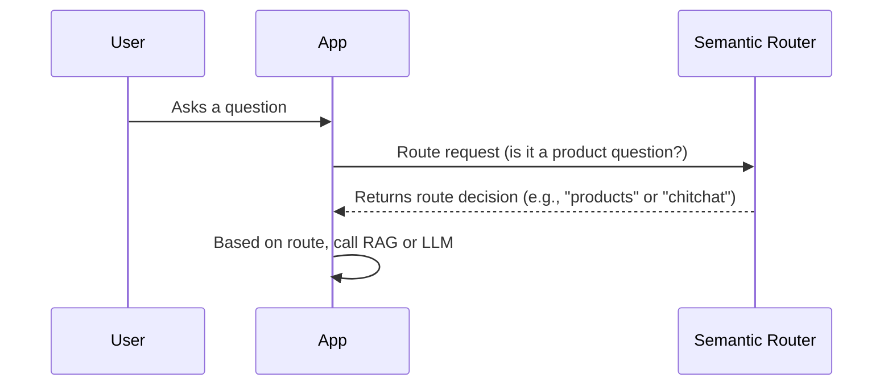

# Chapter 2: Semantic Router

In the previous chapter, [RAG (Retrieval-Augmented Generation)](01_rag__retrieval_augmented_generation__.md), we learned how to answer product-specific questions by retrieving relevant information. But what if a user just wants to chat? That's where the Semantic Router comes in!

Imagine you're building a chatbot for an online store. You want it to handle both product inquiries and casual conversations. If a user asks "What's the price of the SuperPhone X?", you want to use RAG to provide a specific answer. But if they say "Hi, how are you?", you just want a friendly response. The **Semantic Router** acts like a traffic controller, deciding where each question should go.

**What Problem Does the Semantic Router Solve?**

The Semantic Router solves the problem of directing user queries to the appropriate module. It analyzes the intent of the question and routes it either to RAG (for product-related questions) or to a more general language model (for casual conversation). This ensures that product questions are answered with accurate product information and non-product questions are handled appropriately.

Think of it like a receptionist:

*   **Without a Semantic Router:** Every question goes to the same place, regardless of whether it's about products or just a general greeting. This can lead to irrelevant or incorrect answers.
*   **With a Semantic Router:** The receptionist (router) directs product-related questions to the product expert (RAG) and general questions to the general knowledge expert (LLM).

**Key Concepts**

The Semantic Router relies on a few key concepts:

1.  **Routes:** These are categories or types of queries. In our example, we have two routes: "products" (for product-related questions) and "chitchat" (for casual conversation).
2.  **Samples:** For each route, we provide example questions that belong to that category. These samples help the router learn what kind of questions to expect for each route. For example, for the "products" route, we might provide samples like "What is the price of the SuperPhone X?" and "Does the SuperPhone X have a good camera?".
3.  **Intent Recognition:** The Semantic Router uses a pre-trained embedding model (more on this later) to understand the *meaning* or *intent* of the user's query.
4.  **Similarity Scoring:** The router compares the user's query to the samples for each route. It calculates a "similarity score" that indicates how closely the query matches each route.
5.  **Routing Decision:** Based on the similarity scores, the router decides which route is the best match for the user's query. It then directs the query to the corresponding module (RAG or LLM).

**How Does the Semantic Router Work in `extracted`?**

Let's break down how the Semantic Router works in our `extracted` project:

1.  **User Asks a Question:** You type a question into the chatbot, like "Tell me about the SuperPhone X." or "How's the weather today?".
2.  **Intent Recognition (via embedding model):** The question is converted into a numerical representation called an embedding.  This captures the meaning of the question. It's like giving the question a unique fingerprint.
3.  **Similarity Scoring:** The router compares the question's embedding to the embeddings of the sample questions for each route ("products" and "chitchat").
4.  **Routing Decision:** The router selects the route with the highest similarity score. If the question is more similar to the "products" route, it's directed to the RAG module. If it's more similar to the "chitchat" route, it's directed to a general LLM.

**Example Input and Output**

*   **Input (User Query):** "What are the specs of the SuperPhone X?"
*   **Semantic Router Output:** "products" (route name) - This indicates that the query should be handled by the RAG module.

*   **Input (User Query):** "What's up?"
*   **Semantic Router Output:** "chitchat" (route name) - This indicates that the query should be handled by a general LLM.

**Code Example**

Here's a simplified example of how the Semantic Router is used in the `serve.py` file:

```python
from semantic_router import SemanticRouter, Route
from semantic_router.samples import productSample, chitchatSample

# Define the routes
PRODUCT_ROUTE_NAME = 'products'
CHITCHAT_ROUTE_NAME = 'chitchat'

productRoute = Route(name=PRODUCT_ROUTE_NAME, samples=productSample) # samples are example questions
chitchatRoute = Route(name=CHITCHAT_ROUTE_NAME, samples=chitchatSample) # samples are example questions

# Initialize the Semantic Router
semanticRouter = SemanticRouter(routes=[productRoute, chitchatRoute])

# Example query
query = "What's the price of the SuperPhone X?"

# Route the query
scores, guided_route = semanticRouter.guide(query) # route the query!
print(f"Semantic route: {guided_route}") # output should be "products"
```

In this code:

1.  We define two routes: `products` and `chitchat`. Each route has a name and a list of sample questions.
2.  We initialize the `SemanticRouter` with these routes.
3.  We provide a sample question to the `guide` method.
4.  The `guide` method returns the route name with the highest similarity score. In this case, it should return "products" because the question is related to a product.

`semantic_router.samples.py` contains `productSample` and `chitchatSample`. This file provides example questions for each route.

For the `productSample`:
```python
productSample = [
    "What is the price of the SuperPhone X?",
    "Does the SuperPhone X have a good camera?",
    "What are the specifications of the SuperPhone X?",
    "Where can I buy the SuperPhone X?",
    "Can you tell me about the SuperPhone X?"
]
```

For the `chitchatSample`:
```python
chitchatSample = [
    "Hi, how are you?",
    "What's up?",
    "How's the weather today?",
    "Tell me a joke.",
    "What do you do?"
]
```

**Internal Implementation: Under the Hood**

Let's take a closer look at what happens internally when the Semantic Router is used.



1.  **The User interacts with the App:** The user types their question into the app's interface.
2.  **App asks Semantic Router to route:** The app calls the `SemanticRouter.guide()` method to determine the intent of the question.
3.  **Semantic Router decides and informs App:** The router analyzes the question and returns the name of the most appropriate route ("products" or "chitchat").
4.  **App calls relevant Module:** Depending on the returned route, the app either calls the [RAG (Retrieval-Augmented Generation)](01_rag__retrieval_augmented_generation__.md) or a general LLM.

Now let's look at the relevant code in `semantic_router/router.py`:

```python
import numpy as np
from sentence_transformers import SentenceTransformer

class SemanticRouter():
    def __init__(self, routes):
        self.routes = routes
        self.embedding_model = SentenceTransformer("keepitreal/vietnamese-sbert")
        self.routesEmbedding = {}
        self.routesEmbeddingCal = {}

        for route in self.routes:
            self.routesEmbedding[
                route.name
            ] = self.embedding_model.encode(route.samples) # get embeddings for each sample

    def guide(self, query):
        queryEmbedding = self.embedding_model.encode([query]) # get embedding for the query
        scores = []

        # Calculate the cosine similarity of the query embedding with the sample embeddings of the router.

        for route in self.routes:
            routeEmbeddingCal = self.routesEmbeddingCal[route.name]
            score = np.mean(np.dot(routeEmbeddingCal, queryEmbedding.T).flatten())
            scores.append((score, route.name))

        scores.sort(reverse=True)
        return scores[0]
```

In this code:

1.  We are using `sentence_transformers` a pre-trained model from huggingface.
2.  When the `SemanticRouter` is initialized, it calculates the embeddings of all the sample questions for each route using `self.embedding_model.encode(route.samples)`. These embeddings are stored in `self.routesEmbedding`.
3.  When the `guide` method is called, it calculates the embedding of the user's query using `self.embedding_model.encode([query])`.
4.  It then calculates the cosine similarity between the query embedding and the sample embeddings for each route. The cosine similarity measures how similar two vectors are.
5.  Finally, it returns the route with the highest similarity score.

The cosine similarity calculates a score between -1 and 1. 1 indicates high similarity while -1 indicates low similarity.

**Conclusion**

In this chapter, you've learned about the Semantic Router and how it helps direct user queries to the appropriate module based on their intent. You've also seen how it's implemented in the `extracted` project using routes, samples, and embedding models. This prevents having to unnecessarily query the [RAG (Retrieval-Augmented Generation)](01_rag__retrieval_augmented_generation__.md) system.

Next, we'll explore how to obtain product information and load it into our database using [Web Scraper](03_web_scraper_.md).


---

Generated by [AI Codebase Knowledge Builder](https://github.com/The-Pocket/Tutorial-Codebase-Knowledge)