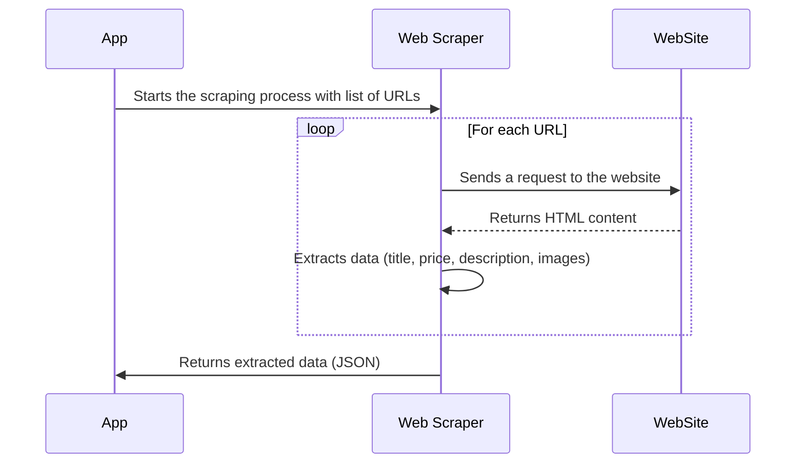

# Chapter 3: Web Scraper

In the previous chapter, [Semantic Router](02_semantic_router_.md), we learned how to direct user queries to the right part of our system. Now, let's talk about how we get the actual product information in the first place! That's where the Web Scraper comes in.

Imagine you're building a chatbot for an online flower shop. You need information about all the different flowers they sell: their names, descriptions, prices, and pictures.  Manually copying and pasting all that information would take forever! The Web Scraper automatically gathers this data for you.

**What Problem Does the Web Scraper Solve?**

The Web Scraper solves the problem of automatically extracting data from websites. Instead of manually copying product information, the scraper does it for you, saving time and effort.  It visits the website, finds the information we need, and saves it in a structured format.

Think of it like this:

*   **Without a Web Scraper:** You'd have to visit each product page on the flower shop website, copy the name, description, price, and image URLs, and then manually create a list of all the flowers.
*   **With a Web Scraper:** The web scraper automatically visits each product page, extracts the information, and creates a neat and organized list for you.

**Key Concepts**

Let's break down the key concepts behind web scraping:

1.  **URLs (Uniform Resource Locators):** These are the web addresses (like `https://hoatuoimymy.com/rose-bouquet`) that the scraper visits to find information.
2.  **HTML (HyperText Markup Language):** This is the language websites are written in. The scraper needs to understand HTML to find the specific information it's looking for. Think of HTML as the structure and content of a webpage.
3.  **CSS Selectors:** These are patterns that help the scraper pinpoint specific elements within the HTML. For example, a CSS selector might target the `<h1>` tag that contains the product name or the `<span>` tag that contains the price.
4.  **Scrapy:** Scrapy is a powerful Python framework for building web scrapers. It handles many of the complex details of web scraping, such as making requests, handling responses, and extracting data.
5.  **Beautiful Soup:** Beautiful Soup is another Python library used for parsing HTML and XML. It creates a parse tree for parsed pages that can be used to extract data from HTML, which is useful for extracting information from elements such as `<p>`, `<h2>`, `<ul>` tags.

**How Does the Web Scraper Work in `extracted`?**

In `extracted`, our web scraper does the following:

1.  **Gets a List of URLs:** First, we need a list of all the product pages on the flower shop's website. In our example, we fetch this list from "sitemap" files provided by the website. Sitemaps are structured lists of URLs.
2.  **Visits Each URL:** The scraper visits each URL in the list, one by one.
3.  **Extracts the Data:** For each page, the scraper uses CSS selectors and BeautifulSoup to find the product name, description, price, and image URLs.
4.  **Saves the Data:** The scraper saves all the extracted data in a structured format (JSON) that can be easily loaded into our database.

**Example Input and Output**

*   **Input (URL):** `https://hoatuoimymy.com/shop/bo-hoa-hong-do-tang-nguoi-yeu/`
*   **Output (JSON):**

```json
{
    "url": "https://hoatuoimymy.com/shop/bo-hoa-hong-do-tang-nguoi-yeu/",
    "content": "Bó hoa hồng đỏ tặng người yêu ... (description)",
    "price": "1.200.000₫",
    "title": "Bó hoa hồng đỏ tặng người yêu",
    "image_urls": [
        "https://hoatuoimymy.com/wp-content/uploads/2023/11/bo-hoa-hong-do-tang-nguoi-yeu-1.jpg",
        "https://hoatuoimymy.com/wp-content/uploads/2023/11/bo-hoa-hong-do-tang-nguoi-yeu-2.jpg"
    ]
}
```

**Code Example**

Here's a simplified example of how the web scraper is implemented using Scrapy:

```python
import scrapy

class FlowerSpider(scrapy.Spider):
    name = "flower_spider"
    start_urls = ['https://hoatuoimymy.com/shop/bo-hoa-hong-do-tang-nguoi-yeu/'] # Example URL

    def parse(self, response):
        title = response.css('h1.product-title::text').get() #CSS selector for the title
        price = response.css('span.woocommerce-Price-amount::text').get() #CSS selector for the price
        image_urls = response.css('div.woocommerce-product-gallery__image img::attr(data-large_image)').getall() #CSS selector for image urls
        description = "".join(response.css('div.woocommerce-Tabs-panel--description p::text').getall()) #CSS selector for descriptions

        yield {
            'title': title,
            'price': price,
            'image_urls': image_urls,
            'description': description
        }
```

This code defines a Scrapy spider called `FlowerSpider`.  Here's what it does:

1.  `name = "flower_spider"`:  Gives our spider a name.
2.  `start_urls`:  Tells the spider where to start scraping. In this example, we only scrape the first product.
3.  `parse(response)`:  This function is called for each URL. It extracts the product title, price, description, and image URLs using CSS selectors and returns them as a dictionary.

Here is an example of how the list of URLs is scraped.

```python
import requests
import xml.etree.ElementTree as ET
import json

sitemap_urls = [
    'https://hoatuoimymy.com/product-sitemap1.xml',
    'https://hoatuoimymy.com/product-sitemap2.xml'
]

all_urls = []

def fetch_sitemap(url):
    try:
        response = requests.get(url) # Fetch the XML sitemap file
        response.raise_for_status()
        root = ET.fromstring(response.content)

        for url_element in root.iter('{http://www.sitemaps.org/schemas/sitemap/0.9}loc'):
            all_urls.append(url_element.text)
    except Exception as e:
        print(f"Error fetching or parsing {url}: {e}")

for sitemap_url in sitemap_urls:
    fetch_sitemap(sitemap_url)

with open('all_urls.json', 'w') as f:
    json.dump(all_urls, f, indent=4)

print(f"Extracted {len(all_urls)} URLs and saved to all_urls.json")
```

This code extracts all the URLs to be scraped.
1. Makes a request to retrieve each XML file from `sitemap_urls`.
2. Parses the XML to find all URLs in the XML file.
3. Saves all the URLs in the `all_urls.json` file.

**Internal Implementation: Under the Hood**

Let's take a closer look at what happens internally when the web scraper is used.



1.  **The App starts the scraping process:** The application starts the web scraper, providing it with a list of product URLs.
2.  **Web Scraper requests each URL:** The `Web Scraper` sends an HTTP request to each URL in the list.
3.  **Website returns HTML content:** The website responds with the HTML content of the page.
4.  **Web Scraper extracts data:** The `Web Scraper` parses the HTML content and extracts the desired information (product name, description, price, image URLs) using CSS selectors.
5.  **Web Scraper returns data to App:** The extracted data is structured (typically as a JSON object) and returned to the application.

Now let's look at relevant code snippets from `web_scraper.py`:

```python
import scrapy
from scrapy.crawler import CrawlerProcess

class CustomSpider(scrapy.Spider):
    name = 'custom_spider'
    start_urls = all_urls[100:] #start_urls should be defined

    def parse(self, response):
        # Extract data here
        title = response.css('h1.product-title::text').get()
        # ... (other data extraction logic)
        yield { # Important: Yield the scraped data
            'title': title,
            # ... (other fields)
        }
```

In this code:

1.  We define a Scrapy spider called `CustomSpider`.
2.  The `start_urls` attribute tells the spider which URLs to start scraping. In this example, the `all_urls` list is used.
3.  The `parse` method is called for each URL. It extracts the product title, price, and image URLs using CSS selectors.
4.  The `yield` keyword is used to return the extracted data as a dictionary.

```python
process = CrawlerProcess({
    'LOG_LEVEL': 'INFO',
    'FEEDS': {
        'output.json': {
            'format': 'json',
            'encoding': 'utf8',
            'store_empty': False,
            'fields': None,
            'indent': 4,
        },
    },
    'CLOSESPIDER_TIMEOUT': 60000000000,
    'DOWNLOAD_DELAY': 3,
})

process.crawl(CustomSpider)
process.start()
```

In this code:

1.  We create a `CrawlerProcess` to manage the scraping process.
2.  We configure the process to output the scraped data to a JSON file (`output.json`).
3.  We start the spider using `process.crawl(CustomSpider)` and `process.start()`.

**Conclusion**

In this chapter, you've learned about the Web Scraper and how it automatically extracts data from websites. You've seen how it's implemented in the `extracted` project using Scrapy and CSS selectors. The extracted data is now available for use by other modules in the system, like [Data Ingestion (load_document.py)](04_data_ingestion__load_document_py__.md) which will be covered next!


---

Generated by [AI Codebase Knowledge Builder](https://github.com/The-Pocket/Tutorial-Codebase-Knowledge)