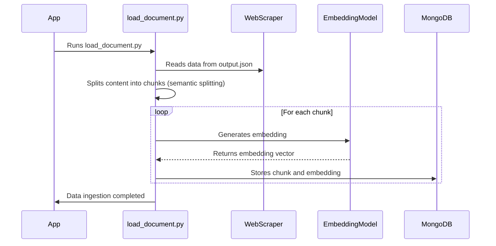

# Chapter 4: Data Ingestion (load_document.py)

In the previous chapter, [Web Scraper](03_web_scraper_.md), we learned how to automatically collect product information from websites. Now, we need to take that raw data and get it ready to be used by our RAG system. That's where Data Ingestion comes in!

Imagine you've just harvested a bunch of vegetables from your garden. You can't just throw them into a pot and expect a delicious meal! You need to wash them, chop them into smaller pieces, and organize them. **Data Ingestion** is like that preparation process. It takes the raw data from the web scraper, cleans it up, breaks it into manageable chunks, and stores it in a way that our system can easily use.

**What Problem Does Data Ingestion Solve?**

Data ingestion solves the problem of turning raw, unstructured data into structured, searchable information that our RAG system can understand. The scraped data is often messy, and we need to prepare it for efficient retrieval.

Think of it like this:

*   **Without Data Ingestion:** The RAG system would have to deal with the raw, messy output of the web scraper. It would be like trying to find a specific ingredient in a cluttered, disorganized kitchen.
*   **With Data Ingestion:** The data is cleaned, organized, and stored in a database (MongoDB) with embeddings. Now the RAG system can quickly find the exact information it needs, like a chef grabbing prepped ingredients from a well-organized pantry.

**Key Concepts**

Let's break down the key concepts involved in data ingestion:

1.  **Chunking:**  Breaking down large documents into smaller, more manageable pieces. Think of it like cutting a cake into slices. Smaller chunks are easier to process and retrieve.

2.  **Embeddings:**  Converting text into numerical representations that capture the meaning of the text. It's like giving each chunk a unique fingerprint based on its content. These fingerprints allow us to find similar chunks quickly using vector search. We covered [Embedding Model](06_embedding_model_.md) in Chapter 6.

3.  **MongoDB:** A NoSQL database where we store our processed data (chunks and embeddings). It's like a well-organized pantry where we store all our prepped ingredients. We will introduce [MongoDB Client](05_mongodb_client_.md) in Chapter 5.

4.  **Semantic Splitting:** Intelligent chunking based on sentence similarity. Instead of simply chopping a text into fixed-size chunks, semantic splitting tries to keep related sentences together.

**How Data Ingestion Works in `extracted`?**

Here's how the `load_document.py` script handles data ingestion in our project:

1.  **Loads Scraped Data:** Reads the JSON file (`output.json`) generated by the web scraper ([Web Scraper](03_web_scraper_.md)).
2.  **Chunks the Data:** Splits the product descriptions into smaller chunks using *semantic splitting*. This ensures that related sentences stay together.
3.  **Creates Embeddings:** Generates embeddings for each chunk using the [Embedding Model](06_embedding_model_.md).
4.  **Stores Data in MongoDB:** Stores the chunks, along with their embeddings, in the MongoDB database.

**Example Input and Output**

*   **Input (from `output.json` - Web Scraper):** A JSON file containing product information, including long descriptions.

```json
{
    "url": "https://example.com/product1",
    "content": "This is a very long product description... It has many sentences and details...",
    "price": "$19.99",
    "title": "Awesome Product 1",
    "image_urls": ["https://example.com/image1.jpg"]
}
```

*   **Output (in MongoDB):**  The product description is split into multiple smaller chunks. Each chunk, along with its embedding, is stored as a separate document in MongoDB.

```json
{
    "url": "https://example.com/product1",
    "content": "This is a shorter chunk from the product description.",
    "price": "$19.99",
    "title": "Awesome Product 1",
    "image_urls": ["https://example.com/image1.jpg"],
    "embedding": [0.1, -0.2, 0.5, ...] // numerical representation
}
```

**Code Example: Semantic Splitting**

Here's a simplified snippet of how semantic splitting is implemented:

```python
from spacy.lang.vi import Vietnamese
from sklearn.metrics.pairwise import cosine_similarity
from sklearn.feature_extraction.text import TfidfVectorizer

# Load the spaCy model for sentence segmentation
nlp = Vietnamese()
nlp.add_pipe('sentencizer')

def semantic_splitting(text, threshold=0.2):
    # Parse the document
    doc = nlp(text)
    sentences = [sent.text for sent in doc.sents]  # Extract sentences

    # Vectorize the sentences for similarity checking
    vectorizer = TfidfVectorizer().fit_transform(sentences)
    vectors = vectorizer.toarray()

    # Calculate pairwise cosine similarity between sentences
    similarities = cosine_similarity(vectors)

    # Initialize chunks with the first sentence
    chunks = [[sentences[0]]]

    # Group sentences into chunks based on similarity threshold
    for i in range(1, len(sentences)):
        sim_score = similarities[i-1, i]

        if sim_score >= threshold:
            # If the similarity is above the threshold, add to the current chunk
            chunks[-1].append(sentences[i])
        else:
            # Start a new chunk
            chunks.append([sentences[i]])

    # Join the sentences in each chunk to form coherent paragraphs
    return [' '.join(chunk) for chunk in chunks]
```

This code snippet uses `spacy` to split the document into sentences. It then uses TF-IDF to vectorize the sentences and calculate cosine similarity scores between each adjacent sentence. If the similarity between adjacent sentences is above a threshold, they're combined to form a chunk. This way, the semantic meaning of each chunk is kept more consistent.

**Code Example: Creating Embeddings**

```python
from sentence_transformers import SentenceTransformer

embedding_model = SentenceTransformer("keepitreal/vietnamese-sbert")

def get_embedding(text: str) -> list[float]:
    embedding = embedding_model.encode(text)
    return embedding.tolist()
```

This code snippet initializes the `SentenceTransformer` model (the [Embedding Model](06_embedding_model_.md)) and defines a function `get_embedding` that takes text as input and returns its embedding vector.

**Code Example: Storing Data in MongoDB**

```python
import os
from dotenv import load_dotenv
from rag.mongo_client import MongoClient
import pandas as pd

load_dotenv()  # Load environment variables from .env file
mongo_uri = os.getenv('MONGO_URI')
db_name = os.getenv('DB_NAME')
db_collection = os.getenv('DB_COLLECTION')

mongo_client = MongoClient().get_mongo_client(mongo_uri)

db = mongo_client[db_name]
collection = db[db_collection]
# clear collection
collection.delete_many({})
documents = dataset_df.to_dict("records")
collection.insert_many(documents)

print("Data ingestion into MongoDB completed")
```

This code snippet connects to the MongoDB database, clears the collection, and inserts the data (chunks and embeddings) into the collection. The `MongoClient` will be covered in [MongoDB Client](05_mongodb_client_.md).

**Internal Implementation: Under the Hood**

Let's take a closer look at what happens internally when `load_document.py` is run.



1.  **The App runs load_document.py:** The application triggers the data ingestion process by running the `load_document.py` script.
2.  **Reads Data from Web Scraper:** `load_document.py` reads the scraped data from `output.json` generated by the [Web Scraper](03_web_scraper_.md).
3.  **Chunks the data:** The script splits the content of each product into smaller chunks using semantic splitting.
4.  **Generates Embeddings:** For each chunk, the script calls the [Embedding Model](06_embedding_model_.md) to generate an embedding vector.
5.  **Stores Data in MongoDB:** The script stores the chunk and its corresponding embedding vector in the MongoDB database.

**Conclusion**

In this chapter, you've learned about Data Ingestion and how it prepares the data scraped from websites for use in our RAG system. You've seen how it's implemented in the `extracted` project using chunking, embedding models, and MongoDB.

Next, we'll explore how to connect to our database using [MongoDB Client](05_mongodb_client_.md).


---

Generated by [AI Codebase Knowledge Builder](https://github.com/The-Pocket/Tutorial-Codebase-Knowledge)