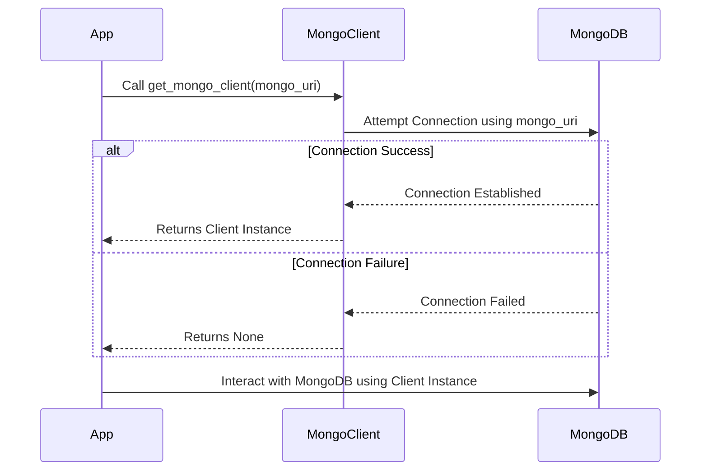

# Chapter 5: MongoDB Client

In the previous chapter, [Data Ingestion (load_document.py)](04_data_ingestion__load_document_py__.md), we learned how to prepare and load our product data into a database. But how do we actually *connect* to that database from our code? That's where the MongoDB Client comes in!

Imagine you're building a house. You have all the materials (our product data), and you've prepared the foundation (data ingestion). Now you need a reliable way to transport those materials to the building site. The MongoDB Client is like a delivery service that connects your application to the database, allowing you to send and retrieve data.

**What Problem Does the MongoDB Client Solve?**

The MongoDB Client solves the problem of establishing and managing the connection between your Python application and the MongoDB database. Without it, your code wouldn't be able to talk to the database, and you couldn't store or retrieve any product information.

Think of it like this:

*   **Without a MongoDB Client:** Your application is isolated from the database. It's like trying to send a letter without a postal service.
*   **With a MongoDB Client:** Your application can connect to the database, send data (like new product information), and retrieve data (like product details for the chatbot).

**Key Concepts**

Let's break down the key concepts behind the MongoDB Client:

1.  **Connection String (mongo_uri):** This is like the address of your database. It tells the client where to find the database and how to connect to it. It typically includes the hostname, port number, username, and password (if authentication is required).

2.  **Client Instance:** This is an object created by the MongoDB Client that represents the connection to the database. You use this object to interact with the database, such as inserting data, querying data, and updating data.

3.  **Database (DB_NAME):** This is a specific database within your MongoDB server where your data is stored. Think of it like a folder containing different files (collections).

4.  **Collection (DB_COLLECTION):** This is a group of related documents within a database. Think of it like a table in a relational database. In our case, we might have a "products" collection to store product information.

**How to Use the MongoDB Client**

Let's see how we use the MongoDB Client in `extracted` to connect to our database:

```python
import os
from dotenv import load_dotenv
from rag.mongo_client import MongoClient

load_dotenv()  # Load environment variables from .env file
mongo_uri = os.getenv('MONGO_URI')
db_name = os.getenv('DB_NAME')
db_collection = os.getenv('DB_COLLECTION')

mongo_client = MongoClient().get_mongo_client(mongo_uri)

db = mongo_client[db_name]
collection = db[db_collection]
```

Here's what this code does:

1.  **Import Libraries:** We import the necessary libraries, including `os` for environment variables, `dotenv` to load environment variables from a `.env` file, and `MongoClient` from our `rag` package.
2.  **Load Environment Variables:** We load the MongoDB connection string (`MONGO_URI`), database name (`DB_NAME`), and collection name (`DB_COLLECTION`) from environment variables. This is a good practice for security, as it prevents you from hardcoding sensitive information in your code.
3.  **Get MongoDB Client:** We create an instance of the `MongoClient` class and call the `get_mongo_client()` method to establish a connection to the MongoDB database using the connection string.
4.  **Access Database and Collection:** We access the specific database and collection that we want to work with. `db = mongo_client[db_name]` gets the database, and `collection = db[db_collection]` gets the collection within that database.

**Example: Inserting Data**

Now that we have a connection, let's see how we can insert some data into our "products" collection:

```python
product = {
    "title": "SuperPhone X",
    "price": 799,
    "description": "The latest and greatest smartphone!",
}

collection.insert_one(product)
print("Product inserted successfully!")
```

This code creates a dictionary representing a product and then uses the `insert_one()` method of the collection object to insert the product into the database. After the insertion, it prints a success message.

**Internal Implementation: Under the Hood**

Let's take a closer look at what happens internally when we use the MongoDB Client.



1.  **The App calls `get_mongo_client()`:** The application calls the `get_mongo_client()` method of the `MongoClient` class, passing in the MongoDB connection string (`mongo_uri`).
2.  **MongoClient attempts to connect:** The `get_mongo_client()` method uses the `pymongo` library to establish a connection to the MongoDB database using the provided connection string.
3.  **Connection Success or Failure:** If the connection is successful, the MongoDB server returns a connection object to the `MongoClient`. If the connection fails (e.g., due to an invalid connection string or network issues), the MongoDB server returns an error.
4.  **MongoClient returns the connection:** The `get_mongo_client()` method returns the connection object (or `None` if the connection failed) to the application.
5.  **The App interacts with MongoDB:** The application uses the connection object to perform various operations on the MongoDB database, such as inserting data, querying data, and updating data.

Now let's look at relevant code snippets from `rag/mongo_client.py`:

```python
import pymongo

class MongoClient:
    def __init__(self):
        pass

    def get_mongo_client(self, mongo_uri):
        """Establish connection to the MongoDB."""
        try:
            client = pymongo.MongoClient(mongo_uri, appname="devrel.content.python")
            print("Connection to MongoDB successful")
            return client
        except pymongo.errors.ConnectionFailure as e:
            print(f"Connection failed: {e}")
            return None
```

In this code:

1.  **Import `pymongo`:** We import the `pymongo` library, which is the official Python driver for MongoDB.
2.  **`get_mongo_client()` method:** This method takes the MongoDB connection string (`mongo_uri`) as input and uses the `pymongo.MongoClient()` constructor to establish a connection to the MongoDB database. We also set the `appname` for tracking purposes.
3.  **Error Handling:** The `try...except` block handles potential connection errors. If a `pymongo.errors.ConnectionFailure` exception occurs, the code prints an error message and returns `None`. Otherwise, it returns the client object.

**Conclusion**

In this chapter, you've learned about the MongoDB Client and how it enables your Python application to connect to and interact with a MongoDB database. You've seen how to establish a connection, insert data, and handle potential connection errors.

Next, we'll explore how to convert text into numerical representations using [Embedding Model](06_embedding_model_.md).


---

Generated by [AI Codebase Knowledge Builder](https://github.com/The-Pocket/Tutorial-Codebase-Knowledge)