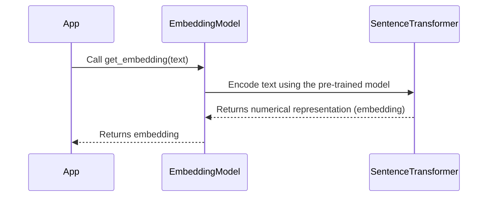

# Chapter 6: Embedding Model

In the previous chapter, [MongoDB Client](05_mongodb_client_.md), we learned how to connect our application to the database where our product information is stored. Now, we need a way for our system to *understand* the meaning of text so it can find relevant information. That's where the Embedding Model comes in!

Imagine you want to search for "red roses" on our online flower shop's website. A simple search might just look for those exact words. But what if a product description says "crimson blossoms"? An Embedding Model helps the system understand that "red roses" and "crimson blossoms" are *semantically* similar, even if they don't share the exact same words. It's like teaching the computer to understand synonyms and related concepts.

**What Problem Does the Embedding Model Solve?**

The Embedding Model solves the problem of enabling computers to understand the *meaning* of text. It transforms text into numerical representations (called "embeddings") that capture the semantic relationships between words and phrases. This allows us to perform tasks like:

*   **Semantic Search:** Finding documents that are *related* to a query, even if they don't contain the exact same keywords.
*   **Similarity Comparison:** Determining how similar two pieces of text are to each other.
*   **Clustering:** Grouping similar documents together based on their meaning.

Think of it like this:

*   **Without an Embedding Model:** The system can only understand text literally. It's like trying to navigate a city using only a street address, without understanding the map or the neighborhood.
*   **With an Embedding Model:** The system understands the *meaning* of text. It's like having a map that shows you related locations and nearby attractions, even if they don't have the exact same address.

**Key Concepts**

Let's break down the key concepts behind Embedding Models:

1.  **Embedding:** A numerical representation of text (a word, sentence, or document). Think of it as a vector (a list of numbers) that captures the meaning of the text. Similar text will have similar vectors. It's like giving each word or phrase a unique coordinate on a map.

2.  **Vector Space:** The multi-dimensional space where these embeddings live. Words with similar meanings are located closer to each other in this space. Imagine a map where countries with similar cultures are located near each other.

3.  **Semantic Similarity:** How closely related the meanings of two pieces of text are. This is measured by calculating the distance between their embeddings in the vector space. The closer the embeddings, the more similar the meanings. It's like measuring the distance between two cities on a map – the closer they are, the more similar they are.

4.  **Sentence Transformers:** Sentence Transformers is a popular Python library for creating embeddings. It provides pre-trained models that can efficiently encode text into meaningful vector representations.

**How Does the Embedding Model Work in `extracted`?**

In `extracted`, the Embedding Model does the following:

1.  **Takes Text as Input:** It receives a piece of text, such as a user query or a product description.
2.  **Generates an Embedding:** It uses a pre-trained Sentence Transformer model to convert the text into a numerical vector (the embedding).
3.  **Returns the Embedding:** It returns the embedding, which can then be used for semantic search, similarity comparison, or other tasks.

**Example Input and Output**

*   **Input (Text):** "Beautiful red roses for your loved one"
*   **Output (Embedding):** `[0.123, -0.456, 0.789, ..., 0.987]` (A list of floating-point numbers)

**Code Example**

Here's a simplified example of how to use the Embedding Model in `extracted`:

```python
from sentence_transformers import SentenceTransformer

# Load the pre-trained model
embedding_model = SentenceTransformer("keepitreal/vietnamese-sbert")

# Example text
text = "Những đóa hoa hồng đỏ thắm cho người yêu của bạn" #Beautiful red roses for your loved one

# Generate the embedding
embedding = embedding_model.encode(text)

# Print the embedding
print(embedding)
```

This code snippet does the following:

1.  **Loads the Model:** It loads a pre-trained Sentence Transformer model called `"keepitreal/vietnamese-sbert"`. This model is specifically trained for Vietnamese text.
2.  **Defines Example Text:** It defines a sample text string.
3.  **Generates Embedding:** It uses the `encode()` method of the embedding model to generate the embedding for the text.
4.  **Prints Embedding:** It prints the resulting embedding vector.

**Code Example: `EmbeddingModel` class in `extracted`**

Here's how the `EmbeddingModel` class is defined in `extracted` (from `embedding_model/core.py`):

```python
from sentence_transformers import SentenceTransformer

class EmbeddingModel():
    def __init__(self):
        self.embedding_model = SentenceTransformer("keepitreal/vietnamese-sbert")
        
    def get_embedding(self, text: str):
        if not text.strip():
            return []

        embedding = self.embedding_model.encode(text)
        return embedding.tolist()
```

This code defines a class `EmbeddingModel` that encapsulates the Sentence Transformer model.

*   **`__init__`:** The constructor initializes the Sentence Transformer model when the `EmbeddingModel` object is created.
*   **`get_embedding`:** This method takes text as input, checks if the text is empty, and then uses the Sentence Transformer model to generate the embedding. It returns the embedding as a list of floats.

**Internal Implementation: Under the Hood**

Let's take a closer look at what happens internally when the Embedding Model is used.



1.  **The App calls `get_embedding()`:** The application calls the `get_embedding()` method of the `EmbeddingModel` class, passing in the text to be embedded.
2.  **EmbeddingModel encodes the text:** The `get_embedding()` method uses the pre-trained Sentence Transformer model to convert the text into a numerical representation (embedding). This involves several steps, including tokenization, word embedding lookup, and pooling. The Sentence Transformer model has already been trained to capture semantic relationships between words, so the resulting embedding reflects the meaning of the text.
3.  **SentenceTransformer returns the embedding:** The Sentence Transformer model returns the embedding to the `get_embedding()` method.
4.  **The App receives the embedding:** The `get_embedding()` method returns the embedding to the application, which can then use it for various tasks, such as semantic search or similarity comparison.

Now let's look at relevant code snippets from `embedding_model/core.py`:

```python
from sentence_transformers import SentenceTransformer

class EmbeddingModel():
    def __init__(self):
        self.embedding_model = SentenceTransformer("keepitreal/vietnamese-sbert")
        
    def get_embedding(self, text: str):
        if not text.strip():
            return []

        embedding = self.embedding_model.encode(text)
        return embedding.tolist()
```

In this code:

1.  **`__init__`:** The constructor initializes the Sentence Transformer model using `SentenceTransformer("keepitreal/vietnamese-sbert")`. This loads the pre-trained model into memory.
2.  **`get_embedding`:** This method takes the text as input and calls `self.embedding_model.encode(text)` to generate the embedding. The `encode` function is provided by the Sentence Transformer library, and it handles the complex process of converting the text into a numerical vector.
3.  **Handling Empty String:** If an empty string is provided as input, it returns an empty list to avoid errors.

**Conclusion**

In this chapter, you've learned about the Embedding Model and how it transforms text into numerical representations that capture the meaning of the text. You've seen how it's implemented in the `extracted` project using Sentence Transformers. This is a very important step in making our system understand the context of text.

Next, we'll explore how to store and retrieve embeddings efficiently using [Semantic Cache](07_semantic_cache_.md).


---

Generated by [AI Codebase Knowledge Builder](https://github.com/The-Pocket/Tutorial-Codebase-Knowledge)