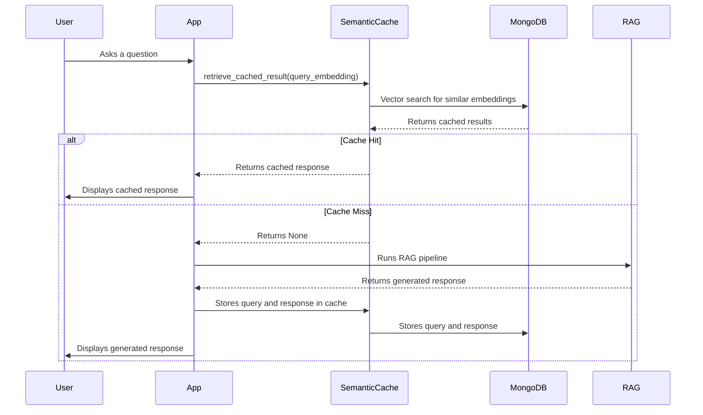

# Chapter 7: Semantic Cache

In the previous chapter, [Embedding Model](06_embedding_model_.md), we learned how to convert text into numerical representations, which allows our system to understand the meaning of words. Now, imagine someone asks the same question about a product multiple times. Do we really need to re-calculate everything every time, re-query the database, and re-generate the response? That's where the Semantic Cache comes in!

Imagine you are a customer service agent. If you answer the same question again and again, you will memorize it. The Semantic Cache is like a short-term memory for our chatbot. It stores previous questions and their answers. If a similar question comes up again, it retrieves the answer from the cache instead of going through the whole process again. This saves time and resources!

**What Problem Does the Semantic Cache Solve?**

The Semantic Cache solves the problem of redundant computations. It avoids re-processing similar queries by storing and re-using previous results. This makes the chatbot faster and more efficient.

Think of it like this:

*   **Without a Semantic Cache:** Every question, even if it's very similar to a previous one, triggers the entire RAG process. It's like looking up the same phone number in a phone book every single time someone asks for it.
*   **With a Semantic Cache:** If a question is similar to one we've already answered, we simply retrieve the answer from the cache. It's like memorizing the phone number and reciting it when someone asks again.

**Key Concepts**

Let's break down the key concepts of the Semantic Cache:

1.  **Cache Key:**  This is how we identify each unique item in the cache. In our case, we use the embedding of the user's query as the key. Since embeddings capture the *meaning* of the query, similar queries will have similar keys.

2.  **Cache Value:** This is the information we store in the cache, associated with the cache key. In our case, this is the chatbot's response to the query.

3.  **Semantic Similarity Search:**  This is how we find similar queries in the cache. We compare the embedding of the current query to the embeddings of the queries stored in the cache. This is similar to what we did with [Embedding Model](06_embedding_model_.md). If we find a query with a high degree of similarity, we consider it a "cache hit."

4.  **Cache Hit Threshold:** This is the minimum similarity score required for a query to be considered a cache hit. For example, if the threshold is 0.85, we only use cached results if the similarity score is 85% or higher. This prevents us from using irrelevant or inaccurate cached results.

**How Does the Semantic Cache Work in `extracted`?**

Here's how the Semantic Cache works in our `extracted` project:

1.  **User Asks a Question:** You type a question into the chatbot, like "What is the price of the SuperPhone X?".
2.  **Generate Embedding:** The question is converted into an embedding vector using the [Embedding Model](06_embedding_model_.md).
3.  **Search the Cache:** The system searches the Semantic Cache for similar embeddings. It performs a vector search in MongoDB using the query embedding.
4.  **Check for Cache Hit:** The system compares the similarity score of the closest match to the cache hit threshold. If the score is high enough, we have a cache hit!
5.  **Return Cached Response (if hit):** If there's a cache hit, the system retrieves the cached response and returns it to the user. This avoids re-running the RAG pipeline.
6.  **Run RAG (if miss):** If there's no cache hit, the system runs the full RAG pipeline to generate an answer, as described in [RAG (Retrieval-Augmented Generation)](01_rag__retrieval_augmented_generation__.md).
7.  **Store in Cache (if miss):** After generating the response, the system stores the question (embedding) and the answer in the Semantic Cache for future use.

**Example Input and Output**

*   **Input (User Query):** "What is the price of the SuperPhone X?"
*   **Semantic Cache Output (Cache Hit):** "The SuperPhone X is priced at $799." (Cached response is returned directly)

*   **Input (User Query):** "What is the price of the SuperPhone Y?"
*   **Semantic Cache Output (Cache Miss):** (The RAG pipeline is triggered, and a new response is generated)

**Code Example: Retrieving from Cache**

Here's a simplified example of how to retrieve results from the cache:

```python
from semantic_cache.core import SemanticCache
from embedding_model.core import EmbeddingModel
import os
from dotenv import load_dotenv

load_dotenv()  # Load environment variables from .env file
mongo_uri = os.getenv('MONGO_URI')
db_name = os.getenv('DB_NAME')
semantic_cache_collection = os.getenv('SEMANTIC_CACHE_COLLECTION')
semantic_cache_index_name = os.getenv('SEMANTIC_CACHE_INDEX_NAME')

# Initialize semantic cache
semantic_cache = SemanticCache(
    mongodb_uri=mongo_uri,
    db_name=db_name,
    db_collection=semantic_cache_collection,
    index_name=semantic_cache_index_name
)

# Initialize embedding model
embedding_model = EmbeddingModel()

query = "What is the price of the SuperPhone X?"
query_embedding = embedding_model.get_embedding(query)

cached_result = semantic_cache.retrieve_cached_result(query_embedding)
if cached_result:
    print("Cache Hit!")
    print(f"Response: {cached_result}")
else:
    print("Cache Miss!")
    print("Running RAG...")
    # In real implementation, we would run the RAG pipeline here
```

In this code:

1.  We initialize the `SemanticCache` with the MongoDB details, similar to how we initialized the database connection in [MongoDB Client](05_mongodb_client_.md). We are using environment variables for this.
2.  We then embed the query.
3.  We attempt to retrieve the cached result using `semantic_cache.retrieve_cached_result(query_embedding)`.
4.  If `retrieve_cached_result` returns a result, we print "Cache Hit!" and the cached response. Otherwise, we print "Cache Miss!" and indicate that we would run the RAG pipeline.

**Internal Implementation: Under the Hood**

Let's take a closer look at what happens internally when the Semantic Cache is used.



1.  **User interacts with the App:** The user types a question into the app.
2.  **The App calls `retrieve_cached_result()`:** The app calls the `retrieve_cached_result()` method of the `SemanticCache` class.
3.  **SemanticCache performs vector search:** The `retrieve_cached_result()` method performs a vector search in MongoDB to find similar embeddings, as described in the previous section.
4.  **MongoDB returns cached results:** The MongoDB database returns a list of cached results, along with their similarity scores.
5.  **Cache Hit or Miss:** The `retrieve_cached_result()` method checks if the highest similarity score is above the cache hit threshold. If it is, it's a cache hit. Otherwise, it's a cache miss.
6.  **Handle Cache Hit:** If it's a cache hit, the `retrieve_cached_result()` method returns the cached response to the application. The app then displays the cached response to the user.
7.  **Handle Cache Miss:** If it's a cache miss, the `retrieve_cached_result()` method returns `None` to the application. The app then runs the RAG pipeline to generate a new response. After generating the response, the app stores the question (embedding) and the answer in the Semantic Cache for future use.

Now let's look at relevant code snippets from `semantic_cache/core.py`:

```python
from rag.mongo_client import MongoClient

# default number of top matches to retrieve from vector search
DEFAULT_SEARCH_LIMIT = 4
CACHE_HIT_THRESHOLD = 0.85

class SemanticCache():
    def __init__(self, 
            mongodb_uri: str,
            db_name: str,
            db_collection: str,
            index_name: str
        ):
        self.client = MongoClient().get_mongo_client(mongodb_uri)
        self.db = self.client[db_name] 
        self.collection = self.db[db_collection]
        self.index_name = index_name
```

This code is similar to the database connection code from [MongoDB Client](05_mongodb_client_.md). It initializes the `SemanticCache` class with the MongoDB connection details.

```python
    def vector_search(self, query_embedding: list):
        # Define the vector search pipeline
        vector_search_stage = {
            "$vectorSearch": {
                "index": self.index_name,
                "queryVector": query_embedding,
                "path": "embedding",
                "numCandidates": 150,  # Number of candidate matches to consider
                "limit": DEFAULT_SEARCH_LIMIT  # Return top matches
            }
        }

        unset_stage = {
            "$unset": "embedding" 
        }

        project_stage = {
            "$project": {
                "_id": 0,  # Exclude the _id field
                "text": 1,  # Include the text field
                "return_val": 1,  # Include the return_val field
                "score": {
                    "$meta": "vectorSearchScore"  # Include the search score
                }
            }
        }
        pipeline = [vector_search_stage, unset_stage, project_stage]

        # Execute the cache search
        results = self.collection.aggregate(pipeline)
        return list(results)

    def retrieve_cached_result(self, query_embedding):
        cache_results = self.vector_search(query_embedding)
        print('cache_results:', list(map(lambda x: { "content": x['text'][0]['content'], "score": x['score'] }, cache_results)))
        if len(cache_results) > 0 and cache_results[0]['score'] > CACHE_HIT_THRESHOLD:
            return cache_results[0]['return_val'][0]['content']
        else:
            return None        
```

1.  `vector_search`:  This method performs a vector search in MongoDB to find similar embeddings.  It uses the `$vectorSearch` aggregation pipeline stage, similar to how we performed vector search in [RAG (Retrieval-Augmented Generation)](01_rag__retrieval_augmented_generation__.md).
2.  `retrieve_cached_result`:  This method calls the `vector_search` method to find similar embeddings.  If the highest similarity score is above the `CACHE_HIT_THRESHOLD`, it returns the cached response.  Otherwise, it returns `None`.

**Conclusion**

In this chapter, you've learned about the Semantic Cache and how it improves the efficiency of our chatbot by storing and re-using previous results. You've seen how it's implemented in the `extracted` project using embedding similarity search and a cache hit threshold.

Next, we'll explore how to fine tune the performance of responses using [Reflection](08_reflection_.md).


---

Generated by [AI Codebase Knowledge Builder](https://github.com/The-Pocket/Tutorial-Codebase-Knowledge)