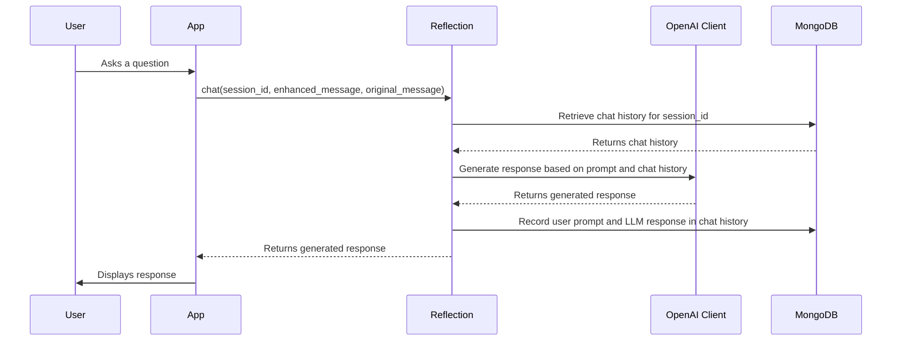

# Chapter 8: Reflection

In the previous chapter, [Semantic Cache](07_semantic_cache_.md), we learned how to speed up our chatbot by remembering previous answers. But what if we want to *improve* the chatbot's responses over time, making them more helpful and engaging? That's where Reflection comes in!

Imagine you're teaching a chatbot to be a helpful flower shop assistant. At first, it might give okay answers, but not great ones. Reflection is like giving the chatbot a chance to *think* about its past conversations and learn how to respond better in the future. It's like a student reviewing their notes and figuring out how to explain things more clearly.

**What Problem Does Reflection Solve?**

Reflection solves the problem of generating human-like, contextually relevant responses, managing chat history, and caching responses for improved efficiency.

Think of it like this:

*   **Without Reflection:** The chatbot answers each question in isolation, without considering the previous conversation or learning from its mistakes. It might sound robotic or give inconsistent advice.
*   **With Reflection:** The chatbot remembers the conversation history, generates responses that feel natural and relevant, and learns from past interactions to provide better answers over time.

**Key Concepts**

Let's break down the key concepts of Reflection:

1.  **Chat History:** Reflection keeps track of the conversation between the user and the chatbot. This allows the chatbot to understand the context of the current question and provide more relevant answers. It's like remembering what you talked about earlier in a conversation.

2.  **LLM (Large Language Model):** Reflection uses an LLM like OpenAI's GPT models to generate human-like responses. The LLM is the "brain" of the chatbot, using its vast knowledge to create coherent and informative answers. We will dive deeper into [OpenAI Client](09_openai_client_.md) in the next chapter.

3.  **Conversational Agent:** Reflection acts as a conversational agent, meaning it's designed to have natural and engaging conversations with users. It takes into account the user's intent, the context of the conversation, and the desired outcome to generate appropriate responses.

4.  **Prompt Engineering:** Reflection uses prompt engineering to guide the LLM in generating the desired responses. The prompt is a carefully crafted input that tells the LLM what to do and how to do it. For example, we might use a prompt to tell the LLM to act like a helpful flower shop assistant.

**How Does Reflection Work in `extracted`?**

Here's how Reflection works in our `extracted` project:

1.  **User Asks a Question:** You type a question into the chatbot, like "What roses do you have for Valentine's Day?".
2.  **Enhance Prompt:** Reflection may enhance the prompt with additional information, such as relevant product details from our database (using [RAG (Retrieval-Augmented Generation)](01_rag__retrieval_augmented_generation__.md)).
3.  **Consult Chat History:** Reflection retrieves the chat history from MongoDB to maintain the conversational context.
4.  **Generate Response (via LLM):** Reflection uses the LLM to generate a response based on the question, the enhanced prompt, and the chat history.
5.  **Record Chat History:** Reflection stores the user's question and the chatbot's response in MongoDB to maintain the chat history.
6.  **Cache Response:** If configured, Reflection will cache the response (using [Semantic Cache](07_semantic_cache_.md)) for future use.
7.  **Return Response:** Reflection returns the generated response to the user.

**Example Input and Output**

*   **Input (User Query):** "What roses do you have for Valentine's Day?"
*   **Reflection Output:** "For Valentine's Day, we have a beautiful selection of red roses, pink roses, and mixed rose bouquets. Our most popular choice is the 'Eternal Love' bouquet, featuring a dozen long-stemmed red roses. Would you like to know more about it?"

**Code Example: Using Reflection**

Here's a simplified example of how to use Reflection in our application:

```python
from reflection.core import Reflection
from openai_client import OpenAIClient
import os
from dotenv import load_dotenv

load_dotenv()  # Load environment variables from .env file
api_key = os.getenv('OPENAI_API_KEY')
mongo_uri = os.getenv('MONGO_URI')
db_name = os.getenv('DB_NAME')
db_chat_history_collection = os.getenv('DB_CHAT_HISTORY_COLLECTION')
semantic_cache_collection = os.getenv('SEMANTIC_CACHE_COLLECTION')

# Initialize OpenAI client
llm = OpenAIClient(api_key)

# Initialize Reflection
reflection = Reflection(
    llm=llm,
    mongodbUri=mongo_uri,
    dbName=db_name,
    dbChatHistoryCollection=db_chat_history_collection,
    semanticCacheCollection=semantic_cache_collection
)

# Example query
query = "What roses do you have for Valentine's Day?"

# Generate response
response = reflection.chat(session_id="user123", enhanced_message=query, original_message=query)

# Print response
print(response)
```

This code snippet does the following:

1.  **Initializes OpenAI client:** Create an instance of OpenAIClient to communicate with the OpenAI API.
2.  **Initializes Reflection:** It initializes the `Reflection` class with the LLM and database connection details.
3.  **Defines Example Query:** It defines a sample user query.
4.  **Generates Response:** It calls the `chat` method of the `Reflection` class to generate a response. We also pass a `session_id` to track the conversation.
5.  **Prints Response:** It prints the generated response.

**Internal Implementation: Under the Hood**

Let's take a closer look at what happens internally when Reflection is used.



1.  **User interacts with the App:** The user types a question into the app's interface.
2.  **The App calls `chat()`:** The app calls the `chat()` method of the `Reflection` class, passing in the user's question, session ID, and any enhanced context.
3.  **Reflection retrieves chat history:** The `chat()` method retrieves the chat history from MongoDB for the given session ID.
4.  **MongoDB returns chat history:** The MongoDB database returns the chat history for the given session ID.
5.  **Reflection invokes the LLM:** The `chat()` method constructs a prompt that includes the user's question, any enhanced context, and the chat history. It then sends this prompt to the LLM to generate a response.
6.  **LLM generates response:** The LLM processes the prompt and generates a response.
7.  **Reflection records chat history:** The `chat()` method records the user's question and the LLM's response in the MongoDB database, updating the chat history for the session.
8.  **The App displays the answer:** The app presents the LLM's response to the user.

Now let's look at some key code snippets from `reflection/core.py`:

```python
from rag.mongo_client import MongoClient

OPEN_AI_ROLE_MAPPING = {
    "human": "user",
    "ai": "assistant"
}

class Reflection():
    def __init__(self,
        llm,
        mongodbUri: str,
        dbName: str,
        dbChatHistoryCollection: str,
        semanticCacheCollection: str,
    ):
        self.client = MongoClient().get_mongo_client(mongodbUri)
        self.db = self.client[dbName] 
        self.collection = self.db[dbChatHistoryCollection]
        self.semantic_cache_collection = self.db[semanticCacheCollection]
        self.llm = llm
```

This code initializes the `Reflection` class. It establishes connections to MongoDB (using the [MongoDB Client](05_mongodb_client_.md)) for storing chat history and semantic cache (if enabled). It also takes an LLM client as input, which will be used to generate responses.

```python
    def chat(self, session_id: str, enhanced_message: str, original_message: str = '', cache_response: bool = False, query_embedding: list = []):
        system_prompt_content = """Bạn là một chatbot của cửa hàng hoa. ..."""
        system_prompt = [
            {
                "role": "system", 
                "content": system_prompt_content
            },
        ]
        human_prompt = [
            {
                "role": "user", 
                "content": enhanced_message
            },
        ]
        chat_session_query = { "SessionId": session_id }
        session_messages = self.collection.find(chat_session_query)
        formatted_session_messages = self.__construct_session_messages__(session_messages)
        messages = system_prompt + formatted_session_messages + human_prompt
        print(f"final messages: {messages}")
        response = self.llm.chat(messages)
        self.__record_human_prompt__(session_id, enhanced_message, original_message)
        self.__record_ai_response__(session_id, response)
        if cache_response:
            self.__cache_ai_response__(enhanced_message, original_message, response, query_embedding)

        return response.choices[0].message.content
```

This code defines the `chat` method, which is the core of the Reflection class. Here's what it does:

1.  **Constructs the Prompt:** This involves combining the system prompt (which defines the chatbot's role), the chat history, and the user's current query into a single message.
2.  **Invokes the LLM:** It calls the LLM (OpenAI Client) to generate a response based on the constructed prompt.
3.  **Records Chat History:** It stores the user's query and the LLM's response in MongoDB to maintain the chat history.
4.  **Caches Response:** If caching is enabled, it stores the query and the response in the [Semantic Cache](07_semantic_cache_.md) (MongoDB) for future use.
5.  **Returns Response:** It returns the generated response to the user.

**Conclusion**

In this chapter, you've learned about Reflection and how it enables our chatbot to generate human-like, contextually relevant responses, manage chat history, and cache responses for improved efficiency. This brings us closer to a realistic chatbot implementation.

Next, we'll explore how to interact with OpenAI's API using [OpenAI Client](09_openai_client_.md).


---

Generated by [AI Codebase Knowledge Builder](https://github.com/The-Pocket/Tutorial-Codebase-Knowledge)