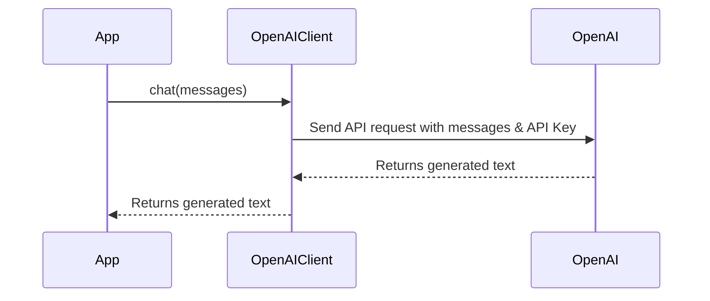

# Chapter 9: OpenAI Client

In the previous chapter, [Reflection](08_reflection_.md), we learned how to create a conversational chatbot that remembers the context of the conversation and generates human-like responses. Now, let's dive deeper into how we communicate with the "brain" of our chatbot - OpenAI's large language models (LLMs). This is where the **OpenAI Client** comes in!

Imagine you want to ask a smart friend for advice. You need a way to send them your question and receive their answer. The OpenAI Client is like that messenger! It's a simple tool that lets our chatbot talk to OpenAI's powerful language models.

**What Problem Does the OpenAI Client Solve?**

The OpenAI Client solves the problem of interacting with the OpenAI API. It simplifies the process of sending prompts (questions or instructions) to OpenAI's models and receiving generated text as a response. Without it, we'd have to write a lot more code to handle the details of the API communication.

Think of it like this:

*   **Without an OpenAI Client:** You'd have to manually construct API requests, handle authentication, manage rate limits, and parse the responses. It's like building a telephone from scratch just to make a phone call.
*   **With an OpenAI Client:** You can simply send a message (prompt) to the OpenAI model and receive a response with minimal code. It's like picking up the phone and dialing a number – much easier!

**Key Concepts**

Let's break down the key concepts behind the OpenAI Client:

1.  **API Key:** This is your secret code that authenticates your requests to the OpenAI API. Think of it as your password to access OpenAI's services. *Keep this key safe and don't share it!*

2.  **Prompt:** This is the input you send to the OpenAI model. It can be a question, a statement, or any text that you want the model to respond to. Think of it as the message you want to send to your smart friend.

3.  **LLM (Large Language Model):** This is the powerful AI model that generates the text response. OpenAI offers various LLMs like GPT-3.5 Turbo and GPT-4. Think of it as your smart friend who knows a lot about everything.

4.  **Message Format:** The OpenAI API expects the prompt to be in a specific format (a list of dictionaries). Each dictionary represents a message with a "role" (either "user" or "assistant") and "content" (the actual text of the message).

**How to Use the OpenAI Client**

Here's how we use the OpenAI Client in `extracted` to send a prompt to OpenAI's LLM and get a response:

```python
import openai
import os
from dotenv import load_dotenv

load_dotenv()  # Load environment variables from .env file
api_key = os.getenv('OPENAI_API_KEY')

class OpenAIClient:
    def __init__(self, api_key):
        self.client = openai.OpenAI(api_key=api_key)

    def chat(self, messages):
        completion = self.client.chat.completions.create(
            model="gpt-3.5-turbo",
            messages=messages
        )
        return completion
```

Here's what this code does:

1.  **Import Libraries:** We import the `openai` library, which is the official Python library for the OpenAI API. We also import the `os` and `dotenv` libraries to manage our API key securely.
2.  **Load API Key:** We load the OpenAI API key from an environment variable.
3.  **Initialize OpenAI Client:** We create an instance of the `OpenAIClient` class, passing in our API key.
4.  **`chat()` method:** This method takes a list of messages as input (the prompt) and sends it to the OpenAI API. It then returns the generated text from the LLM.

**Example Input and Output**

```python
from openai_client import OpenAIClient
import os
from dotenv import load_dotenv

load_dotenv()  # Load environment variables from .env file
api_key = os.getenv('OPENAI_API_KEY')

# Initialize OpenAI client
llm = OpenAIClient(api_key)

# Example messages (prompt)
messages = [
    {"role": "system", "content": "You are a helpful assistant."},
    {"role": "user", "content": "What is the capital of France?"}
]

# Get the response
response = llm.chat(messages)

# Print the response
print(response.choices[0].message.content) # Expected output: "The capital of France is Paris."
```

This code will print the response from the OpenAI model, which should be something like: "The capital of France is Paris."

**Internal Implementation: Under the Hood**

Let's take a closer look at what happens internally when the OpenAI Client is used.



1.  **The App calls `chat()`:** The application calls the `chat()` method of the `OpenAIClient` class, passing in the messages (prompt).
2.  **OpenAIClient sends API request:** The `chat()` method uses the `openai` library to send an API request to OpenAI, including the messages and the API key.
3.  **OpenAI processes the request:** OpenAI receives the API request and uses the specified LLM to generate text based on the prompt.
4.  **OpenAI returns generated text:** OpenAI returns the generated text to the `chat()` method.
5.  **The App receives the generated text:** The `chat()` method returns the generated text to the application, which can then display it to the user or use it for other purposes.

Now let's look at the relevant code snippets from `openai_client.py`:

```python
import openai

class OpenAIClient:
    def __init__(self, api_key):
        self.client = openai.OpenAI(api_key=api_key)

    def chat(self, messages):
        completion = self.client.chat.completions.create(
            model="gpt-3.5-turbo",
            messages=messages
        )
        return completion
```

In this code:

1.  **`__init__`:** The constructor initializes the OpenAI client with the provided API key.
2.  **`chat`:** This method takes the `messages` list, and passes it to the OpenAI API via `self.client.chat.completions.create()`. The model used is "gpt-3.5-turbo" by default, but can be configured. Finally, it returns the API response.

**Conclusion**

In this chapter, you've learned about the OpenAI Client and how it enables our application to communicate with OpenAI's powerful language models. You've seen how to send prompts and receive generated text. This is the final building block in our `extracted` project! You now have a solid foundation for building your own intelligent applications.


---

Generated by [AI Codebase Knowledge Builder](https://github.com/The-Pocket/Tutorial-Codebase-Knowledge)