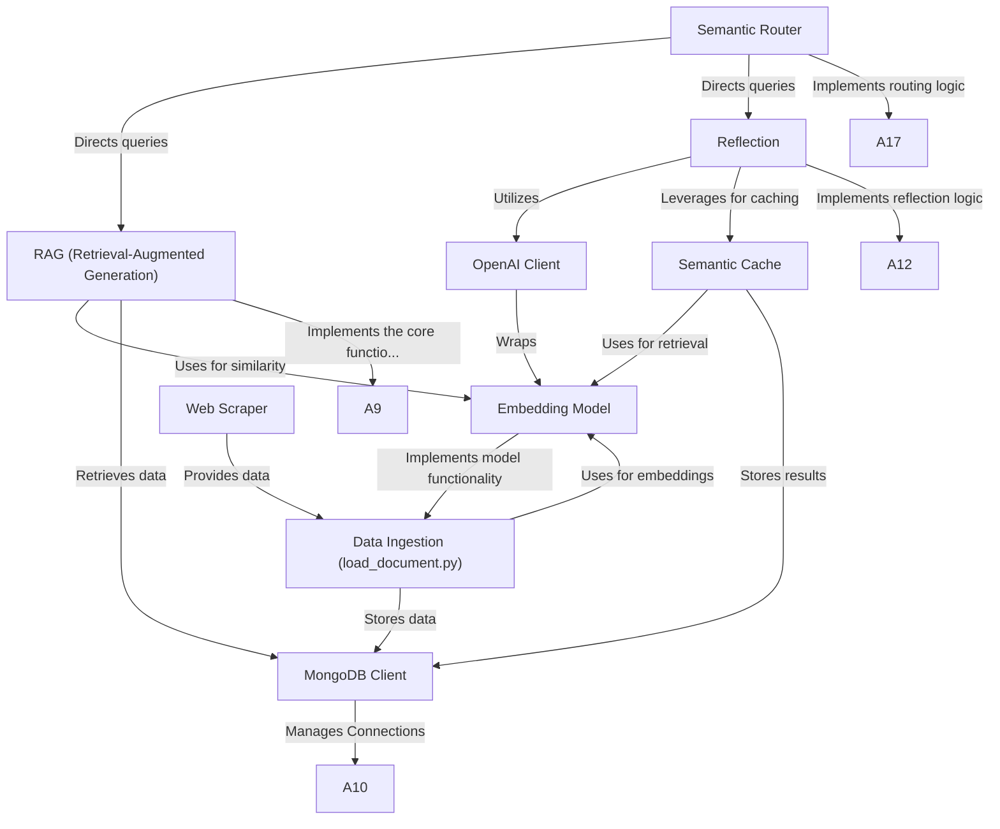

# Tutorial: extracted

This project is a **chatbot** for a flower shop. It uses *Retrieval-Augmented Generation (RAG)* to answer questions about products by finding relevant information from a database and generating a comprehensive answer. It also uses a *Semantic Router* to understand the user's intent and direct the question to the appropriate module.

**Source Repository:** [None](None)

## Chapters

1. [RAG (Retrieval-Augmented Generation)
](01_rag__retrieval_augmented_generation__.md)
2. [Semantic Router
](02_semantic_router_.md)
3. [Web Scraper
](03_web_scraper_.md)
4. [Data Ingestion (load_document.py)
](04_data_ingestion__load_document_py__.md)
5. [MongoDB Client
](05_mongodb_client_.md)
6. [Embedding Model
](06_embedding_model_.md)
7. [Semantic Cache
](07_semantic_cache_.md)
8. [Reflection
](08_reflection_.md)
9. [OpenAI Client
](09_openai_client_.md)

---

Generated by [AI Codebase Knowledge Builder](https://github.com/The-Pocket/Tutorial-Codebase-Knowledge)