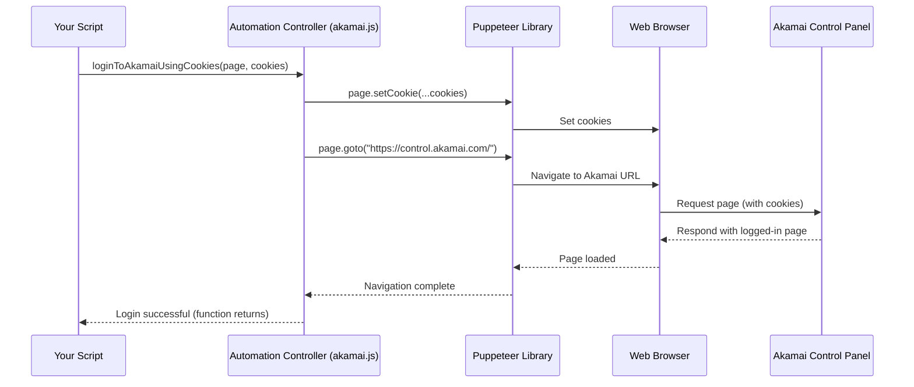

# Chapter 1: Welcome to Akamai Automation - Your Mission Control!

Welcome to the `akamai-automation` project! If you've ever found yourself doing the same tasks over and over again in the Akamai Control Panel (like updating settings for many websites), you're in the right place. This project helps you automate those tasks, saving you time and reducing errors.

In this first chapter, we'll meet the heart of our automation system: the **Automation Controller**.

## What's the Big Idea? Why a Controller?

Imagine you're running a space mission. You wouldn't just launch astronauts randomly, right? You'd have a **Mission Control** center. This center coordinates everything:
*   It prepares the launch vehicle (the spaceship).
*   It tells the astronauts where to go and what procedures to follow.
*   It manages communication and handles unexpected situations.

Our **Automation Controller** (found mainly in the `akamai.js` file) acts exactly like that Mission Control for your Akamai tasks.

*   **The Problem:** Interacting with the Akamai Control Panel involves many steps: logging in, navigating menus, clicking buttons, filling forms, etc. Doing this manually for many properties or rules is slow and tedious.
*   **The Solution:** The Automation Controller handles the basic, repetitive parts of interacting with Akamai, primarily:
    *   **Logging In:** Getting you securely into the Akamai Control Panel.
    *   **Managing the Browser:** Launching and controlling a web browser behind the scenes (using a tool called Puppeteer) – think of these as your automated "spaceships".
    *   **Coordinating Tasks:** Acting as the central point that starts and manages your automation scripts.
    *   **Delegating to Specialists:** It doesn't do *everything* itself. For specific tasks like changing a website's rules or updating variables, it calls on other specialized modules (our "astronauts"), which we'll cover in later chapters.

Think of it this way: You tell Mission Control (the Automation Controller) *what* you want to achieve (e.g., "Update caching rule for these 10 websites"). Mission Control then launches the browser spaceships, logs them in, and directs the right specialist astronauts (like the [Property Manager](02_property_manager.md) or [Rule Engine Manager](04_rule_engine_manager.md)) to perform the specific steps needed on Akamai.

## Your First Mission: Logging In

Let's start with the most fundamental task: logging into the Akamai Control Panel automatically. Manually logging in every time you run a script would defeat the purpose of automation!

The Automation Controller provides a function called `loginToAkamaiUsingCookies` to handle this.

**Why Cookies?** Websites use "cookies" to remember who you are after you log in. By giving our script the cookies your browser saves *after* you log in manually once, the script can use those cookies to authenticate itself without needing your username and password directly.

**How to get Cookies:** You'll need to log into `https://control.akamai.com/` manually in your regular web browser (like Chrome or Firefox) first. Then, use a browser extension (like "Get cookies.txt" for Chrome or "cookies.txt" for Firefox) to export the cookies for the `control.akamai.com` domain into a file (usually in a format called JSON).

**Using the Login Function:**

Here's a simplified example of how you might use the controller to log in:

```javascript
// Import Puppeteer (the browser control library)
const puppeteer = require('puppeteer');
// Import our Automation Controller
const akamai = require('./akamai');
// Load your saved cookies from a file (you'll need to create this file)
const myCookies = require('./my-akamai-cookies.json');

// Main function to run our task
async function runLogin() {
  // Launch a browser instance ('spaceship')
  const browser = await puppeteer.launch({ headless: false }); // headless:false lets you see the browser
  // Open a new blank page
  const page = await browser.newPage();

  console.log('Attempting to log in...');
  // Tell the controller to log in using the page and your cookies
  await akamai.loginToAkamaiUsingCookies(page, myCookies);

  console.log('Successfully logged into Akamai!');

  // You could add more automation steps here later...

  // Close the browser when done
  await browser.close();
}

// Start the login process
runLogin();
```

**Explanation:**

1.  We `require` the necessary libraries: `puppeteer` to control the browser and our `akamai` controller.
2.  We load the cookies you previously saved into the `myCookies` variable.
3.  We launch a new browser instance using `puppeteer.launch()`. Setting `headless: false` is useful initially so you can watch the browser automate!
4.  We open a `newPage()` in the browser.
5.  The key line: `await akamai.loginToAkamaiUsingCookies(page, myCookies);` This tells the Automation Controller to take the `page`, use your `myCookies`, and navigate to Akamai, effectively logging you in.
6.  If successful, it prints a success message.
7.  Finally, `browser.close()` closes the automated browser.

**Input:**
*   `page`: An empty browser page controlled by Puppeteer.
*   `myCookies`: Your Akamai session cookies loaded from a file.

**Output:**
*   The `page` object now represents a browser window logged into `https://control.akamai.com/`. You'll see "Successfully logged into Akamai!" printed in your terminal.

## Under the Hood: How Login Works

What actually happens when you call `akamai.loginToAkamaiUsingCookies`? It's pretty straightforward:

1.  **You:** Call the function `akamai.loginToAkamaiUsingCookies` with the `page` and `cookies`.
2.  **Automation Controller (`akamai.js`):** Receives the call.
3.  **Controller instructs Puppeteer:** Tells the Puppeteer library to:
    *   Set the provided `cookies` onto the given `page`.
    *   Navigate the `page` to the Akamai Control Panel URL (`https://control.akamai.com/`).
4.  **Puppeteer:** Controls the underlying browser (like Chrome) to perform these actions.
5.  **Akamai Website:** Receives the request with the cookies, recognizes the valid session, and loads the logged-in version of the Control Panel.
6.  **Controller waits:** Waits for the page navigation to complete.
7.  **Control returns:** The function finishes, and your script can continue, now operating on a logged-in page.

Here's a simplified diagram showing the interaction:



Let's peek at the relevant code inside `akamai.js`:

```javascript
// File: akamai.js (simplified snippet)

loginToAkamaiUsingCookies: async (page, cookies, url = "https://control.akamai.com/") => {
    // Set the cookies on the page using Puppeteer's function
    await page.setCookie(...cookies);

    // Set a reasonable window size
    await page.setViewport({
        width: 1400,
        height: 900
    })
    // Tell Puppeteer to navigate the page to the Akamai URL
    await page.goto(url, {
        waitUntil: 'domcontentloaded' // Wait until page structure is ready
    })
    // Log message (helper function not shown)
    log.info(`Navigated to ${url} and set cookies.`);
},
```

This code directly uses Puppeteer's `page.setCookie()` and `page.goto()` methods to perform the steps we described.

## More Than Just Login: Coordination and Delegation

Logging in is just the first step. The Automation Controller also includes functions to help manage workflows:

*   **Handling Pop-ups:** The `acceptTheUnsavedChangesDialogWhenNavigate` function (used internally by some other controller functions) automatically handles common confirmation dialogs in Akamai (like "Any unsaved changes will be discarded?"), preventing your script from getting stuck.
*   **Running Tasks in Parallel:** The `paralleExecute` function is a powerful tool (covered in detail in [Parallel Task Executor](08_parallel_task_executor.md)) that allows you to run the same task (like checking a setting) on multiple Akamai properties *at the same time*, significantly speeding up your work. It manages launching multiple browser pages ("spaceships") concurrently.
*   **Calling Specialists:** The controller imports other modules (`require('./property')`, `require('./rule')`, etc.). When you need to interact with specific Akamai features, you'll often use the Controller to get you to the right starting point (like a specific property's configuration page), and then use functions from those specialized modules (like [Property Manager](02_property_manager.md)) to perform the detailed actions.

```javascript
// File: akamai.js (top part)
const puppeteer = require('puppeteer');

// Importing the 'specialist astronauts'
const Variable = require('./variable');
const Rule = require('./rule');
// ... other specialists
const Property = require('./property');
const Cloudlets = require('./cloudlets');
// ... other helper modules

// The controller itself
var self = module.exports = {
    Property, // Making specialists available through the controller
    Variable,
    Rule,
    // ... other specialists exposed
    Cloudlets,

    // Controller's own functions
    loginToAkamaiUsingCookies: async (page, cookies, url) => { /* ... */ },
    acceptTheUnsavedChangesDialogWhenNavigate: async (page) => { /* ... */ },
    paralleExecute: async (browser, cookies, ...) => { /* ... */ },
    goToLatestDraftVersionBasedOnVersionType: async (page, domain, versionType) => { /* ... */ },
    // ... other controller functions
}
```
This shows how the `akamai.js` file brings together its own functions and makes the specialist modules easily accessible.

## Conclusion

You've met the Automation Controller (`akamai.js`), the central "Mission Control" for your Akamai automation tasks. You learned:

*   It handles logging in using cookies (`loginToAkamaiUsingCookies`).
*   It manages browser instances using Puppeteer.
*   It coordinates automation workflows and can run tasks in parallel (`paralleExecute`).
*   It delegates specific Akamai actions to specialized modules.

You now have the foundational knowledge to start automating! With the controller handling the login and browser setup, we can move on to interacting with specific parts of Akamai.

In the next chapter, we'll dive into one of the most common tasks: managing Akamai property configurations using the [Property Manager](02_property_manager.md).

---

Generated by [AI Codebase Knowledge Builder](https://github.com/The-Pocket/Tutorial-Codebase-Knowledge)