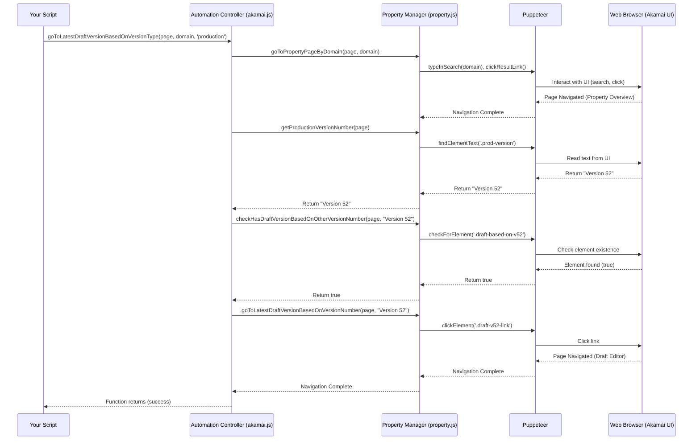

# Chapter 2: Property Manager - Your Configuration Librarian

Welcome back! In [Chapter 1: Welcome to Akamai Automation - Your Mission Control!](01_automation_controller.md), we met the **Automation Controller**, our central command center that handles logging into Akamai and coordinating tasks. Now that we know how to get our "spaceship" (the automated browser) logged in and ready, let's learn how to find and manage the specific destinations we want to work with: Akamai Properties.

## The Problem: Finding and Managing Your Website Configurations

Imagine you manage dozens or even hundreds of websites or applications running on Akamai. Each one has its own unique configuration file within Akamai, defining how it behaves (caching rules, security settings, etc.). Akamai calls these configuration files **Properties**.

Now, think about making a small change, like updating a caching rule, across many of these properties. Manually:
1.  You'd log into the Akamai Control Panel.
2.  You'd search for the first property (e.g., `www.example-one.com`).
3.  You'd navigate to its settings page.
4.  You'd likely need to create a *new version* of the configuration to make edits (you usually can't edit the live version directly).
5.  You'd make your change.
6.  You'd save the new version.
7.  You'd repeat steps 2-6 for `www.example-two.com`, `www.example-three.com`, and so on... Tedious!

This is where the **Property Manager** module comes in.

## Meet the Property Manager: Your Configuration Librarian

Think of your Akamai account as a vast library, and each Property configuration as a book containing the specific instructions for one of your websites or applications. The **Property Manager** (found mostly in the `property.js` file) is like your expert Librarian.

What does a Librarian do?
*   **Finds Books:** Helps you locate the specific book (Property) you need using its title or identifier (like the domain name).
*   **Manages Editions:** Knows about different editions of a book (Property Versions), like the currently published "Production" edition, the testing "Staging" edition, or draft "New" editions where you make your changes.
*   **Checks Out Books for Editing:** Helps you create a new draft edition (new Property Version) based on an existing one so you can safely make edits.
*   **Saves Your Notes:** Helps you save the changes (annotations) you've made to your draft edition.

The Property Manager module in `akamai-automation` does exactly this for your Akamai Properties, automating the process of finding, navigating, and managing different versions of your configurations.

## Your Task: Finding a Property and Preparing to Edit

Let's set a simple goal: We want to automate finding the Akamai Property for `www.example.com` and opening the latest *draft* version that's based on the current *Production* version. This is a common first step before making any configuration changes.

**Steps Involved:**

1.  **Log In:** Use the [Automation Controller](01_automation_controller.md) to log into Akamai (we covered this in Chapter 1).
2.  **Find the Property:** Tell the Property Manager to search for the property associated with `www.example.com`.
3.  **Check Versions:** Find out which version is currently live on Production.
4.  **Find or Create Draft:** See if a draft version based on the Production version already exists.
    *   If yes, navigate to that draft version.
    *   If no, create a *new* draft version based on the Production version.

The `akamai-automation` project makes this surprisingly easy! The [Automation Controller](01_automation_controller.md) provides a handy function `goToLatestDraftVersionBasedOnVersionType` that uses the Property Manager behind the scenes to do exactly these steps for us.

**Example Code:**

```javascript
// Import Puppeteer and our controller
const puppeteer = require('puppeteer');
const akamai = require('./akamai'); // Our Automation Controller
// Load your saved cookies
const myCookies = require('./my-akamai-cookies.json');

// The domain we want to work with
const targetDomain = 'www.example.com'; // Replace with a real domain in your account

async function preparePropertyForEditing() {
  const browser = await puppeteer.launch({ headless: false });
  const page = await browser.newPage();

  console.log('Logging in...');
  await akamai.loginToAkamaiUsingCookies(page, myCookies);
  console.log('Logged in successfully!');

  console.log(`Finding property for ${targetDomain} and navigating to latest draft...`);
  // Use the controller's helper function which utilizes the Property Manager
  // It finds the property, checks production version, and goes to/creates a draft
  await akamai.goToLatestDraftVersionBasedOnVersionType(page, targetDomain, 'production');

  console.log(`Ready to edit the latest draft version for ${targetDomain}!`);

  // Later, you would add steps here to make changes using other modules like
  // the Rule Engine Manager or Behavior Configuration Tool

  // Example: Briefly update the version notes (using the Property Manager)
  await akamai.Property.updatePropertyNote(page, "Automated update preparation.");
  console.log('Updated version notes.');

  // Example: Save the changes (using the Property Manager)
  // const savedVersion = await akamai.Property.saveThePropertyChange(page);
  // if (savedVersion) {
  //   console.log(`Changes saved to new version ${savedVersion}`);
  // } else {
  //   console.log('No changes were saved.'); // Maybe nothing changed, or save failed
  // }

  // Keep the browser open for a bit to see the result
  await new Promise(resolve => setTimeout(resolve, 10000)); // Wait 10 seconds

  await browser.close();
}

preparePropertyForEditing();
```

**Explanation:**

1.  We set up Puppeteer and log in using the `akamai.loginToAkamaiUsingCookies` function from the [Automation Controller](01_automation_controller.md), just like in Chapter 1.
2.  The core step: `await akamai.goToLatestDraftVersionBasedOnVersionType(page, targetDomain, 'production');`
    *   We tell the controller (`akamai`) we want to work with the `targetDomain`.
    *   We specify `'production'` as the base version type we care about.
    *   This function internally uses the Property Manager to:
        *   Find the property for `targetDomain`.
        *   Get the current Production version number.
        *   Check if a draft based on that Production version exists.
        *   Navigate to the existing draft OR click the button to create a new draft if needed.
3.  After this line, the automated browser `page` is now displaying the correct draft version's configuration editor in Akamai.
4.  (Optional) We then show how you *could* use `akamai.Property.updatePropertyNote` to change the description for this version and `akamai.Property.saveThePropertyChange` to save it.

**Input:**
*   `page`: A Puppeteer page object, already logged into Akamai.
*   `targetDomain`: The domain name (e.g., 'www.example.com') of the property you want.
*   `'production'`: The base version type (you could also use `'staging'`).

**Output:**
*   The automated browser navigates to the Akamai Control Panel page for the latest draft version of the specified property, ready for edits. You'll see messages printed to your console confirming the steps.

## Under the Hood: How the Librarian Finds Your Book

How does the Property Manager actually *do* these things? It tells Puppeteer how to interact with the Akamai web interface, just like a human would, but much faster!

Let's trace the `goToLatestDraftVersionBasedOnVersionType` function (simplified):

1.  **Your Script:** Calls `akamai.goToLatestDraftVersionBasedOnVersionType(page, 'www.example.com', 'production')`.
2.  **Automation Controller (`akamai.js`):** Receives the call. It knows it needs the Property Manager's help.
3.  **Controller calls Property Manager:**
    *   `Property.goToPropertyPageByDomain(page, 'www.example.com')`: Tells the Property Manager to find the property.
        *   **Property Manager (`property.js`):** Instructs Puppeteer to type 'www.example.com' into the main search bar on the Akamai page.
        *   **Property Manager:** Tells Puppeteer to find the correct link in the search results and click it.
        *   **Puppeteer:** Performs these actions in the browser. The browser navigates to the property's overview page.
    *   `Property.getProductionVersionNumber(page)`: Asks the Property Manager for the Production version.
        *   **Property Manager:** Tells Puppeteer to find the specific text element on the page that displays the Production version number (e.g., "Version 52").
        *   **Puppeteer:** Reads this text.
        *   **Property Manager:** Returns the version number (e.g., "Version 52") to the Controller.
    *   `Property.checkHasDraftVersionBasedOnOtherVersionNumber(page, "Version 52")`: Asks if a draft based on v52 exists.
        *   **Property Manager:** Tells Puppeteer to look for a specific row in the version table matching "Based On: Version 52" and "Status: Inactive".
        *   **Puppeteer:** Checks if such a row exists.
        *   **Property Manager:** Returns `true` or `false` to the Controller.
4.  **Controller Decides:**
    *   **If Draft Exists (true):** Calls `Property.goToLatestDraftVersionBasedOnVersionNumber(page, "Version 52")`.
        *   **Property Manager:** Tells Puppeteer to find the link for that draft version in the table and click it.
        *   **Puppeteer:** Clicks the link. Browser navigates to the draft version's editor.
    *   **If No Draft (false):** Calls `Property.clickToNewVersionBasedOnProduction(page)`.
        *   **Property Manager:** Tells Puppeteer to find the "New Version" button next to the Production version display and click it.
        *   **Puppeteer:** Clicks the button. Browser navigates to a newly created draft version editor.
5.  **Control Returns:** The function finishes, and your script continues, now on the desired draft version page.

Here's a simplified diagram:



Let's look at a snippet from `property.js` showing how it finds the property:

```javascript
// File: property.js (simplified snippet)

goToPropertyPageByDomain: async (page, domain) => {
    try {
        // XPath selector to find the search input box
        const searchInput = '//akamai-portal-search//input[contains(@class,"search")]';
        // Tell Puppeteer to find the input and type the domain name
        await page.locator('xpath=' + searchInput).fill(domain);

        // XPath selector to find the correct link in the search results
        // (Simplified - actual selector might be more complex)
        const searchItem = `//a[contains(text(),"${domain}")]`;
        // Tell Puppeteer to find the link and click it
        await page.locator('xpath=' + searchItem).click();

        // Wait for the browser page to finish loading after the click
        await page.waitForNavigation();
        log.info(`Navigated to property page for ${domain}`);
        return true;
    } catch (error) {
        log.red(`Could not find property for ${domain}: ${error}`);
        return false;
    }
},
```
This code uses `page.locator()` with specific *XPath selectors* (like addresses for elements on a web page) to find the search box and the result link, then uses `.fill()` to type and `.click()` to navigate. Other Property Manager functions use similar techniques to find version numbers, buttons, and table rows.

## Conclusion

You've now met the **Property Manager**, your automation "Librarian" for Akamai configurations. You learned:

*   Akamai configurations are called **Properties**.
*   The Property Manager helps you **find** specific properties (like searching for a book).
*   It helps you navigate between different **versions** (like finding the Production edition or a specific draft).
*   It can **create new draft versions** so you can make edits safely (like checking out a book to add notes).
*   It can **save your changes** to a draft version.
*   The [Automation Controller](01_automation_controller.md) provides convenient functions like `goToLatestDraftVersionBasedOnVersionType` that use the Property Manager to perform common workflows.

With the Controller handling login and the Property Manager finding the right configuration version, you're getting closer to automating actual changes!

In the next chapter, we'll explore how to manage variables within your Akamai properties using the [Variable Store](03_variable_store.md).

---

Generated by [AI Codebase Knowledge Builder](https://github.com/The-Pocket/Tutorial-Codebase-Knowledge)