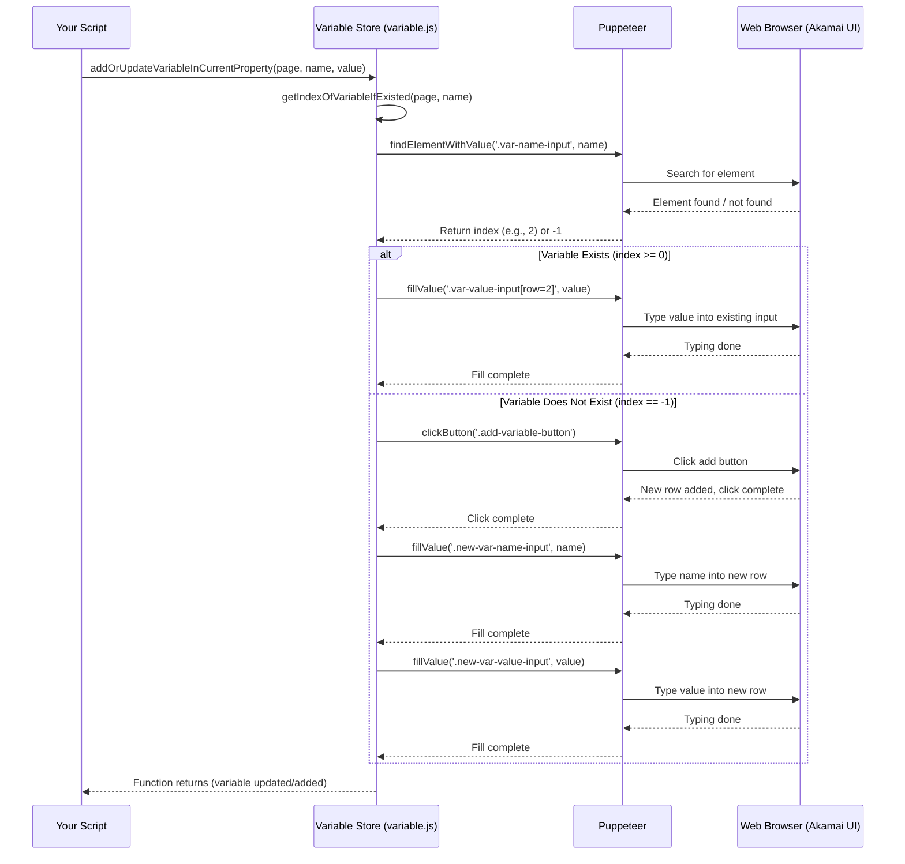

# Chapter 3: Variable Store - Your Configuration's Shared Whiteboard

Welcome back! In [Chapter 2: Property Manager - Your Configuration Librarian](02_property_manager.md), we learned how to use the **Property Manager** to find the specific Akamai configuration (Property) we want to work with and prepare a new draft version for editing. Now that our "Librarian" has checked out the right "book" for us, let's learn how to write some important notes on its shared whiteboard: the **Variable Store**.

## The Problem: Repeating Yourself in Configuration

Imagine you have a website, `www.mycoolsite.com`, and its real web server lives at `origin-server-v1.internal.net`. In your Akamai configuration, you might need to tell Akamai about this origin server hostname in several different places:
*   In the main rule that fetches content.
*   Maybe in a special rule for handling API requests.
*   Perhaps in another rule for redirecting old links.

If you just type `origin-server-v1.internal.net` directly into each of these rules, what happens when you need to upgrade your server to `origin-server-v2.internal.net`? You have to hunt down *every single place* you typed the old hostname and update it manually. Miss one, and things might break! This is tedious and error-prone.

## Meet the Variable Store: Your Shared Whiteboard

Wouldn't it be nice if you could write down the origin hostname *once* in a central place for your property configuration, and then just *refer* to that central place in all your rules?

That's exactly what Akamai's **Property Variables** let you do! And the **Variable Store** module (found primarily in `variable.js`) in our `akamai-automation` project is the tool that helps you manage these variables automatically.

Think of the Property Variables section within your Akamai configuration like a **Shared Whiteboard** visible to all the rules and settings for that *specific* property version.
*   You can **write down** important pieces of information (like your origin hostname, a specific file path, or a contact email) as **variables** on this whiteboard. Each variable has a name (like `MY_ORIGIN_HOSTNAME`) and a value (like `origin-server-v1.internal.net`).
*   Then, within your different rules and behaviors, instead of writing the actual value, you can just **refer back** to the variable name on the whiteboard (e.g., use `{{user.PMUSER_MY_ORIGIN_HOSTNAME}}` in a rule).
*   When you need to update the value (like changing the origin server), you only need to **erase and rewrite** it *once* on the whiteboard (update the variable's value). All the rules referencing it will automatically use the new value!

The Variable Store module in `akamai-automation` provides functions to automatically add new variables to this whiteboard or update the values of existing ones.

## Your Task: Adding or Updating an Origin Hostname Variable

Let's automate the task of ensuring our Akamai property configuration has a variable named `PMUSER_ORIGIN_HOSTNAME` and that its value is set to `origin-server-v1.internal.net`.

**Steps Involved:**

1.  **Log In & Navigate:** Use the [Automation Controller](01_automation_controller.md) and [Property Manager](02_property_manager.md) to log in and navigate to the correct draft version of our property (like we did in Chapter 2).
2.  **Use the Variable Store:** Tell the Variable Store module to find the variable `PMUSER_ORIGIN_HOSTNAME`.
    *   If it exists, update its value to `origin-server-v1.internal.net`.
    *   If it doesn't exist, add it with the value `origin-server-v1.internal.net`.
3.  **(Optional) Save Changes:** Use the [Property Manager](02_property_manager.md) to save the changes to the property version.

**Example Code:**

```javascript
// Import Puppeteer and our controller
const puppeteer = require('puppeteer');
const akamai = require('./akamai'); // Our Automation Controller
// Load your saved cookies
const myCookies = require('./my-akamai-cookies.json');

// Property and Variable details
const targetDomain = 'www.mycoolsite.com'; // The property to edit
const variableName = 'PMUSER_ORIGIN_HOSTNAME'; // Standard prefix for user variables
const variableValue = 'origin-server-v1.internal.net'; // The value to set

async function manageOriginVariable() {
  const browser = await puppeteer.launch({ headless: false });
  const page = await browser.newPage();

  console.log('Logging in...');
  await akamai.loginToAkamaiUsingCookies(page, myCookies);
  console.log('Logged in successfully!');

  console.log(`Finding property for ${targetDomain} and navigating to draft...`);
  // Navigate to the latest draft based on production
  await akamai.goToLatestDraftVersionBasedOnVersionType(page, targetDomain, 'production');
  console.log('On the draft version page.');

  console.log(`Adding or updating variable: ${variableName} = ${variableValue}`);
  // Use the Variable Store module via the controller
  await akamai.Variable.addOrUpdateVariableInCurrentProperty(page, variableName, variableValue);
  console.log(`Variable ${variableName} ensured.`);

  // Optional: Save the property version
  console.log('Saving property changes...');
  const savedVersion = await akamai.Property.saveThePropertyChange(page);
  if (savedVersion) {
    console.log(`Changes saved to new version ${savedVersion}`);
  } else {
    console.log('No changes were saved (maybe value was already correct).');
  }

  // Keep browser open briefly
  await new Promise(resolve => setTimeout(resolve, 5000)); // Wait 5 seconds

  await browser.close();
}

manageOriginVariable();
```

**Explanation:**

1.  We set up Puppeteer, load cookies, and define our target domain, variable name, and desired value.
2.  We reuse `akamai.loginToAkamaiUsingCookies` and `akamai.goToLatestDraftVersionBasedOnVersionType` to get our automated browser (`page`) to the right place – the editor for the latest draft version of our property.
3.  The key line: `await akamai.Variable.addOrUpdateVariableInCurrentProperty(page, variableName, variableValue);`
    *   We access the Variable Store module's function through our main controller (`akamai.Variable`).
    *   We pass the `page` object (our browser context), the `variableName` we want to manage, and the `variableValue` we want it to have.
    *   This function handles the logic of checking if the variable exists and either updating the existing one or adding a new one.
4.  Finally, we use the `akamai.Property.saveThePropertyChange` function from the [Property Manager](02_property_manager.md) to save our work.

**Input:**
*   `page`: A Puppeteer page object, navigated to the Akamai property editor's draft version.
*   `variableName`: The name of the variable (e.g., 'PMUSER_ORIGIN_HOSTNAME'). By convention, user-defined variables start with `PMUSER_`.
*   `variableValue`: The desired value for the variable (e.g., 'origin-server-v1.internal.net').

**Output:**
*   The automated browser will interact with the "Property Variables" section in the Akamai UI.
*   If the variable didn't exist, a new row will appear with the name and value filled in.
*   If the variable existed, its value field will be updated.
*   You'll see confirmation messages printed in your terminal.
*   If saved, a new property version number will be printed.

## Under the Hood: How the Whiteboard Gets Updated

How does `addOrUpdateVariableInCurrentProperty` actually work? Like other modules, it tells Puppeteer how to interact with the web page elements.

**High-Level Steps:**

1.  **Your Script:** Calls `akamai.Variable.addOrUpdateVariableInCurrentProperty(page, name, value)`.
2.  **Variable Store (`variable.js`):** Receives the call.
3.  **Find Variables Section:** Locates the "Property Variables" section on the Akamai page.
4.  **Check Existence:** Looks through the existing variable input fields to see if one already has the given `name`. (It uses the helper function `getIndexOfVariableIfExisted` for this).
5.  **Act Based on Existence:**
    *   **If Variable Exists:** Finds the corresponding *value* input field for that variable name and tells Puppeteer to type the new `value` into it, replacing whatever was there before.
    *   **If Variable Doesn't Exist:**
        *   Finds the "Add Variables" button (or similar) and tells Puppeteer to click it. This usually adds a new blank row to the variables table.
        *   Finds the *name* input field in the *new* row and tells Puppeteer to type the `name`.
        *   Finds the *value* input field in the *new* row and tells Puppeteer to type the `value`.
6.  **Control Returns:** The function finishes, and your script continues. The variable is now added or updated on the page, ready to be saved.

**Sequence Diagram:**



**Code Snippet (`variable.js`):**

Let's look at a simplified version of the code inside `variable.js`:

```javascript
// File: variable.js (simplified snippet)
const puppeteer = require('puppeteer');
const log = require('./log');

// Helper function to find if a variable exists and return its row index
const getIndexOfVariableIfExisted = async (page, variableName) => {
    // Selector for all variable name input fields
    const xpathInput = `//pm-version-variable-name//input`;
    // Get the 'value' attribute of all matching input elements
    const variableNames = await page.$$eval('xpath=' + xpathInput,
        elements => elements.map(e => e.value) // Get current value of each input
    );
    // Return the index (position) of the variableName, or -1 if not found
    return variableNames.indexOf(variableName);
};

module.exports = {
    addOrUpdateVariableInCurrentProperty: async (page, variableName, variableValue) => {
        // Find the 'Property Variables' section and wait for inputs to be ready
        const xpathNameInput = `//pm-version-variable-name//input`;
        await page.locator('xpath=' + xpathNameInput).wait(); // Wait for elements

        // Check if the variable already exists
        const indexOf = await getIndexOfVariableIfExisted(page, variableName);

        if (indexOf >= 0) { // Variable exists, update it
            log.info(`Variable '${variableName}' exists, updating value.`);
            // Selector for the value input in the specific row (indexOf + 1)
            const xpathValueInput = `//tbody/tr[${indexOf + 1}]/td[contains(@class,'variable-value')]//input`;
            // Find the input and fill it with the new value
            await page.locator('xpath=' + xpathValueInput).fill(variableValue);
            log.white(`Filled variable ${variableName} with value ${variableValue}`);

        } else { // Variable doesn't exist, add it
            log.info(`Variable '${variableName}' not found, adding new variable.`);
            // Selector for the 'Add Variables' button
            const xpathAddButton = `//button[contains(string(), "Variables")]`; // Simplified
            // Find and click the 'Add' button
            await page.locator('xpath=' + xpathAddButton).click();

            // Selectors for the name and value inputs in the *new* row (usually the first)
            const xpathNewNameInput = `//tbody/tr[1]/td[contains(@class,'variable-name')]//input`; // Simplified
            const xpathNewValueInput = `//tbody/tr[1]/td[contains(@class,'variable-value')]//input`; // Simplified

            // Fill the name and value in the new row
            await page.locator('xpath=' + xpathNewNameInput).fill(variableName);
            log.white(`Filled new variable name ${variableName}`);
            await page.locator('xpath=' + xpathNewValueInput).fill(variableValue);
            log.white(`Filled new variable value ${variableValue}`);
        }
    }
};
```
This code uses Puppeteer's `page.locator()` with XPath selectors to find specific elements (buttons, input fields based on their row or class). It uses `.fill()` to type text and `.click()` to interact with buttons, automating the process of adding or updating variables. The `$$eval` function is used by the helper to efficiently get all current variable names from the page.

## Conclusion

You've learned about Akamai **Property Variables** and how they act like a **Shared Whiteboard** for your configuration, making it more flexible and easier to manage. You also saw how the **Variable Store** module (`variable.js`) in `akamai-automation` helps you automatically:

*   **Check** if a variable exists.
*   **Update** the value of an existing variable.
*   **Add** a new variable if it doesn't exist.
*   Using the `addOrUpdateVariableInCurrentProperty` function.

Being able to manage variables programmatically is crucial, as these variables are often used to control the behavior of different rules within your Akamai property.

In the next chapter, we'll dive into the heart of Akamai configuration: managing the rules themselves with the [Rule Engine Manager](04_rule_engine_manager.md).

---

Generated by [AI Codebase Knowledge Builder](https://github.com/The-Pocket/Tutorial-Codebase-Knowledge)