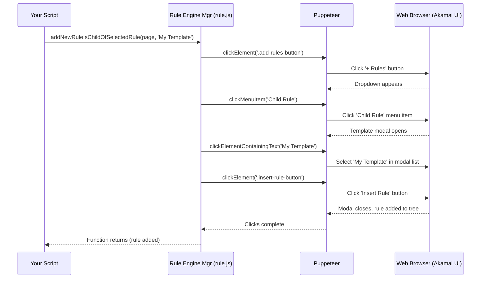

# Chapter 4: Rule Engine Manager - Your Configuration's Flowchart Editor

Welcome back! In [Chapter 3: Variable Store - Your Configuration's Shared Whiteboard](03_variable_store.md), we learned how to manage reusable values (variables) within our Akamai property configurations. Now that we know how to manage these shared values, let's dive into the core logic structure of an Akamai configuration: the **Rules**.

## The Problem: Managing Complex Web Traffic Logic

Think about how a website works. When a visitor requests a page, it's not always a simple fetch. You might need to:
*   Check if the visitor is on a mobile device.
*   See if the requested file is an image or a video.
*   Redirect visitors from `http://` to `https://`.
*   Block requests from certain countries.
*   Decide how long a specific type of content should be cached.

In Akamai, you define all this logic using **Rules**. A property configuration is essentially a collection of these rules, often nested inside each other, forming a decision tree or a flowchart for how Akamai should handle each incoming request.

Manually managing these rules in the Akamai Control Panel can get complex:
*   Ensuring a standard security rule exists in all your properties.
*   Adding a new caching rule consistently across dozens of configurations.
*   Finding and deleting an old, unused rule everywhere.
*   Rearranging rules or nesting them correctly.

It's like trying to edit a large, intricate flowchart by hand – time-consuming and easy to make mistakes.

## Meet the Rule Engine Manager: Your Flowchart Editor

This is where the **Rule Engine Manager** (found mainly in the `rule.js` file) comes to the rescue! Think of it as your automated **Flowchart Editor** for Akamai rules.

What does this editor help you do?
*   **Check if a Step Exists:** See if a rule with a specific name (or path in the flowchart) already exists (`checkIfHasTheRule`).
*   **Select a Specific Step:** Focus on a particular rule to examine or modify it (`clickToSelectTheRule`).
*   **Add New Steps (from Templates):** Insert predefined blocks of logic (rule templates) into your flowchart at specific positions – before, after, or nested within an existing rule (`addNewRuleFromTemplate`, `addNewRuleAfterSelectedRule`, `addNewRuleIsChildOfSelectedRule`).
*   **Delete Steps:** Remove rules you no longer need (`deleteTheSelectedRule`).
*   **Signal Edits Complete:** Tell the Akamai interface you're done editing a rule, which is sometimes needed for the UI to update correctly (`informAkamaiToFinishedEditingTheRule`).

Essentially, the Rule Engine Manager automates the process of building, modifying, and verifying the structure of your Akamai configuration's logic flowchart.

## Key Concept: The Rule Tree

Akamai rules aren't just a flat list; they form a hierarchy or **tree**.
*   There's a main **"Default Rule"** which is the root of the tree.
*   You can add rules *inside* the Default Rule.
*   You can add rules *inside* those rules (child rules), creating branches.

For example, you might have:

```
Default Rule
├── Redirects (Rule)
│   └── HTTP to HTTPS (Child Rule)
├── Caching (Rule)
│   ├── Cache Images (Child Rule)
│   └── Cache Videos (Child Rule)
└── Security (Rule)
    └── Block Bad Bots (Child Rule)
```

When using the Rule Engine Manager, you often need to specify the path to a rule using an array of names, like `['Caching', 'Cache Images']`.

## Your Task: Adding a Standard "HTTP to HTTPS" Redirect Rule

Let's automate a common task: ensuring our property has a rule that automatically redirects visitors from `http://` to the secure `https://` version of the site. We'll assume Akamai provides a pre-built template for this called "Redirect HTTP to HTTPS".

**Steps Involved:**

1.  **Log In & Navigate:** Use the [Automation Controller](01_automation_controller.md) and [Property Manager](02_property_manager.md) to log in and navigate to the correct draft version of our property (as covered in previous chapters).
2.  **Define Rule Path:** Decide where the rule should go. Let's put it inside the "Default Rule". The path for our *new* rule will be `['Default Rule', 'Redirect HTTP to HTTPS']`. (Note: We don't actually need 'Default Rule' in the path for `checkIfHasTheRule` or `addNewRuleFromTemplate` because it operates relative to the selected rule). Let's say the new rule will be called `Redirect HTTP to HTTPS` and we want to add it as a child of the `Default Rule`.
3.  **Check Existence:** Use the Rule Engine Manager to check if a rule named `Redirect HTTP to HTTPS` already exists directly under the Default Rule. Path to check: `['Redirect HTTP to HTTPS']`.
4.  **If Not Exists:**
    *   Select the parent rule: `clickToSelectTheDefaultRule`.
    *   Add the new rule using the template: `addNewRuleIsChildOfSelectedRule('Redirect HTTP to HTTPS')`.
    *   Signal completion: `informAkamaiToFinishedEditingTheRule`.
5.  **(Optional) Save Changes:** Use the [Property Manager](02_property_manager.md) to save the changes.

**Example Code:**

```javascript
// Import Puppeteer and our controller
const puppeteer = require('puppeteer');
const akamai = require('./akamai'); // Our Automation Controller
// Load your saved cookies
const myCookies = require('./my-akamai-cookies.json');

// Property and Rule details
const targetDomain = 'www.mysecuresite.com'; // The property to edit
const newRuleName = 'Redirect HTTP to HTTPS'; // Name of the rule we want
const newRulePath = [newRuleName]; // Path relative to parent for checking/adding
const ruleTemplateName = 'Redirect HTTP to HTTPS'; // Name of the template to use

async function addHttpsRedirectRule() {
  const browser = await puppeteer.launch({ headless: false });
  const page = await browser.newPage();

  console.log('Logging in...');
  await akamai.loginToAkamaiUsingCookies(page, myCookies);
  console.log('Logged in successfully!');
  await akamai.acceptTheUnsavedChangesDialogWhenNavigate(page); // Handle potential popups

  console.log(`Finding property for ${targetDomain} and navigating to draft...`);
  await akamai.goToLatestDraftVersionBasedOnVersionType(page, targetDomain, 'production');
  console.log('On the draft version page.');

  console.log(`Checking if rule '${newRuleName}' exists...`);
  // Check if the rule exists directly under the Default Rule
  // (We assume Default Rule is selected initially or we select it first)
  await akamai.Rule.clickToSelectTheDefaultRule(page); // Ensure parent is selected
  const ruleExists = await akamai.Rule.checkIfHasTheRule(page, newRulePath);

  if (!ruleExists) {
    console.log(`Rule '${newRuleName}' not found. Adding it...`);
    // We already selected the Default Rule above
    await akamai.Rule.addNewRuleIsChildOfSelectedRule(page, ruleTemplateName);
    console.log(`Rule added from template '${ruleTemplateName}'.`);

    // Good practice: Signal Akamai UI that editing is done for this step
    await akamai.Rule.informAkamaiToFinishedEditingTheRule(page);

    // Optional: Save the property version
    console.log('Saving property changes...');
    const savedVersion = await akamai.Property.saveThePropertyChange(page);
    if (savedVersion) {
      console.log(`Changes saved to new version ${savedVersion}`);
    } else {
      console.log('No changes were saved.');
    }
  } else {
    console.log(`Rule '${newRuleName}' already exists. No action needed.`);
  }

  // Keep browser open briefly
  await new Promise(resolve => setTimeout(resolve, 5000)); // Wait 5 seconds

  await browser.close();
}

addHttpsRedirectRule();
```

**Explanation:**

1.  Standard setup: Launch browser, log in, navigate to the target property's draft version.
2.  Define the `newRuleName`, `newRulePath` (how to find/refer to it relative to its parent), and the `ruleTemplateName`.
3.  `await akamai.Rule.clickToSelectTheDefaultRule(page);`: We explicitly select the "Default Rule" because we want to check for/add a rule directly inside it.
4.  `const ruleExists = await akamai.Rule.checkIfHasTheRule(page, newRulePath);`: We ask the Rule Engine Manager if the rule path `['Redirect HTTP to HTTPS']` exists *relative to the currently selected rule* (which is the Default Rule).
5.  **If `!ruleExists`:**
    *   `await akamai.Rule.addNewRuleIsChildOfSelectedRule(page, ruleTemplateName);`: Since the Default Rule is still selected, we tell the manager to add a new *child* rule using the specified template.
    *   `await akamai.Rule.informAkamaiToFinishedEditingTheRule(page);`: This clicks the rule header in the UI, which helps ensure Akamai registers the changes before we proceed or save.
    *   (Optional) Save changes using the [Property Manager](02_property_manager.md).
6.  **If `ruleExists`:** We print a message saying no action is needed.

**Input:**
*   `page`: Puppeteer page object, logged in and on the property editor draft page.
*   `newRulePath`: An array of strings representing the rule hierarchy to check (e.g., `['Redirect HTTP to HTTPS']`).
*   `ruleTemplateName`: The name of the rule template in the Akamai UI (e.g., `'Redirect HTTP to HTTPS'`).

**Output:**
*   The automated browser interacts with the rule tree UI.
*   If the rule didn't exist, it will be added (usually as the last child of the selected rule).
*   Console messages will indicate whether the rule was found or added.
*   If saved, a new version number will be printed.

## Under the Hood: Editing the Flowchart Programmatically

How does the Rule Engine Manager perform these actions? It uses Puppeteer to simulate exactly what a human would do in the Akamai Control Panel interface.

**Adding a New Rule (Simplified Steps):**

1.  **Your Script:** Calls `akamai.Rule.addNewRuleIsChildOfSelectedRule(page, 'My Template')`.
2.  **Rule Engine Manager (`rule.js`):** Receives the call. Knows the currently selected rule needs a child added.
3.  **Click "+ Rules":** Instructs Puppeteer to find the "+ Rules" button near the top of the rule editor and click it.
4.  **Click Menu Item:** A dropdown menu appears. The manager tells Puppeteer to find and click the menu item "Child Rule".
5.  **Find Template:** A modal window (popup) appears listing rule templates. The manager tells Puppeteer to find the list item containing the text "My Template" and click it.
6.  **Click "Insert Rule":** The manager tells Puppeteer to find the "Insert Rule" button in the modal footer and click it.
7.  **Akamai UI:** Reacts to these clicks, adding the new rule based on the template as a child of the originally selected rule.
8.  **Control Returns:** The function finishes, and your script continues.

**Sequence Diagram (Adding a Child Rule):**



**Code Snippets (`rule.js`):**

Let's look at simplified snippets showing how these actions are coded:

*   **Checking if a Rule Exists:**

```javascript
// File: rule.js (simplified checkIfHasTheRule)
checkIfHasTheRule: async (page, rules) => {
    // Wait for the base 'Default Rule' to be visible first
    const xpathDefaultRule = `//pm-rule-node[@depth=0 and contains(string(),"Default Rule")]`;
    await page.locator('xpath=' + xpathDefaultRule).wait();

    // Build the XPath to find the nested rule structure
    // Example: rules = ['Caching', 'Cache Images']
    // XPath becomes: //pm-rule-node[@depth=1 and contains(string(),"Caching")]/following-sibling::pm-rule-node[@depth=2 and contains(string(),"Cache Images")]
    var xpath = `//pm-rule-node[@depth=1 and contains(string(),"${rules[0]}")]`;
    for (let i = 1; i < rules.length; i++) {
        // Uses 'following-sibling::' to find rules nested later in the DOM
        xpath += `/following-sibling::pm-rule-node[@depth=${i + 1} and contains(string(),"${rules[i]}")]`;
    }

    // Check if an element matching the XPath exists on the page
    if (await page.$('xpath=' + xpath)) return true; // page.$ returns element or null
    return false;
},
```
*Explanation:* This builds a complex *XPath* selector based on the `rules` array. XPath is like a path address for elements on a web page. It looks for elements (`pm-rule-node`) at specific nesting depths (`@depth=...`) containing the rule names (`contains(string(),...)`) and connected as siblings in the page structure. `page.$` checks if such an element exists.

*   **Adding a Rule (Core Logic):**

```javascript
// File: rule.js (simplified addNewRuleFromRuleTemplate)
const addNewRuleFromRuleTemplate = async (page, ruleTemplateName, position) => {
    // Find and click the main '+ Rules' button cluster
    const addRulesButtonXPath = `//button[contains(string(), "Rules")]/following-sibling::button`;
    await page.locator('xpath=' + addRulesButtonXPath).click();

    // Click the desired position ('After Current Rule', 'Before Current Rule', 'Child Rule')
    await akamaiMenu.clickToMenuItemInAkamMenu(page, position); // Uses helper module

    // --- Inside the 'Add Rule' Modal ---
    // Find and click the template name in the list
    const templateXPath = `//div[@class="add-rule-modal-sidebar-body"]//li[contains(text(), "${ruleTemplateName}")]`;
    await page.locator('xpath=' + templateXPath).click();

    // Find and click the 'Insert Rule' button
    const insertBtnXPath = `//div[@akammodalactions]/button[contains(text(), "Insert Rule")]`;
    await page.locator('xpath=' + insertBtnXPath).click();
}

// Example of a specific function using the core logic:
addNewRuleIsChildOfSelectedRule: async (page, ruleTemplateName) => {
    // Calls the main function, specifying 'Child Rule' position
    await addNewRuleFromRuleTemplate(page, ruleTemplateName, "Child Rule");
},
```
*Explanation:* This code simulates the clicks needed: first the '+ Rules' button, then the menu item for the desired position (using a helper `akamaiMenu` module not shown here), then selecting the template by its text, and finally clicking 'Insert Rule'. Specific functions like `addNewRuleIsChildOfSelectedRule` simply call this core logic with the correct `position` parameter.

*   **Informing Akamai Edit is Done:**

```javascript
// File: rule.js (simplified informAkamaiToFinishedEditingTheRule)
informAkamaiToFinishedEditingTheRule: async (page) => {
    // Find the header/title element of the currently selected rule's editor pane
    const ruleNameHeaderXPath = `//pm-rule-editor/div[@class="rule-name"]`;
    // Get the actual name for logging purposes
    const ruleName = await page.$eval('xpath=' + ruleNameHeaderXPath, el => el.innerText);

    // Click on the rule's name header
    await page.locator('xpath=' + ruleNameHeaderXPath)
        .on(puppeteer.LocatorEvent.Action, () => {
            log.blue(`Clicked rule header to signal completion for: ${ruleName}`);
        }).click();
},
```
*Explanation:* Sometimes, after modifying behaviors or criteria within a rule, the Akamai UI needs a nudge to recognize the changes properly before you select another rule or save. This function simply finds the title bar of the rule editor pane and clicks it. This seemingly minor action often helps trigger the necessary UI updates behind the scenes.

## Conclusion

You've now met the **Rule Engine Manager**, your automated **Flowchart Editor** for Akamai configurations. You learned:

*   Akamai properties use **Rules** organized in a **tree structure** to define request processing logic.
*   The Rule Engine Manager (`rule.js`) automates managing this structure.
*   Key actions include:
    *   **Checking** if rules exist (`checkIfHasTheRule`).
    *   **Selecting** specific rules (`clickToSelectTheRule`).
    *   **Adding** new rules from templates (`addNewRuleFromTemplate` and variants).
    *   **Deleting** selected rules (`deleteTheSelectedRule`).
    *   **Signaling** edit completion (`informAkamaiToFinishedEditingTheRule`).

You can now programmatically build and modify the fundamental logic structure of your Akamai configurations. However, rules are usually more than just placeholders; they contain conditions (Criteria) and actions (Behaviors).

In the next chapter, we'll explore how to define the *conditions* under which a rule should apply using the [Criteria Matching Engine](05_criteria_matching_engine.md).

---

Generated by [AI Codebase Knowledge Builder](https://github.com/The-Pocket/Tutorial-Codebase-Knowledge)