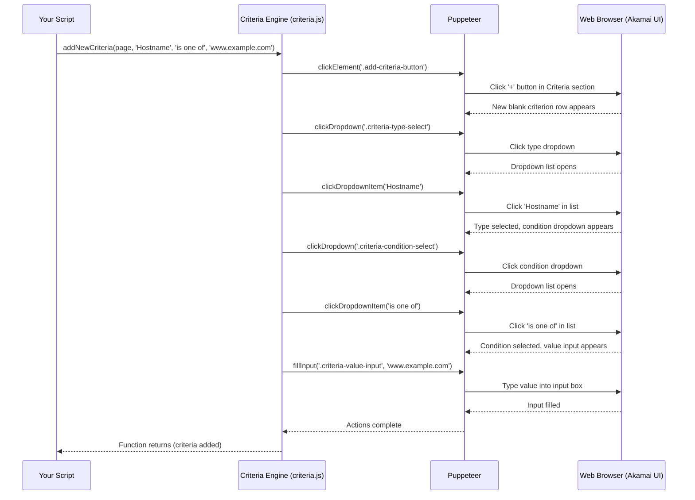

# Chapter 5: Criteria Matching Engine - The Rule Gatekeeper

Welcome back! In [Chapter 4: Rule Engine Manager - Your Configuration's Flowchart Editor](04_rule_engine_manager.md), we learned how to use the **Rule Engine Manager** to build the structure of our Akamai configuration's logic, like adding steps to a flowchart. But just having a rule (a step in the flowchart) isn't enough. We need to tell Akamai *when* that rule should actually be used. That's where **Criteria** come in.

## The Problem: When Should a Rule Apply?

Imagine you created a rule using the [Rule Engine Manager](04_rule_engine_manager.md) to cache images for a longer time. You wouldn't want that rule to apply to *every single request*, right? It should only apply if the request is actually *for* an image file.

Or, maybe you have a special rule with settings just for your mobile users. You need a way to tell Akamai: "Only use *this* rule if the incoming request is coming from a mobile device."

In Akamai, these conditions ("IF the request is for an image", "IF the request is from a mobile device") are called **Criteria**. Every rule in your configuration flowchart needs Criteria to determine if it should be activated for a particular incoming request.

Manually setting up these conditions for many rules across many properties can be repetitive:
1.  Select the rule.
2.  Click the "Add Criteria" button.
3.  Find the right type of condition (e.g., "File Extension").
4.  Choose how to match (e.g., "is one of").
5.  Enter the specific values (e.g., "jpg", "png", "gif").
6.  Repeat for other rules or properties.

## Meet the Criteria Matching Engine: Your Rule Gatekeeper

Think of each rule in your Akamai configuration as a special room with specific instructions (which we'll call Behaviors later). Before anyone can enter that room and follow those instructions, they need to pass the **Gatekeeper** standing at the door. This Gatekeeper is our **Criteria Matching Engine** (found mainly in the `criteria.js` file).

What does this Gatekeeper do?
*   It holds a list of **Criteria** (conditions) for entering the room (applying the rule).
*   When a request arrives, the Gatekeeper checks the request against its list.
*   **Checks ID:** Does the request's Hostname match? (Like checking an ID card).
*   **Checks Destination:** Does the request's URL Path match? (Like checking a destination address).
*   **Checks Other Details:** Does a specific Variable have the right value? Or is the file extension correct?
*   **Only if ALL criteria pass**, the Gatekeeper lets the request "enter the room", meaning the rule's actions (Behaviors) are applied.

Our Criteria Matching Engine module (`criteria.js`) helps you automate managing these Gatekeepers:
*   `checkHasExistedCriteria`: Ask the Gatekeeper if a specific condition (e.g., checking Hostname) is already on their list.
*   `addNewCriteria`: Tell the Gatekeeper to add a new condition to their list (e.g., "only allow requests where the Path starts with /blog/").
*   `getCriteriaValueByName`: Ask the Gatekeeper for the current allowed values for a specific condition (e.g., "What hostnames are currently allowed?").
*   `addValueToExistedCriteria`: Tell the Gatekeeper to add another allowed value to an *existing* condition (e.g., "Also allow blog.example.com" to an existing Hostname check).
*   `deleteAllValueInExitedCriteria`: Tell the Gatekeeper to clear all current values for a specific condition (useful before adding new ones).

It lets you define *exactly* when each rule should become active.

## Your Task: Making a Rule Apply Only to a Specific Hostname

Let's say we have a rule (maybe added using the [Rule Engine Manager](04_rule_engine_manager.md)) that should *only* apply to requests made to `www.mycoolsite.com`. We need to add a "Hostname" criterion to this rule.

**Steps Involved:**

1.  **Log In & Navigate:** Use the [Automation Controller](01_automation_controller.md) and [Property Manager](02_property_manager.md) to get to the draft version of our property.
2.  **Select the Rule:** Use the [Rule Engine Manager](04_rule_engine_manager.md) (`akamai.Rule.clickToSelectTheRule`) to select the specific rule we want to modify.
3.  **Check for Existing Hostname Criteria:** Use the Criteria Matching Engine (`akamai.Criteria.checkHasExistedCriteria`) to see if this rule *already* has a Hostname condition set up.
4.  **If Not Exists:** Use the Criteria Matching Engine (`akamai.Criteria.addNewCriteria`) to add the condition: "Hostname is one of www.mycoolsite.com".
5.  **(Optional) Save Changes:** Use the [Property Manager](02_property_manager.md) to save.

**Example Code:**

```javascript
// Import Puppeteer and our controller
const puppeteer = require('puppeteer');
const akamai = require('./akamai'); // Our Automation Controller
// Load your saved cookies
const myCookies = require('./my-akamai-cookies.json');

// Property and Rule details
const targetDomain = 'www.mycoolsite.com'; // The property to edit
const targetRulePath = ['My Special Rule']; // Path to the rule to modify
const criteriaName = 'Hostname'; // The type of condition
const criteriaCondition = 'is one of'; // How to match
const criteriaValue = 'www.mycoolsite.com'; // The specific value to match

async function addHostnameCriteria() {
  const browser = await puppeteer.launch({ headless: false });
  const page = await browser.newPage();

  console.log('Logging in...');
  await akamai.loginToAkamaiUsingCookies(page, myCookies);
  console.log('Logged in successfully!');
  await akamai.acceptTheUnsavedChangesDialogWhenNavigate(page);

  console.log(`Finding property for ${targetDomain} and navigating to draft...`);
  await akamai.goToLatestDraftVersionBasedOnVersionType(page, targetDomain, 'production');
  console.log('On the draft version page.');

  console.log(`Selecting rule: ${targetRulePath.join(' -> ')}`);
  // Use Rule Engine Manager to select the rule
  const ruleSelected = await akamai.Rule.clickToSelectTheRule(page, targetRulePath);

  if (ruleSelected) {
    console.log('Rule selected. Checking for existing Hostname criteria...');
    // Use Criteria Engine to check if the criteria already exists
    const criteriaExists = await akamai.Criteria.checkHasExistedCriteria(page, criteriaName, criteriaCondition);

    if (!criteriaExists) {
      console.log(`Criteria '${criteriaName} ${criteriaCondition}' not found. Adding it...`);
      // Use Criteria Engine to add the new criteria
      await akamai.Criteria.addNewCriteria(page, criteriaName, criteriaCondition, criteriaValue);
      console.log(`Added criteria: ${criteriaName} ${criteriaCondition} ${criteriaValue}`);

      // Optional: Signal Akamai UI update & Save
      await akamai.Rule.informAkamaiToFinishedEditingTheRule(page); // Good practice
      console.log('Saving property changes...');
      const savedVersion = await akamai.Property.saveThePropertyChange(page);
      if (savedVersion) {
        console.log(`Changes saved to new version ${savedVersion}`);
      } else { console.log('No changes were saved.'); }

    } else {
      console.log(`Criteria '${criteriaName} ${criteriaCondition}' already exists.`);
      // Optional: You could use addValueToExistedCriteria here if needed
      // await akamai.Criteria.addValueToExistedCriteria(page, criteriaName, criteriaValue);
      // console.log(`Ensured value '${criteriaValue}' is present.`);
    }
  } else {
    console.log(`Could not select rule: ${targetRulePath.join(' -> ')}`);
  }

  // Keep browser open briefly
  await new Promise(resolve => setTimeout(resolve, 5000));
  await browser.close();
}

addHostnameCriteria();
```

**Explanation:**

1.  Standard setup: Log in, navigate to the property draft.
2.  Define the rule we want to target (`targetRulePath`), the type of check (`criteriaName = 'Hostname'`), how it should check (`criteriaCondition = 'is one of'`), and the value (`criteriaValue = 'www.mycoolsite.com'`).
3.  `await akamai.Rule.clickToSelectTheRule(page, targetRulePath);`: We tell the [Rule Engine Manager](04_rule_engine_manager.md) to select our target rule first. This is crucial because criteria are added to the *currently selected* rule.
4.  `const criteriaExists = await akamai.Criteria.checkHasExistedCriteria(page, criteriaName, criteriaCondition);`: We ask the Criteria Matching Engine if the selected rule already has a 'Hostname' condition set to 'is one of'.
5.  **If `!criteriaExists`:**
    *   `await akamai.Criteria.addNewCriteria(page, criteriaName, criteriaCondition, criteriaValue);`: We tell the Criteria Matching Engine to add the new condition.
    *   We optionally signal the edit is done and save the changes using the [Property Manager](02_property_manager.md).
6.  **If `criteriaExists`:** We print a message. The commented-out lines show how you *could* use `addValueToExistedCriteria` to add the hostname if the criterion existed but didn't contain this specific value.

**Input:**
*   `page`: Puppeteer page object, on the property editor page with the correct rule selected.
*   `criteriaName`: Type of check (e.g., 'Hostname', 'Path', 'File Extension').
*   `criteriaCondition`: How to match (e.g., 'is one of', 'is not one of', 'matches wildcard').
*   `criteriaValue`: The specific value(s) to match against (e.g., 'www.mycoolsite.com').

**Output:**
*   The automated browser interacts with the "Criteria" section of the selected rule in the Akamai UI.
*   If the criterion didn't exist, it will be added, and the value filled in.
*   Console messages confirm the actions taken.
*   If saved, a new version number is printed.

## Under the Hood: Telling the Gatekeeper What to Check

How does `addNewCriteria` actually add a condition? It guides Puppeteer through the web interface clicks and typing, just like you would.

**Simplified Steps for `addNewCriteria`:**

1.  **Your Script:** Calls `akamai.Criteria.addNewCriteria(page, 'Hostname', 'is one of', 'www.example.com')`.
2.  **Criteria Engine (`criteria.js`):** Receives the call. Knows it needs to add a new criterion to the *currently selected* rule.
3.  **Find & Click "+ Criteria":** Tells Puppeteer to find the button (often labeled "+", or within a "Criteria" panel header) used to add a new condition and click it. This usually adds a new, blank criterion row/section.
4.  **Select Criteria Type:** A dropdown appears for the type of criterion. The engine tells Puppeteer to click this dropdown. Then, it tells Puppeteer to find and click the 'Hostname' item in the dropdown list. (Uses helper `setCriteriaName`).
5.  **Select Condition:** Another dropdown appears for the condition (how to match). The engine tells Puppeteer to click it, then find and click 'is one of'. (Uses helper `setCriteriaCondition`).
6.  **Enter Value:** An input box appears for the value. The engine tells Puppeteer to find this input box and type 'www.example.com' into it. (Uses helper `setCriteriaValue`).
7.  **Akamai UI:** Updates to show the newly configured criterion.
8.  **Control Returns:** The function finishes.

**Sequence Diagram (Adding Hostname Criteria):**



**Code Snippets (`criteria.js`):**

Let's peek at how `criteria.js` might implement this. It uses helper functions for clarity.

*   **Main `addNewCriteria` function:**

```javascript
// File: criteria.js (simplified snippet)
const puppeteer = require('puppeteer');
const akamaiMenu = require('./menu'); // Helper for dropdowns
const log = require('./log');

// Include helper functions (defined below or separately)
const setCriteriaName = async (page, criteriaName) => { /* ... */ };
const setCriteriaCondition = async (page, criteriaCondition) => { /* ... */ };
const setCriteriaValue = async (page, criteriaValue) => { /* ... */ };

module.exports = {
    addNewCriteria: async (page, criteriaName, criteriaCondition, criteriaValue) => {
        // Selector for the button to add a new criteria row
        const xpathBtn = `//pm-rule-editor/pm-match-list//akam-content-panel-header[contains(string(), "Criteria")]//button`;
        // Find and click the add button
        await page.locator('xpath=' + xpathBtn).setEnsureElementIsInTheViewport(false)
            .on(puppeteer.LocatorEvent.Action, () => {
                log.white(`Add new criteria: ${criteriaName} ${criteriaCondition} ${criteriaValue}`)
            })
            .click();

        // Call helper functions to set the details in the newly added row
        await setCriteriaName(page, criteriaName);
        await setCriteriaCondition(page, criteriaCondition);
        await setCriteriaValue(page, criteriaValue);
    },
    // ... other functions like checkHasExistedCriteria, addValueToExistedCriteria ...
};
```
*Explanation:* This function first finds the specific button to add a new criterion row (using an XPath selector) and clicks it. Then, it calls separate helper functions to handle setting the type, condition, and value in that new row.

*   **Example Helper Function (`setCriteriaName`):**

```javascript
// File: criteria.js (simplified snippet)
// Helper to select the Criteria Type (like Hostname, Path)
const setCriteriaName = async (page, criteriaName) => {
    // Selector for the type dropdown in the *last* (newest) criteria row
    const xpathSelect = `//pm-rule-editor/pm-match-list//pm-match[last()]//akam-select`;
    // Click the dropdown to open it
    await page.locator('xpath=' + xpathSelect).setEnsureElementIsInTheViewport(false).click();

    // Use a menu helper to click the correct item in the opened dropdown
    await akamaiMenu.clickToItemInDropdown(page, criteriaName);
};
```
*Explanation:* This helper focuses on one specific task: selecting the criterion type. It finds the dropdown element in the newly added row (`//pm-match[last()]`), clicks it, and then uses another helper module (`akamaiMenu`, not shown in detail) designed specifically for clicking items within Akamai's standard dropdown menus. `setCriteriaCondition` and `setCriteriaValue` would work similarly, targeting the condition dropdown and value input respectively.

## Conclusion

You've now met the **Criteria Matching Engine**, the automated **Gatekeeper** for your Akamai rules. You learned:

*   **Criteria** are the conditions (like Hostname, Path, File Extension) that determine IF a rule should be applied to a request.
*   The Criteria Matching Engine (`criteria.js`) helps you manage these conditions automatically.
*   Key actions include:
    *   **Checking** if criteria exist (`checkHasExistedCriteria`).
    *   **Adding** new criteria (`addNewCriteria`).
    *   **Adding values** to existing criteria (`addValueToExistedCriteria`).

You now know how to set up the "IF" part of your Akamai logic: *IF* these conditions are met... But what happens *THEN*?

In the next chapter, we'll explore the actions that rules perform once their criteria are met, using the [Behavior Configuration Tool](06_behavior_configuration_tool.md).

---

Generated by [AI Codebase Knowledge Builder](https://github.com/The-Pocket/Tutorial-Codebase-Knowledge)