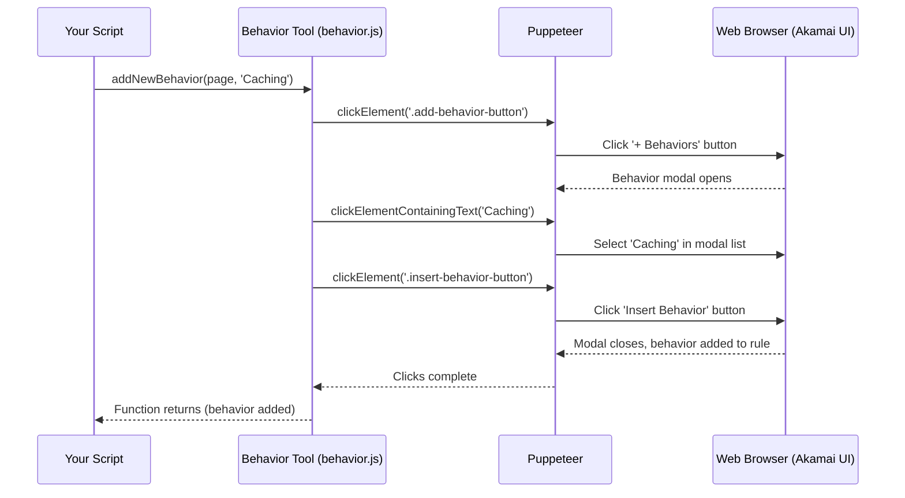

# Chapter 6: Behavior Configuration Tool - Your Rule's Toolkit

Welcome back! In [Chapter 5: Criteria Matching Engine - The Rule Gatekeeper](05_criteria_matching_engine.md), we learned how to set up the "IF" conditions (Criteria) that determine *when* a specific rule in our Akamai configuration should apply. We used the Criteria Matching Engine like a Gatekeeper at the door of a rule.

Now, it's time to define what actually happens *inside* that room once the Gatekeeper lets a request through. We need to define the "THEN" part: *THEN* what actions should Akamai take? These actions are called **Behaviors**.

## The Problem: Defining the Actions Within a Rule

So, our rule's Criteria (the Gatekeeper) have decided that an incoming request should be processed by this specific rule. What should the rule *do*?
*   Should it **cache** the content, and if so, for how long?
*   Should it **redirect** the user to a different URL?
*   Should it **modify** a request header before sending it to the origin server?
*   Should it **compress** the response?

These specific actions are called **Behaviors** in Akamai. A single rule can contain multiple behaviors that are executed in order.

Manually configuring these behaviors across many rules and properties can be very repetitive:
1.  Select the correct rule (using the flowchart editor).
2.  Make sure its Criteria (gatekeeper conditions) are correct.
3.  Click the "Add Behavior" button.
4.  Search through a catalog of dozens of possible behaviors.
5.  Select the desired behavior (e.g., "Caching").
6.  Fill in the specific settings for that behavior (e.g., Cache duration: "7 days").
7.  Repeat for other behaviors or other rules... Yawn!

## Meet the Behavior Configuration Tool: Your Rule's Toolkit

This is where the **Behavior Configuration Tool** (found mainly in the `behavior.js` file) comes in handy. Think of each rule in your Akamai configuration flowchart as a workstation for processing web traffic. When a request arrives at this workstation (because it passed the Criteria Gatekeeper), the Behavior Configuration Tool provides the specific **Toolkit** needed for that station.

What's in this Toolkit? A collection of **Behaviors**, which are like specialized tools:
*   A **Caching Stamp:** Marks content with how long it should be cached.
*   A **Redirect Hammer:** Sends the visitor's browser to a different URL.
*   A **Header Modification Wrench:** Changes request or response headers.
*   A **Compression Vise:** Squeezes down the size of content.

Our Behavior Configuration Tool module (`behavior.js`) helps you automate managing the tools in each rule's toolkit:
*   `checkHasBehaviorByName`: Checks if a specific tool (Behavior) is already in the rule's toolkit.
*   `addNewBehavior`: Adds a new tool (Behavior) to the toolkit from Akamai's catalog.
*   `updateValueForInputFieldInBehavior`: Adjusts a setting on a tool that uses a text box (like typing a specific Redirect URL).
*   `updateValueForSelectFieldInBehavior`: Adjusts a setting that uses a dropdown menu (like choosing the Cache Duration unit: Days, Hours, Minutes).
*   `updateValueForRadioFieldInBehavior`: Adjusts a setting that uses radio buttons (like turning a feature ON or OFF).
*   `getValueOfInputFieldInBehavior`: Reads the current setting of a text box on a tool.

It lets you programmatically define *what* actions each rule performs.

## Your Task: Adding and Configuring a Caching Behavior

Let's automate a common task: ensuring a specific rule in our property has a "Caching" behavior and configuring it to cache content for 7 days.

**Steps Involved:**

1.  **Log In & Navigate:** Use the [Automation Controller](01_automation_controller.md) and [Property Manager](02_property_manager.md) to get to the draft version of our property.
2.  **Select the Rule:** Use the [Rule Engine Manager](04_rule_engine_manager.md) (`akamai.Rule.clickToSelectTheRule`) to select the specific rule we want to modify (e.g., a rule named 'Cache Static Content').
3.  **Check for Existing Caching Behavior:** Use the Behavior Configuration Tool (`akamai.Behavior.checkHasBehaviorByName`) to see if this rule already has the "Caching" tool.
4.  **If Not Exists:** Use `akamai.Behavior.addNewBehavior` to add the "Caching" behavior from the catalog.
5.  **Configure Caching:** Use `akamai.Behavior.updateValueForSelectFieldInBehavior` to set the caching duration unit to "DAYS" and `akamai.Behavior.updateValueForInputFieldInBehavior` to set the duration value to "7".
6.  **(Optional) Signal Edit Complete & Save:** Use `akamai.Rule.informAkamaiToFinishedEditingTheRule` and the [Property Manager](02_property_manager.md) to save.

**Example Code:**

```javascript
// Import Puppeteer and our controller
const puppeteer = require('puppeteer');
const akamai = require('./akamai'); // Our Automation Controller
// Load your saved cookies
const myCookies = require('./my-akamai-cookies.json');

// Property, Rule, and Behavior details
const targetDomain = 'www.mywebsite.com'; // The property to edit
const targetRulePath = ['Cache Static Content']; // Path to the rule
const behaviorName = 'Caching'; // The behavior we want
const cacheDurationUnit = 'DAYS';
const cacheDurationValue = '7';

async function configureCachingBehavior() {
  const browser = await puppeteer.launch({ headless: false });
  const page = await browser.newPage();

  console.log('Logging in...');
  await akamai.loginToAkamaiUsingCookies(page, myCookies);
  console.log('Logged in successfully!');
  await akamai.acceptTheUnsavedChangesDialogWhenNavigate(page);

  console.log(`Finding property for ${targetDomain} and navigating to draft...`);
  await akamai.goToLatestDraftVersionBasedOnVersionType(page, targetDomain, 'production');
  console.log('On the draft version page.');

  console.log(`Selecting rule: ${targetRulePath.join(' -> ')}`);
  // Use Rule Engine Manager to select the rule
  const ruleSelected = await akamai.Rule.clickToSelectTheRule(page, targetRulePath);

  if (ruleSelected) {
    console.log(`Rule selected. Checking for '${behaviorName}' behavior...`);
    // Use Behavior Tool to check if the behavior exists
    const behaviorExists = await akamai.Behavior.checkHasBehaviorByName(page, behaviorName);

    if (!behaviorExists) {
      console.log(`Behavior '${behaviorName}' not found. Adding it...`);
      // Use Behavior Tool to add the behavior
      await akamai.Behavior.addNewBehavior(page, behaviorName);
      console.log(`Behavior '${behaviorName}' added.`);
    } else {
      console.log(`Behavior '${behaviorName}' already exists.`);
    }

    // Configure the behavior settings
    console.log(`Configuring '${behaviorName}' behavior...`);
    // Use Behavior Tool to set dropdown value
    await akamai.Behavior.updateValueForSelectFieldInBehavior(page, behaviorName, 'Maximum Age', cacheDurationUnit);
    // Use Behavior Tool to set text input value
    await akamai.Behavior.updateValueForInputFieldInBehavior(page, behaviorName, 'Maximum Age', cacheDurationValue);
    console.log(`Set Maximum Age to: ${cacheDurationValue} ${cacheDurationUnit}`);

    // Optional: Signal Akamai UI update & Save
    await akamai.Rule.informAkamaiToFinishedEditingTheRule(page); // Good practice!
    console.log('Saving property changes...');
    const savedVersion = await akamai.Property.saveThePropertyChange(page);
    if (savedVersion) {
      console.log(`Changes saved to new version ${savedVersion}`);
    } else { console.log('No changes were saved.'); }

  } else {
    console.log(`Could not select rule: ${targetRulePath.join(' -> ')}`);
  }

  // Keep browser open briefly
  await new Promise(resolve => setTimeout(resolve, 5000));
  await browser.close();
}

configureCachingBehavior();
```

**Explanation:**

1.  Standard setup: Log in, navigate to the property draft.
2.  Define the `targetRulePath`, the `behaviorName` ('Caching'), and the desired settings (`cacheDurationUnit`, `cacheDurationValue`).
3.  `await akamai.Rule.clickToSelectTheRule(page, targetRulePath);`: Select the target rule first. Behaviors belong to the *currently selected* rule.
4.  `const behaviorExists = await akamai.Behavior.checkHasBehaviorByName(page, behaviorName);`: Ask the Behavior Tool if the "Caching" behavior is already present in the selected rule.
5.  **If `!behaviorExists`:**
    *   `await akamai.Behavior.addNewBehavior(page, behaviorName);`: Tell the Behavior Tool to add the "Caching" behavior from the catalog.
6.  **Configure Settings:**
    *   `await akamai.Behavior.updateValueForSelectFieldInBehavior(...)`: Find the "Maximum Age" dropdown within the "Caching" behavior and select the "DAYS" option.
    *   `await akamai.Behavior.updateValueForInputFieldInBehavior(...)`: Find the "Maximum Age" text input next to the dropdown and type "7" into it.
7.  Optionally signal completion with `informAkamaiToFinishedEditingTheRule` and save using the [Property Manager](02_property_manager.md).

**Input:**
*   `page`: Puppeteer page object, on the property editor page with the correct rule selected.
*   `behaviorName`: The name of the behavior as it appears in the Akamai UI (e.g., 'Caching').
*   `fieldLabel`: The text label next to the setting you want to change (e.g., 'Maximum Age').
*   `fieldValue`: The value to set (e.g., 'DAYS', '7').

**Output:**
*   The automated browser interacts with the "Behaviors" section of the selected rule.
*   If the behavior didn't exist, it will be added.
*   The specified settings (dropdown, text input) within the behavior will be updated.
*   Console messages confirm the actions.
*   If saved, a new version number is printed.

## Under the Hood: Using the Toolkit Programmatically

How does the Behavior Configuration Tool (`behavior.js`) actually manipulate these settings? Again, it instructs Puppeteer to mimic human actions on the web page.

**Simplified Steps for `addNewBehavior`:**

1.  **Your Script:** Calls `akamai.Behavior.addNewBehavior(page, 'Caching')`.
2.  **Behavior Tool (`behavior.js`):** Receives the call. Knows it needs to add a behavior to the selected rule.
3.  **Find & Click "+ Behaviors":** Tells Puppeteer to find the "+ Behaviors" button (usually in the Behaviors panel header) and click it.
4.  **(Maybe Select Type):** Sometimes a small menu appears (e.g., "Standard property behavior"). If so, click the appropriate type.
5.  **Find Behavior in Modal:** A large modal window (popup) appears with a list or search box for behaviors. The tool tells Puppeteer to find the 'Caching' item in the list and click it.
6.  **Click "Insert Behavior":** Tells Puppeteer to find the "Insert Behavior" button in the modal footer and click it.
7.  **Akamai UI:** Closes the modal and adds the "Caching" behavior (with default settings) to the rule's behavior list.
8.  **Control Returns:** The function finishes.

**Simplified Steps for `updateValueForInputFieldInBehavior`:**

1.  **Your Script:** Calls `akamai.Behavior.updateValueForInputFieldInBehavior(page, 'Caching', 'Maximum Age', '7')`.
2.  **Behavior Tool (`behavior.js`):** Receives the call.
3.  **Locate Behavior:** Tells Puppeteer to find the specific "Caching" behavior block within the rule editor. (It uses XPath selectors, potentially looking for the header text).
4.  **Locate Field Label:** Within that behavior block, tells Puppeteer to find the text label "Maximum Age".
5.  **Locate Input Field:** Tells Puppeteer to find the `input` element that is associated with (usually immediately following or structurally related to) that label.
6.  **Fill Input:** Tells Puppeteer to clear any existing text in the input field and then type "7".
7.  **Control Returns:** The function finishes. `updateValueForSelectFieldInBehavior` and `updateValueForRadioFieldInBehavior` work similarly but involve clicking dropdowns or radio buttons instead of typing.

**Sequence Diagram (Adding a Behavior):**



**Code Snippets (`behavior.js`):**

Let's look at the simplified code from `behavior.js` provided earlier.

*   **Adding a New Behavior:**

```javascript
// File: behavior.js (simplified addNewBehavior)
addNewBehavior: async (page, behaviorName) => {
    // Find the '+ Behaviors' button and click it
    const xpathBtn = `//pm-rule-editor/pm-behavior-list//akam-content-panel-header[contains(string(), "Behaviors")]//button`;
    await page.locator('xpath=' + xpathBtn).click();

    // Sometimes need to select 'Standard property behavior' from a menu
    await akamaiMenu.clickToMenuItemInAkamMenu(page, "Standard property behavior"); // Uses helper

    // Find the behavior name in the modal list and click it
    const selectedRule = `//pm-add-behavior-modal//li[contains(text(), "${behaviorName}")]`;
    await page.locator('xpath=' + selectedRule).click();

    // Find the 'Insert Behavior' button in the modal and click it
    const insertBtn = `//div[@akammodalactions]/button[contains(text(), "Insert Behavior")]`;
    await page.locator('xpath=' + insertBtn).click();
},
```
*Explanation:* This code uses specific XPath selectors to find and click the "+ Behaviors" button, the behavior name in the popup list, and the final "Insert Behavior" button, automating the process of adding a tool to the toolkit.

*   **Updating a Text Input Field:**

```javascript
// File: behavior.js (simplified updateValueForInputFieldInBehavior)
updateValueForInputFieldInBehavior: async (page, behaviorName, fieldLabel, fieldValue, index = 1) => {
    // Construct an XPath to find the input field:
    // Find the behavior block with the right name (using index if multiple exist)
    // Then find the label within it
    // Then find the text input field related to that label
    const xpathInput = `//pm-behavior[div[@class="header" and contains(string(), "${behaviorName}")]][${index}]//div[akam-form-label[contains(string(), "${fieldLabel}")]]/following-sibling::div//input[@type="text"]`;

    // Find the input element using the XPath and type the value into it
    await page.locator('xpath=' + xpathInput)
        .on(puppeteer.LocatorEvent.Action, () => {
            log.white(`Filled ${behaviorName}[${index}] -> ${fieldLabel}: ${fieldValue}`) // Log action
        })
        .fill(fieldValue); // Use .fill() to clear and type
},
```
*Explanation:* This uses a more complex XPath selector. It first finds the correct behavior block (`//pm-behavior[...${behaviorName}...]`), then finds the `div` containing the specific `fieldLabel`, then uses `following-sibling::div` to get the container holding the input, and finally selects the `input[@type="text"]` within that container. `page.locator().fill()` then types the desired `fieldValue`. The `index` parameter handles cases where a rule might have multiple instances of the same behavior (e.g., multiple "Modify Outgoing Request Header" behaviors).

## Conclusion

You've now learned about **Behaviors**, the specific actions or "tools" within an Akamai rule's **Toolkit**. You met the **Behavior Configuration Tool** (`behavior.js`), which allows you to automate:

*   **Checking** if behaviors exist (`checkHasBehaviorByName`).
*   **Adding** new behaviors from the catalog (`addNewBehavior`).
*   **Configuring** behavior settings using various input types (text boxes, dropdowns, radio buttons) via functions like `updateValueForInputFieldInBehavior`.

With the ability to manage Rules ([Chapter 4](04_rule_engine_manager.md)), set their Conditions/Criteria ([Chapter 5](05_criteria_matching_engine.md)), and now define their Actions/Behaviors (this chapter), you have the core components needed to automate much of your Akamai Property Manager configuration!

In the next chapter, we'll look at another important Akamai feature that often works alongside Property Manager: managing **Cloudlets** using the [Cloudlet Policy Management](07_cloudlet_policy_management.md) tool.

---

Generated by [AI Codebase Knowledge Builder](https://github.com/The-Pocket/Tutorial-Codebase-Knowledge)