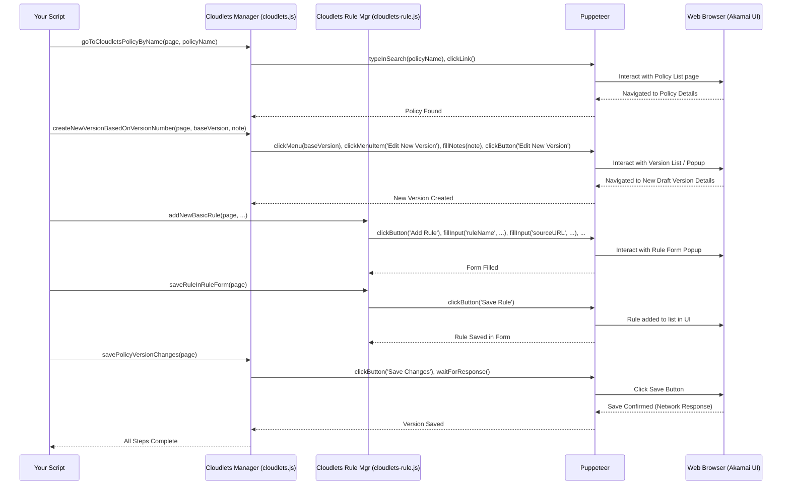

# Chapter 7: Cloudlet Policy Management - Your Edge App Controller

Welcome back! In the last few chapters, we've learned how to manage the main configuration files for your websites using tools like the [Property Manager](02_property_manager.md), [Rule Engine Manager](04_rule_engine_manager.md), [Criteria Matching Engine](05_criteria_matching_engine.md), and [Behavior Configuration Tool](06_behavior_configuration_tool.md). These handle the core logic for how Akamai delivers your content.

But sometimes, you need specialized mini-applications running right at the edge of the internet for specific tasks. Akamai calls these **Cloudlets**. Think of them as plug-in apps for your Akamai setup. This chapter introduces the tool to manage them: the **Cloudlet Policy Management** module.

## The Problem: Managing Specialized Edge Apps

Imagine you have hundreds of old web page links that need to be redirected to new ones. You *could* try to put all these redirects into your main website configuration (your Property), but that can make the main configuration huge and complex.

Akamai offers a specialized Cloudlet called **Edge Redirector** designed specifically for this task. It's a mini-app optimized for handling redirects at the edge. Other Cloudlets exist for tasks like modifying requests (Forward Rewrite), managing API traffic, handling images, and more.

Just like your main Property configuration, these Cloudlets need to be managed:
*   You need a specific **Policy** (like a configuration file) for each Cloudlet instance (e.g., one Edge Redirector policy for site A, another for site B).
*   These policies have **Versions** (like Draft, Staging, Production) so you can make changes safely.
*   Each policy version contains specific **Rules** (e.g., the individual redirect rules).

Managing these Cloudlet policies and rules manually through the Akamai Control Panel has the same drawbacks as managing main properties: it's repetitive, slow, and error-prone, especially if you have many policies or rules.

## Meet the Cloudlet Policy Management Tool: Your Edge App Controller

This is where the **Cloudlet Policy Management** module (found in `cloudlets.js` and its helper `cloudlets-rule.js`) comes in. It acts like a dedicated controller specifically for your Cloudlet "apps".

Think of it as a sibling to the [Property Manager](02_property_manager.md). While the Property Manager handles the main configuration "books" in your library, the Cloudlet Policy Management tool handles the special "pamphlets" or "manuals" for your Cloudlet plug-in apps.

What can this dedicated controller do?
*   **Find Policies:** Locates the specific Cloudlet policy you want to work with (e.g., `goToCloudletsPolicyByName`).
*   **Manage Versions:** Handles different versions of a policy, finds the current Staging/Production versions, checks for drafts, and creates new draft versions (`getStagingPolicyVersionNumber`, `checkHasDraftVersionBasedOnOtherVersionNumber`, `createNewVersionBasedOnVersionNumber`).
*   **Navigate Versions:** Goes to specific policy versions for viewing or editing (`goToLatestDraftVersionBasedOnVersionNumber`, `goToVersionDetailsBasedOnVersionNumber`).
*   **Save Changes:** Saves modifications made to a policy version (`savePolicyVersionChanges`).
*   **Activate Versions:** Pushes a specific version to the Staging or Production network (`activeStagingForCurrentVersion`).
*   **Manage Rules (via `Cloudlets.Rule`):** Provides tools to add, edit, or manage the specific rules *within* a policy version (e.g., `Cloudlets.Rule.addNewBasicRule`, `Cloudlets.Rule.openTheRuleFormByNameInVersionDetails`, `Cloudlets.Rule.saveRuleInRuleForm`).

It provides a complete interface for automating the lifecycle of your Akamai Cloudlet configurations.

## Your Task: Adding a Redirect Rule to an Edge Redirector Policy

Let's tackle a very common use case: Automatically adding a new redirect rule to an existing Edge Redirector Cloudlet policy.

**Goal:** Add a rule to our policy named "Website Redirects" that redirects visitors requesting `/old-page.html` to `/new-page.html` using a permanent redirect (301).

**Steps Involved:**

1.  **Log In:** Use the [Automation Controller](01_automation_controller.md) to log into Akamai.
2.  **Find Policy:** Use the Cloudlet manager to find and navigate to the "Website Redirects" policy.
3.  **Prepare Draft Version:** Find the current Staging version, check if a draft based on it exists. If not, create a new draft version based on the Staging version. Navigate to this draft version's details page.
4.  **Add Redirect Rule:** Use the `Cloudlets.Rule` sub-module to add a new rule with the specified source URL, redirect URL, and redirect type.
5.  **Save Changes:** Save the changes made to the draft policy version.
6.  **(Optional) Activate:** Activate the newly modified version on the Staging network.

**Example Code:**

```javascript
// Import Puppeteer and our controller
const puppeteer = require('puppeteer');
const akamai = require('./akamai'); // Our Automation Controller
// Load your saved cookies
const myCookies = require('./my-akamai-cookies.json');

// Cloudlet Policy and Rule details
const policyName = 'Website Redirects'; // Name of the Edge Redirector policy
const ruleName = 'Redirect Old to New Page';
const sourceUrl = '/old-page.html'; // Note: Hostname is often matched separately
const redirectUrl = '/new-page.html';
const redirectType = '301'; // Permanent Redirect
const copyQueryString = false; // Don't append original query params

async function addCloudletRedirectRule() {
  const browser = await puppeteer.launch({ headless: false });
  const page = await browser.newPage();

  console.log('Logging in...');
  await akamai.loginToAkamaiUsingCookies(page, myCookies);
  console.log('Logged in successfully!');
  await akamai.acceptTheUnsavedChangesDialogWhenNavigate(page);

  console.log(`Navigating to Cloudlet Policy: ${policyName}`);
  // Step 2: Find the policy (Assumes you are on Cloudlets homepage or navigate there first)
  // Example: await page.goto('https://control.akamai.com/apps/cloudlets/#/policies?gid=YOUR_GROUP_ID');
  await akamai.Cloudlets.goToCloudletsPolicyByName(page, policyName);
  console.log('On the policy details page.');

  // Step 3: Prepare Draft Version
  console.log('Checking/Creating draft version based on Staging...');
  const stagingVersion = await akamai.Cloudlets.getStagingPolicyVersionNumber(page);
  const hasDraft = await akamai.Cloudlets.checkHasDraftVersionBasedOnOtherVersionNumber(page, stagingVersion);

  if (hasDraft) {
    await akamai.Cloudlets.goToLatestDraftVersionBasedOnVersionNumber(page, stagingVersion);
  } else {
    await akamai.Cloudlets.createNewVersionBasedOnVersionNumber(page, stagingVersion, 'Add new redirect rule via automation');
  }
  console.log('On the draft version details page.');

  // Step 4: Add the Redirect Rule
  console.log(`Adding rule: ${ruleName}`);
  await akamai.Cloudlets.Rule.addNewBasicRule(page,
    ruleName, sourceUrl, redirectUrl, redirectType, copyQueryString
  );
  // Save the rule within the rule editor form/dialog
  await akamai.Cloudlets.Rule.saveRuleInRuleForm(page);
  console.log('Rule added to the version.');

  // Step 5: Save Changes to the Policy Version
  console.log('Saving policy version changes...');
  const saved = await akamai.Cloudlets.savePolicyVersionChanges(page);
  if (saved) {
    console.log('Policy version saved successfully.');
  } else {
    console.log('No changes needed saving or save failed.');
  }

  // Optional Step 6: Activate on Staging
  // console.log('Activating version on Staging...');
  // const activatedVersion = await akamai.Cloudlets.activeStagingForCurrentVersion(page);
  // console.log(`Version ${activatedVersion} activated on Staging.`);

  // Keep browser open briefly
  await new Promise(resolve => setTimeout(resolve, 5000));
  await browser.close();
}

addCloudletRedirectRule();
```

**Explanation:**

1.  **Setup:** Standard login using the [Automation Controller](01_automation_controller.md).
2.  **Find Policy:** `akamai.Cloudlets.goToCloudletsPolicyByName(page, policyName)` searches for the policy by name on the Cloudlets page and clicks its link to navigate to the policy details.
3.  **Prepare Draft:**
    *   We get the current `stagingVersion` number.
    *   We check if a draft `hasDraft` based on that version exists.
    *   If yes, `goToLatestDraftVersionBasedOnVersionNumber` navigates to it.
    *   If no, `createNewVersionBasedOnVersionNumber` creates a new draft and navigates to it. The browser is now on the "Version Details" page for the draft.
4.  **Add Rule:**
    *   `akamai.Cloudlets.Rule.addNewBasicRule(...)` clicks the "Add Rule" button, fills in the basic details (name, source, redirect URL, type, etc.) in the popup form.
    *   `akamai.Cloudlets.Rule.saveRuleInRuleForm(page)` clicks the "Save Rule" button within that popup form, adding the rule to the list in the current version.
5.  **Save Version:** `akamai.Cloudlets.savePolicyVersionChanges(page)` clicks the main "Save Changes" button for the entire policy version, persisting the added rule.
6.  **(Optional) Activate:** The commented-out code shows how `akamai.Cloudlets.activeStagingForCurrentVersion(page)` could be used to activate this version on the staging network.

**Input:**
*   `page`: Puppeteer page object, logged into Akamai.
*   `policyName`: The name of the target Cloudlet policy.
*   Rule details: `ruleName`, `sourceUrl`, `redirectUrl`, `redirectType`, `copyQueryString`.

**Output:**
*   The automated browser navigates through the Akamai Cloudlet interface.
*   A new draft version might be created.
*   A new redirect rule is added to the draft version.
*   The draft version is saved.
*   Console messages track the progress.

## Under the Hood: How the Controller Manages Cloudlets

The Cloudlet Policy Management module works very similarly to the [Property Manager](02_property_manager.md). It uses Puppeteer to interact with the specific web elements found in the Cloudlets section of the Akamai Control Panel.

**Simplified Steps for Adding a Rule (like in the example):**

1.  **Your Script:** Calls the functions `goToCloudletsPolicyByName`, `getStagingPolicyVersionNumber`, `createNewVersionBasedOnVersionNumber`, `addNewBasicRule`, `saveRuleInRuleForm`, `savePolicyVersionChanges`.
2.  **Cloudlets Module (`cloudlets.js`):**
    *   `goToCloudletsPolicyByName`: Finds the search box, types the name, finds the matching link in the results table, and clicks it.
    *   `getStagingPolicyVersionNumber`: Finds the "Staging" info block, clicks it (if needed), and reads the version number text.
    *   `createNewVersionBasedOnVersionNumber`: Finds the '...' menu for the specified base version, clicks it, clicks "Edit New Version", fills the notes in the popup, and clicks the "Edit New Version" button in the popup. Waits for navigation.
3.  **Cloudlets.Rule Module (`cloudlets-rule.js`):**
    *   `addNewBasicRule`: Finds and clicks the "Add Rule" button. In the new rule form popup, finds the input fields for name, source URL, redirect URL, etc., and fills them. Finds the "Copy Query String" checkbox and clicks it if needed.
    *   `saveRuleInRuleForm`: Finds and clicks the "Save Rule" button within the rule form popup.
4.  **Cloudlets Module (`cloudlets.js`):**
    *   `savePolicyVersionChanges`: Finds the main "Save Changes" button on the version details page and clicks it. Waits for the save confirmation (e.g., by waiting for a specific network response).
5.  **Puppeteer & Browser:** Execute all the clicks, typing, and navigation actions in the background.
6.  **Control Returns:** Each function completes, returning control to your script.

**Sequence Diagram (Simplified Add Rule Flow):**



**Code Snippets:**

Let's look at simplified versions of the code from the provided files:

*   **Finding a Policy (`cloudlets.js`):**

```javascript
// File: cloudlets.js (simplified goToCloudletsPolicyByName)
goToCloudletsPolicyByName: async (page, policyName) => {
    // Wait for table rows to appear
    await page.locator('xpath=//akam-table[@id-property="policyId"]//table/tbody/tr').wait();

    // Find search input, type policy name
    const xpthSearchInput = `//div[contains(@class, "cloudletsView")]//input[@type="search"]`;
    await page.locator('xpath=' + xpthSearchInput).fill(policyName);

    // Find the link for the matching policy name in the table and click it
    const matchResult = `//div[contains(@class, "cloudletsView")]//table//tr[td[contains(string(), "${policyName}")]]/td[1]//a`;
    await page.locator('xpath=' + matchResult).click();
    // Wait for page navigation to complete
    await page.waitForNavigation();
},
```
*Explanation:* Uses XPath selectors to find the search box, fill it, find the correct link in the table based on the policy name, and click it.

*   **Adding a Basic Rule (`cloudlets-rule.js`):**

```javascript
// File: cloudlets-rule.js (simplified addNewBasicRule)
addNewBasicRule: async (page, ruleName, sourceUrl, redirectURL, redirectType, copyQueryString, ...) => {
    // Click the main 'Add Rule' button
    await page.locator('xpath=//akam-table-toolbar//button[contains(string(), "Add Rule")]').click();

    // --- Inside the Rule Form Popup ---
    // Fill the rule name input
    await page.locator(`xpath=//form[@name="ruleForm"]//input[@name="ruleName"]`).fill(ruleName);
    // Fill the source URL input
    await page.locator(`xpath=//form[@name="ruleForm"]//input[@name="sourceURL"]`).fill(sourceUrl);
    // Fill the redirect URL input
    await page.locator(`xpath=//form[@name="ruleForm"]//input[@name="redirectURL"]`).fill(redirectURL);
    // Select the redirect type dropdown
    await page.locator(`xpath=//form[@name="ruleForm"]//select[@name="redirectType"]`).select(redirectType); // Use .select() for dropdowns

    // If copyQueryString is true, click the checkbox's associated div
    if (copyQueryString) {
        await page.locator(`xpath=//form[@name="ruleForm"]//input[@type="checkbox"]/following-sibling::div`).click();
    }
    // ... (handle other options like relative redirect if needed)
},
```
*Explanation:* Clicks "Add Rule", then uses XPath to find specific input fields (`input[@name="..."]`) and dropdowns (`select[@name="..."]`) within the rule form (`//form[@name="ruleForm"]`) and fills/selects them using Puppeteer's `.fill()` and `.select()` methods.

*   **Saving Policy Version Changes (`cloudlets.js`):**

```javascript
// File: cloudlets.js (simplified savePolicyVersionChanges)
savePolicyVersionChanges: async (page) => {
    // Wait a short moment for UI updates if needed
    await new Promise(r => setTimeout(r, 1000));

    // Selector for the main 'Save Changes' button
    const xBtnSave = `//akam-table-toolbar//button[contains(string(), "Save Changes")]`;
    // Check if the button is enabled (not disabled)
    const isDisabled = await page.$eval('xpath=' + xBtnSave, el => el.disabled);

    if (!isDisabled) {
        // If enabled, wait for the API response after clicking Save
        const [res] = await Promise.all([
            // Expect a response to the Cloudlets API endpoint
            page.waitForResponse(res => res.url().includes('/cloudlets/api/v2/policies/')),
            // Click the Save button
            page.locator('xpath=' + xBtnSave).click()
        ]);
        // Check if the response indicates success (simplified check)
        if (res && (await res.json()).matchRules) {
            log.greenBg(`Saved policy version successfully.`);
            return true;
        }
        return false; // Save failed or response malformed
    } else {
        log.red(`Nothing to save, "Save Changes" button is disabled.`);
        return false; // Nothing to save
    }
},
```
*Explanation:* Locates the main "Save Changes" button. Crucially, it first checks if the button is `disabled` (meaning no changes were detected by the UI). If it's enabled, it clicks the button and simultaneously waits for a network response from the Akamai Cloudlets API using `page.waitForResponse`. This is a reliable way to confirm the save operation completed on the backend.

## Conclusion

You've now met the **Cloudlet Policy Management** tool, your specialized controller for managing Akamai's edge mini-applications (Cloudlets). You learned:

*   Cloudlets like **Edge Redirector** handle specific tasks at the edge.
*   They are configured using **Policies**, which have **Versions** and contain **Rules**.
*   The Cloudlet Policy Management module (`cloudlets.js` and `cloudlets-rule.js`) automates managing these policies, versions, and rules, much like the [Property Manager](02_property_manager.md) does for main configurations.
*   Key actions include finding policies, creating/managing versions, adding/editing rules within a version, saving, and activating.

This allows you to automate tasks like bulk-adding redirects or managing other Cloudlet-specific logic programmatically.

We've covered many powerful modules for automating different parts of Akamai. But what if you need to perform these actions across hundreds of properties or policies? Doing them one by one, even automated, can still take time.

In the final chapter, we'll explore a powerful utility that helps significantly speed up these large-scale tasks: the [Parallel Task Executor](08_parallel_task_executor.md).

---

Generated by [AI Codebase Knowledge Builder](https://github.com/The-Pocket/Tutorial-Codebase-Knowledge)