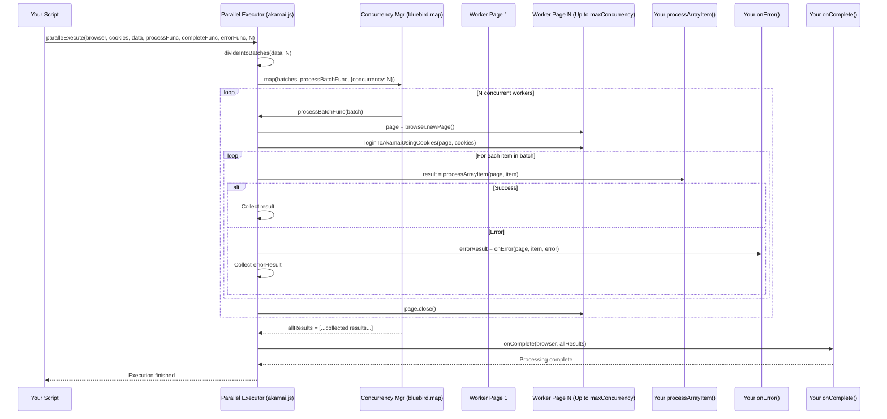

# Chapter 8: Parallel Task Executor - Speeding Up Your Work!

Welcome to the final chapter of our core tutorial! In [Chapter 7: Cloudlet Policy Management](07_cloudlet_policy_management.md), we learned how to manage specialized Akamai applications called Cloudlets. By now, you've seen how `akamai-automation` can automate tasks within a single Akamai Property or Cloudlet Policy.

But what if you need to make the *same* change or check the *same* setting across **hundreds** of different properties or policies? Imagine you need to add a specific variable ([Chapter 3: Variable Store](03_variable_store.md)) to 100 websites. Running your automation script 100 times, or even looping through them one by one in a single script, could take a very long time!

This is where the **Parallel Task Executor** comes in – it's designed to dramatically speed up these kinds of large-scale, repetitive tasks.

## The Problem: Automation Can Still Be Slow in Bulk

Think about checking the currently active "Production" version number for 100 different Akamai properties. Even with automation, doing it sequentially looks like this:

1.  Log in.
2.  Go to Property 1.
3.  Find Production version. Record it.
4.  Go to Property 2.
5.  Find Production version. Record it.
6.  ...
7.  Go to Property 100.
8.  Find Production version. Record it.
9.  Log out.

Each step takes time (navigating pages, waiting for elements). Doing this 100 times in a row adds up.

## Meet the Parallel Task Executor: Your Workforce Manager

Imagine you have a big pile of paperwork (100 forms to check). Instead of doing them all yourself, you hire a few temporary workers. You give each worker a small stack of forms and tell them exactly what information to find on each form. They all work *at the same time* on their own stacks. When everyone is finished, they give you back their results. This is much faster!

The **Parallel Task Executor** (found within the main [Automation Controller](01_automation_controller.md) file, `akamai.js`, specifically the `paralleExecute` function) acts exactly like this Workforce Manager for your Akamai tasks.

*   **The Big Task List:** You give it your list of 100 properties (or Cloudlet policies, or domains, etc.).
*   **The Workforce:** You tell it how many "workers" (concurrent browser pages) you want to use (e.g., 3 workers).
*   **Dividing the Work:** It automatically divides the 100 properties into smaller batches (e.g., 3 batches of roughly 33-34 properties each).
*   **Independent Workers:** It launches 3 separate, invisible browser pages (your "workers").
*   **Login for Each:** It ensures each worker page logs into Akamai independently using your credentials ([Chapter 1: Welcome to Akamai Automation - Your Mission Control!](01_automation_controller.md)).
*   **Assigning Tasks:** It gives each worker page one batch of properties.
*   **Simultaneous Work:** Each worker page starts processing its assigned properties *at the same time* as the other workers. Each worker uses the *same* task instructions you provide (e.g., "find the production version").
*   **Error Handling:** If one worker encounters an error with a specific property, it doesn't stop the other workers. It can log the error and continue with the rest of its batch.
*   **Collecting Results:** As workers finish, the manager collects the results (e.g., the version numbers found or error messages).
*   **Completion:** Once all workers have processed all their assigned properties, the manager signals that the entire job is done and gives you the combined results.

This parallel processing can turn a task that might take hours sequentially into one that takes only minutes!

## How to Use the Parallel Task Executor (`paralleExecute`)

Let's use our example: getting the current Production version number for a list of domains. The `akamai.paralleExecute` function is the key.

**What `paralleExecute` Needs (Inputs):**

1.  `browser`: The main Puppeteer browser instance you launched (like the factory that builds your worker pages).
2.  `cookies`: Your Akamai login cookies ([Chapter 1](01_automation_controller.md)).
3.  `arrayData`: Your list of items to process (e.g., `['site1.com', 'site2.com', 'site3.com', ...]`).
4.  `processArrayItem`: **This is the crucial part you define.** It's a function that tells *one worker* exactly what to do with *one item* from the list. It receives the worker's `page` object and the current `item`. It should return the result for that item (e.g., the version number).
5.  `onComplete`: A function you define that runs *after all* workers have finished processing *all* items. It receives the `browser` and a list containing all the results collected from `processArrayItem`.
6.  `onError`: A function you define to handle errors for a *single item*. It receives the worker's `page`, the `item` that failed, and the `error` object. It can log the error and return a specific error result.
7.  `maxConcurrency` (Optional): How many workers (pages) to run simultaneously. Defaults to 3. Be careful not to set this too high, as it uses more computer resources and might overload the Akamai interface or your network.

**Example Code: Getting Production Versions in Parallel**

```javascript
// Import necessary modules
const puppeteer = require('puppeteer');
const akamai = require('./akamai'); // Our main controller with paralleExecute
const log = require('./log'); // For logging messages
const jsonIO = require('./helper/json-io'); // Helper to load data

// --- 1. Define the Task for ONE Worker and ONE Item ---
// This function gets called repeatedly by different workers for different domains.
async function getProductionVersion(page, domain) {
  try {
    log.info(`Worker processing: ${domain}`);
    // Use Property Manager to navigate to the domain's page
    await akamai.Property.goToPropertyPageByDomain(page, domain);
    // Use Property Manager to get the production version number
    const version = await akamai.Property.getProductionVersionNumber(page);
    log.info(`Worker found version ${version} for ${domain}`);
    // Return the result for this domain
    return { domain: domain, productionVersion: version, status: 'Success' };
  } catch (err) {
    log.error(`Worker error on ${domain}: ${err.message}`);
    // Re-throw the error so onError callback is triggered
    throw err;
  }
}

// --- 2. Define What Happens When an Item Fails ---
async function handleItemError(page, domain, error) {
  log.red(`ERROR processing ${domain}: ${error.message.split('\n')[0]}`); // Log concise error
  // Return a specific error object for the results list
  return { domain: domain, productionVersion: 'ERROR', status: 'Failed' };
}

// --- 3. Define What Happens When EVERYTHING is Done ---
async function jobComplete(browser, allResults) {
  log.green('--- All tasks completed! ---');
  console.log('Collected Results:');
  // Sort results alphabetically by domain for clarity
  allResults.sort((a, b) => a.domain.localeCompare(b.domain));
  console.log(JSON.stringify(allResults, null, 2)); // Pretty-print the results

  // You could save results to a file here, e.g., using jsonIO

  log.info('Closing browser.');
  // Important: Close the main browser when everything is truly finished
  await browser.close();
}

// --- Main Script Execution ---
(async () => {
  // Load the list of domains from a file (e.g., ['site1.com', 'site2.com', ...])
  const domainsToProcess = await jsonIO.readJson('./data/domains.json');
  // Load Akamai login cookies
  const cookies = await jsonIO.readJson('./data/cookies.json');

  log.info(`Starting parallel processing for ${domainsToProcess.length} domains...`);
  // Launch the main browser instance
  const browser = await puppeteer.launch({ headless: true }); // Run headless (no visible browser)

  // --- 4. Call the Parallel Task Executor ---
  await akamai.paralleExecute(
    browser,                // The main browser
    cookies,                // Login credentials
    domainsToProcess,       // The list of domains
    getProductionVersion,   // Function defining work for one domain
    jobComplete,            // Function to run when all domains are processed
    handleItemError,        // Function to handle errors for a single domain
    4                       // Use 4 concurrent workers (browser pages)
  );

  log.info('paralleExecute function has finished its coordination.');
  // Note: browser is closed inside jobComplete callback now.
})();
```

**Explanation:**

1.  **`getProductionVersion(page, domain)`:** This is the core logic for a single domain. It uses the `page` object provided by the executor for that specific worker and the `domain` name assigned to it. It calls functions from the [Property Manager](02_property_manager.md) to navigate and get the version. It returns an object containing the result. If an error occurs, it re-throws it.
2.  **`handleItemError(page, domain, error)`:** If `getProductionVersion` throws an error, this function is called. It logs the error and returns a specific object indicating failure for that domain. This ensures that one failure doesn't crash the entire process.
3.  **`jobComplete(browser, allResults)`:** This runs only once after all domains have been attempted (either successfully or resulting in an error). It receives the list of all result objects (from `getProductionVersion` and `handleItemError`). Here, we sort and print them, and then close the main browser.
4.  **Main Execution Block:**
    *   Loads the domains and cookies.
    *   Launches the main `browser`.
    *   Calls `akamai.paralleExecute`, passing in all the necessary components: the browser, cookies, domain list, and the three functions we defined (`getProductionVersion`, `jobComplete`, `handleItemError`), along with the desired concurrency level (4).

**Input:**
*   A list of domain names in `./data/domains.json`.
*   Valid Akamai cookies in `./data/cookies.json`.

**Output:**
*   You'll see log messages in your terminal showing workers processing different domains concurrently.
*   Error messages will appear if any domain fails.
*   At the end, a sorted JSON array will be printed containing objects like `{ "domain": "site1.com", "productionVersion": "Version 12", "status": "Success" }` or `{ "domain": "site-error.com", "productionVersion": "ERROR", "status": "Failed" }`.
*   The browser will close automatically after printing the results.

## Under the Hood: How the Workforce Manager Operates

What's actually happening inside `akamai.paralleExecute`?

1.  **Divide Work:** It takes the input `arrayData` (our list of domains) and divides it into smaller batches using the `divideIntoBatches` helper function, based on the `maxConcurrency` number. If we have 100 domains and `maxConcurrency = 4`, we get 4 batches of 25 domains each.
2.  **Manage Concurrency:** It uses a library like `bluebird` (specifically `bluebird.map` with the `{ concurrency: maxConcurrency }` option). This library is excellent at running asynchronous tasks (like processing a batch) with a controlled level of parallelism.
3.  **Process Each Batch (Concurrently):** For each batch, the `bluebird.map` function executes the following steps (up to `maxConcurrency` batches run at the same time):
    *   **Launch Worker Page:** Opens a brand new, independent `page` using `browser.newPage()`.
    *   **Worker Login:** Logs this new `page` into Akamai using `akamai.loginToAkamaiUsingCookies()`.
    *   **Process Items in Batch:** Loops through each `item` (domain) *within that specific batch*.
    *   **Execute User Task:** Calls *your* `processArrayItem` function (e.g., `getProductionVersion`) with the worker `page` and the current `item`.
    *   **Handle Errors:** Wraps the call to `processArrayItem` in a `try...catch` block. If an error occurs, it calls *your* `onError` function (e.g., `handleItemError`).
    *   **Collect Results:** Stores the result returned by `processArrayItem` or `onError`.
    *   **Close Worker Page:** After processing all items in its batch, the worker `page` is closed (`page.close()`) to free up resources.
4.  **Wait for All:** `bluebird.map` waits until all batches have been processed.
5.  **Final Callback:** Once everything is done, `paralleExecute` calls *your* `onComplete` function (e.g., `jobComplete`) with the main `browser` instance and the list of all collected results.

**Simplified Sequence Diagram:**



**Code Snippets from `akamai.js`:**

*   **Dividing the Work:**

```javascript
// File: akamai.js (Simplified divideIntoBatches)
const divideIntoBatches = (arrayData, numberOfBatches) => {
    // Helper to slice array into chunks of batchSize
    const divideIntoBatchesByBatchSize = (items, batchSize) => {
        const batches = [];
        for (let i = 0; i < items.length; i += batchSize) {
            batches.push(items.slice(i, i + batchSize));
        }
        return batches;
    };
    // Calculate how many items per batch
    numberOfBatches = Math.max(1, numberOfBatches); // At least 1 batch
    const batchSize = Math.max(1, Math.ceil(arrayData.length / numberOfBatches));
    // Create the batches
    return divideIntoBatchesByBatchSize(arrayData, batchSize);
}
```
*Explanation:* This helper function calculates the size of each batch based on the total number of items and the desired number of concurrent workers (`numberOfBatches`), then slices the original array into smaller batch arrays.

*   **The `paralleExecute` Core Loop (Simplified):**

```javascript
// File: akamai.js (Simplified paralleExecute)
const bluebird = require("bluebird"); // Library for concurrency management

// ... inside the main akamai.js export ...
paralleExecute: async (browser, cookies, arrayData, processArrayItem, onComplete, onError, maxConcurrency = 3) => {

    const allResults = []; // Array to store results from all workers
    const batches = divideIntoBatches(arrayData, maxConcurrency); // Create batches

    // Use bluebird.map to process batches concurrently
    await bluebird.map(batches, async (batchGroup) => {
        // --- This code runs FOR EACH BATCH (up to maxConcurrency at a time) ---
        const page = await browser.newPage(); // Create a worker page
        try {
            // Login the worker page
            await self.loginToAkamaiUsingCookies(page, cookies);
            // Handle potential dialogs automatically for this worker
            await self.acceptTheUnsavedChangesDialogWhenNavigate(page);

            // Process each item assigned to this worker's batch
            for (let i = 0; i < batchGroup.length; i++) {
                const currentItem = batchGroup[i];
                try {
                    // *** Call the USER'S task function ***
                    const itemResult = await processArrayItem(page, currentItem);
                    allResults.push(itemResult); // Collect success result
                } catch (error) {
                    // If user's task function throws an error...
                    if (onError) {
                        // *** Call the USER'S error handling function ***
                        const errorResult = await onError(page, currentItem, error);
                        allResults.push(errorResult); // Collect error result
                    } else {
                        // Default error logging if no onError provided
                        log.red(`Error processing ${currentItem}: ${error.message}`);
                    }
                }
            } // End loop for items in batch
        } finally {
            // Ensure the worker page is closed even if errors occurred
            await page.close();
            log.info('Worker page closed.');
        }
        // --- End of code for one batch ---
    }, { concurrency: maxConcurrency }); // Control how many batches run at once

    // --- All batches are finished now ---
    // Call the USER'S final completion function
    await onComplete(browser, allResults);
},
```
*Explanation:* This shows the core structure. It creates batches, then uses `bluebird.map` to run an asynchronous function for each batch, limited by `concurrency`. Inside that function, it creates and logs in a `page`, then loops through the items in the `batchGroup`. The crucial `try...catch` block calls *your* `processArrayItem` function and collects the result, or calls *your* `onError` function if an error occurs. Finally, the worker `page` is closed. After `bluebird.map` finishes all batches, your `onComplete` function is called with all the collected results.

## Conclusion

You've reached the end of our core module tutorial! You've now met the **Parallel Task Executor** (`akamai.paralleExecute`), your automated **Workforce Manager**. You learned:

*   It solves the problem of performing automated tasks across **many** items (properties, policies, domains) much faster by running them **concurrently**.
*   It acts like a manager, dividing the work into **batches** and assigning them to multiple independent worker **browser pages**.
*   Each worker **logs in** and executes the specific **task function** you provide for each item in its batch.
*   It provides **callbacks** for handling **errors** gracefully (`onError`) and processing the final **results** (`onComplete`).
*   Using it involves defining the task for a single item (`processArrayItem`), how to handle errors (`onError`), and what to do when everything is done (`onComplete`).

The Parallel Task Executor is a powerful tool that leverages all the other modules we've learned about ([Property Manager](02_property_manager.md), [Rule Engine Manager](04_rule_engine_manager.md), [Cloudlet Policy Management](07_cloudlet_policy_management.md), etc.) to perform large-scale Akamai automation efficiently.

With the knowledge gained from these chapters, you are now well-equipped to start building your own automation scripts to manage your Akamai configurations more effectively! Good luck with your automation journey!

---

Generated by [AI Codebase Knowledge Builder](https://github.com/The-Pocket/Tutorial-Codebase-Knowledge)