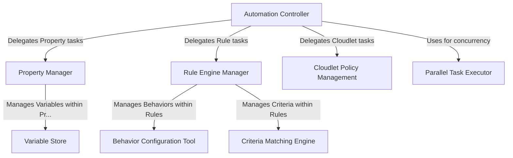

# Tutorial: akamai-automation

This project provides tools to **automate** configuration changes within the *Akamai Control Panel*.
It uses browser automation (Puppeteer) to interact with the Akamai web interface, acting like a **robot assistant**.
You can use it to manage website configurations (**Properties**), define traffic rules (**Rules**, **Criteria**, **Behaviors**), handle specialized applications (**Cloudlets**), manage configuration variables (**Variables**), and run tasks in **parallel** for speed.

**Source Repository:** [None](None)

## Chapters

1. [Automation Controller](01_automation_controller.md)
2. [Property Manager](02_property_manager.md)
3. [Variable Store](03_variable_store.md)
4. [Rule Engine Manager](04_rule_engine_manager.md)
5. [Criteria Matching Engine](05_criteria_matching_engine.md)
6. [Behavior Configuration Tool](06_behavior_configuration_tool.md)
7. [Cloudlet Policy Management](07_cloudlet_policy_management.md)
8. [Parallel Task Executor](08_parallel_task_executor.md)

---

Generated by [AI Codebase Knowledge Builder](https://github.com/The-Pocket/Tutorial-Codebase-Knowledge)