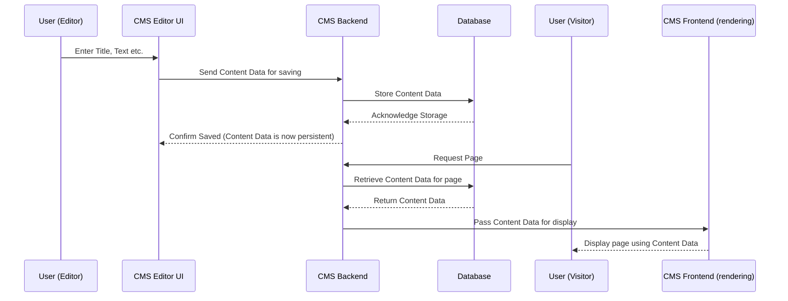

# Chapter 1: Content Data

Welcome to the first chapter of the typijs-cms tutorial! We're going to start with a core concept: **Content Data**.

## What is Content Data?

Imagine you want to build a website with typijs-cms. What's the most important thing you'll put on that website? Content, right? Things like pages, blog posts, images, product descriptions, etc.

Think of **Content Data** as the *actual stuff* that makes up these content items. It's the specific text you write, the images you upload, the numbers you enter, and so on, for one particular page or one particular block of content.

**Analogy:** If you're writing a recipe, the recipe card itself (with spaces for title, ingredients, instructions) is like a template. The **Content Data** is what you write *on that card* for a *specific* recipe, like "Chocolate Chip Cookies", list *specific* ingredients (2 cups flour, 1 cup sugar), and write the *specific* steps.

In typijs-cms, when you create a new page, a new blog post, or a reusable block of text, you are essentially creating a new piece of **Content Data**.

## Why is it important?

Content Data is fundamental because it holds the information that the CMS manages and ultimately displays to visitors on your website. Without Content Data, you just have empty templates. It's the data you create and edit in the CMS editor.

## Page Data and Block Data

Content Data is a general term. In typijs-cms, the two most common types of Content Data you'll work with are:

1.  **Page Data:** This holds the information for a specific page on your website. Think of a "Homepage", an "About Us" page, or a single blog post.
2.  **Block Data:** This holds the information for a reusable block of content. Examples could be a testimonial block, a banner block, or a simple rich text block that you can place on different pages.

`PageData` and `BlockData` are just specific kinds of `ContentData`. They inherit from a base `ContentData` concept, meaning they share some common characteristics (like having an ID, a name, and knowing what kind of content they are) but also have their own unique features (like `PageData` having a URL).

## How Content Data Works (Simplified)

Let's consider a simple use case: Creating a new "About Us" page in the CMS.

1.  You go into the CMS editor.
2.  You click "Create New Page".
3.  You choose a specific type of page (like a "Standard Page" type – we'll talk more about [Content Type
    ](02_content_type_.md)s in the next chapter!).
4.  The editor shows you fields based on the page type you chose: maybe a field for the Title, a big area for the main content text, and a field to upload a header image.
5.  You fill out these fields:
    *   Title: "About Us"
    *   Main Content: "Our company was founded in..."
    *   Header Image: You upload an image file.

All the information you just entered ("About Us", "Our company was founded...", the uploaded image) is the **Content Data** for this *specific* "About Us" page. When you hit "Save", this **Content Data** is packaged up and stored by the CMS.

When someone visits `/about-us` on your website, the CMS finds the **Content Data** associated with that page's URL, and uses it to display the title, text, and image on the screen.

Here's a very simple look at how Content Data flows:



## Looking at the Code (Simplified)

Let's peek at the code to see how `ContentData` is represented. You don't need to understand everything here yet, just get a feel for the structure.

Look at the file `core\src\services\content\models\content-data.ts`.

```typescript
// Simplified from core\src\services\content\models\content-data.ts
export abstract class ContentData {
    id: string; // A unique identifier for this piece of content
    versionId: string; // Represents a specific version (draft, published, etc.)
    parentId?: string; // For hierarchical content (like pages under a parent)

    // ... other system fields like status, language ...

    contentType: string; // What type of content is this? (e.g., 'StandardPage', 'HeroBlock')
    name: string; // The name you give it in the CMS editor (e.g., 'About Us', 'Homepage Hero')
    type: 'Page' | 'Block'; // Is this Page Data or Block Data?

    // This is where the values for your custom fields live
    // Example: properties.pageTitle, properties.mainBodyText
    [propName: string]: any;
}

export class PageData extends ContentData {
    linkUrl: string; // The URL path for the page (e.g., '/about-us')
    urlSegment: string; // Part of the URL (e.g., 'about-us')

    // ... constructor and other methods omitted for simplicity ...
}

export class BlockData extends ContentData {
    // Block Data doesn't have URLs like pages do
    // It inherits the base properties from ContentData
    // ... constructor and other methods omitted for simplicity ...
}
```

**Explanation:**

*   The `ContentData` class is like a blueprint for the basic information every piece of content must have: an `id`, a `name`, its `contentType` (what *kind* of content it is), and its general `type` (is it a `Page` or a `Block`).
*   `PageData` and `BlockData` extend `ContentData`, meaning they get all the properties from `ContentData` and can add their own. `PageData` adds things relevant to pages, like `linkUrl`.
*   Notice the `[propName: string]: any;` line in `ContentData`. This is a TypeScript way of saying "this object can have any other properties with string names". This is where the actual values you enter in the editor go – like the text for your 'Main Content' field or the value for your 'Header Image' field. These specific fields are defined by the [Content Type
    ](02_content_type_.md).

You'll also see `ContentData` being used in components that display content, like in `core\src\bases\cms-component.ts`.

```typescript
// Simplified from core\src\bases\cms-component.ts
@Directive()
export abstract class CmsComponent<T extends ContentData> implements AfterViewInit {

    // When a component needs to display content,
    // it receives the specific piece of Content Data here.
    @Input() currentContent: T;

    // ... methods to get property values from currentContent ...
}
```

**Explanation:**

*   Any component designed to render or work with a specific piece of content (like a page component rendering a page, or a block component rendering a block) uses this `CmsComponent` base class.
*   It has an `@Input()` called `currentContent` which is of type `T extends ContentData`. This means when the component is used, you *must* give it a piece of `ContentData` (either `PageData`, `BlockData`, or any other type that inherits from `ContentData`). This is how the component gets the specific information (the title, the text, the image URL) it needs to display.

## Conclusion

In this chapter, we learned that **Content Data** is the heart of your content in typijs-cms. It's the specific information (text, images, etc.) that you enter into the editor for a particular page or block. `PageData` and `BlockData` are common examples. Content Data holds the *values* for the fields defined by its [Content Type
](02_content_type_.md).

Speaking of [Content Type
](02_content_type_.md), that's exactly what we'll dive into in the next chapter! Content Data needs a blueprint, a definition of *what kind* of information it should contain, and that's where [Content Type
](02_content_type_.md)s come in.

[Chapter 2: Content Type
](02_content_type_.md)

---

Generated by [AI Codebase Knowledge Builder](https://github.com/The-Pocket/Tutorial-Codebase-Knowledge)