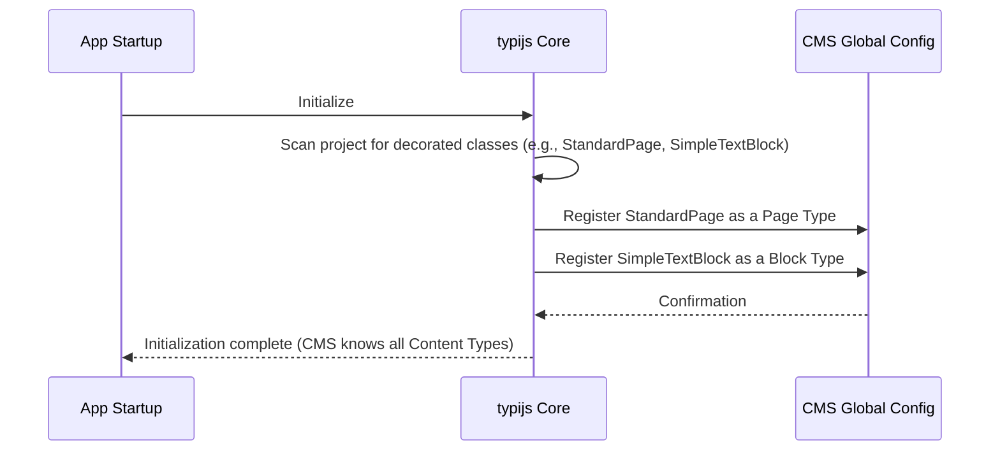

# Chapter 2: Content Type

Welcome back to the typijs-cms tutorial! In the previous chapter, [Chapter 1: Content Data](01_content_data_.md), we learned that **Content Data** is the *actual information* you put into the CMS, like the text, images, and dates for a specific page or block. It's the "stuff" you edit.

But how does the CMS know *what kind* of stuff a piece of **Content Data** is supposed to hold? How does it know a blog post needs a "title" and a "publish date", while a photo gallery block just needs a list of images? This is where **Content Type** comes in.

## What is a Content Type?

Think of a **Content Type** as a **blueprint** or a **template** for creating pieces of **Content Data**. It defines:

1.  **What kind of content it is:** Is it a Page? A Block? A Media file?
2.  **What information it can hold:** What fields should an editor see? (e.g., a field for "Title", a field for "Main Body Text", a field for "Header Image").
3.  **How that information should be structured:** What type of data goes in each field? (e.g., plain text, rich text, an image file, a date).

Using our recipe analogy from Chapter 1:
*   **Content Data** is the filled-out recipe card for *Chocolate Chip Cookies*.
*   **Content Type** is the blank *Recipe Card Template* itself, with labels like "Recipe Title", "Ingredients:", "Instructions:", and "Prep Time:". It tells you what kind of information to put where.

In typijs-cms, when you create a new page or a new block, you first choose a **Content Type**. The CMS then uses that **Content Type**'s blueprint to show you the correct form (fields) to fill out, which ultimately creates the **Content Data** for that item.

## Page Types and Block Types

Just like we have `PageData` and `BlockData` for the actual content (as discussed in [Chapter 1: Content Data](01_content_data_.md)), typijs has different kinds of **Content Types** to define them:

*   **Page Type:** A blueprint for a specific type of page on your website (e.g., a "Standard Page", a "Blog Post Page", a "Product Detail Page"). These define what fields are available for an entire page's content.
*   **Block Type:** A blueprint for a reusable block of content (e.g., a "Testimonial Block", a "Hero Banner Block", a "Simple Rich Text Block"). These define the fields for smaller, often reusable, chunks of content.
*   There are also **Media Types** for defining types of media files, like images or documents, but we'll focus on Pages and Blocks for now.

## How Do We Define Content Types in typijs?

typijs uses standard TypeScript classes and special markers called **decorators** to define Content Types.

Let's look at a simplified example of defining a `Standard Page` blueprint:

```typescript
// simplified-standard-page.pagetype.ts
import { PageType, Property, UIHint } from '@typijs/core';
import { PageData } from '@typijs/core'; // Need to import PageData

// The @PageType decorator tells typijs this class is a Page Type
@PageType({
    displayName: 'Standard Page', // This is the name you'll see in the CMS editor dropdown
    description: 'A basic page template'
    // componentRef: ... we'll talk about this later in Content Rendering
})
export class StandardPage extends PageData { // Our blueprint class extends PageData

    // @Property decorator marks a class property as a CMS editor field
    // UIHint suggests how the field should look (Text, Textarea, etc.)
    @Property({
        displayName: 'Page Title',
        displayType: UIHint.Text
    })
    pageTitle: string; // This property will be a text field in the editor

    @Property({
        displayName: 'Main Content',
        displayType: UIHint.XHtml // XHtml often means a rich text editor
    })
    mainBody: string; // This property will be a rich text editor field

    // ... other properties for other fields ...
}
```

**Explanation:**

1.  We define a regular TypeScript class named `StandardPage`.
2.  Crucially, this class `extends PageData`. This links our blueprint to the underlying **Content Data** structure for pages (which we saw in [Chapter 1: Content Data](01_content_data_.md)).
3.  The `@PageType({...})` decorator is placed just above the class definition. This is how typijs *recognizes* `StandardPage` not just as a class, but as a blueprint for pages. The information inside the `{...}` (like `displayName`) is metadata that the CMS uses (e.g., to show "Standard Page" in a list).
4.  Inside the class, we define properties like `pageTitle` and `mainBody`.
5.  Each property that should become an editable field in the CMS editor is marked with the `@Property({...})` decorator. This decorator includes metadata (like `displayName` and `displayType`) that tells the CMS how to display and manage that specific field. (We'll cover `@Property` in detail in the next chapter, [Chapter 3: Property](03_property_.md)).

This `StandardPage` class is now the blueprint. When an editor creates a new page and selects "Standard Page", the CMS knows to create a piece of **Content Data** ([Chapter 1: Content Data](01_content_data_.md)) that can hold values for `pageTitle` and `mainBody`, and it shows the editor the forms to fill those values in.

Defining a Block Type is very similar, but you use the `@BlockType` decorator and extend `BlockData`:

```typescript
// simplified-simple-text.blocktype.ts
import { BlockType, Property, UIHint } from '@typijs/core';
import { BlockData } from '@typijs/core'; // Need to import BlockData

// The @BlockType decorator tells typijs this class is a Block Type
@BlockType({
    displayName: 'Simple Text Block', // Name in the editor dropdown
    description: 'A block for basic text content'
    // componentRef: ... for rendering this block
})
export class SimpleTextBlock extends BlockData { // Our blueprint class extends BlockData

    @Property({
        displayName: 'Text Content',
        displayType: UIHint.XHtml
    })
    text: string; // A rich text field for the block
}
```

You can see real examples of these in the provided code snippets:
*   `cms-demo\src\app\pages\article\article.pagetype.ts` defines an `ArticlePage` using `@PageType`.
*   `cms-demo\src\app\blocks\best-price\best-price.blocktype.ts` defines a `BestPriceBlock` using `@BlockType`.

## How typijs Knows About Your Content Types (Under the Hood)

So, you create these TypeScript classes with decorators. How does the CMS actually *find* and *use* them?

During the application's startup phase, typijs scans your project. It looks for classes decorated with `@PageType`, `@BlockType`, and `@MediaType`.

Here's a simplified sequence of what happens:



The registered Content Types are stored in a central place, a global configuration object accessible through `CMS`.

Let's look at the code snippets to see this registration happen:

```typescript
// core\src\decorators\content-type.decorator.ts (Simplified)
import 'reflect-metadata';
import { PageData, BlockData } from '../services/content/models/content-data';
import { PAGE_TYPE_METADATA_KEY, BLOCK_TYPE_METADATA_KEY } from './metadata-key';

// ... interface definitions omitted ...

export function PageType(metadata: PageTypeMetadata) {
    function pageTypeDecorator<T extends PageData>(target: ClassOf<T>) {
        // This line essentially registers the class
        // (Simplified - the actual registration happens later during module setup)
        // Reflect.defineMetadata stores the decorator options on the class
        Reflect.defineMetadata(PAGE_TYPE_METADATA_KEY, metadata, target);
        // Add a special property to mark this class as a Page Type
        target[PAGE_TYPE_INDICATOR] = true;
    }
    return pageTypeDecorator;
}

export function BlockType(metadata: ContentTypeMetadata) {
    function blockTypeDecorator<T extends BlockData>(target: ClassOf<T>) {
         // Similar registration and metadata storage for Block Types
        Reflect.defineMetadata(BLOCK_TYPE_METADATA_KEY, metadata, target);
         target[BLOCK_TYPE_INDICATOR] = true;
    }
    return blockTypeDecorator;
}

// ... MediaType decorator omitted ...
```

**Explanation:**

*   The `@PageType` and `@BlockType` functions are factory functions that return the actual decorator function.
*   When you place `@PageType({...})` on a class, the `pageTypeDecorator` function is called with your class (`target`).
*   `Reflect.defineMetadata` is a feature used by decorators to attach information (the `metadata` you passed like `displayName`) *to* the class (`target`).
*   The code also adds a special `Symbol` property (`PAGE_TYPE_INDICATOR`) to the class. This is a simple way for typijs to quickly check if a class is a Page Type later during scanning.
*   During the typijs module initialization (typically in your app's `AppCmsModule`), typijs scans the code, finds classes with these indicators, and adds them to the global `CMS` object.

You can see the `CMS` object structure in `core\src\cms.ts`:

```typescript
// core\src\cms.ts (Simplified)
import { CmsObject } from './types';

export type CmsModel = {
    /**
     * This property keeps all Page Types class was registered via decorator `@PageType`
     */
    PAGE_TYPES: CmsObject; // An object where keys are Content Type names (like 'StandardPage')
                             // and values are the actual TypeScript class constructors
    /**
     * This property keeps all Block Types class was registered via decorator `@BlockType`
     */
    BLOCK_TYPES: CmsObject; // Same for Block Types
    /**
     * This property keeps all Media Types class was registered via decorator `@MediaType`
     */
    MEDIA_TYPES: CmsObject; // Same for Media Types
};

// This is the actual global object where registered types are stored
export const CMS: CmsModel = {
    PAGE_TYPES: {},
    BLOCK_TYPES: {},
    MEDIA_TYPES: {}
};
```

**Explanation:**

*   The `CMS` object is a central registry.
*   When typijs scans your project during startup, it finds your `StandardPage` class, sees it has the `PAGE_TYPE_INDICATOR`, reads its `@PageType` metadata (including the display name), and effectively does something like `CMS.PAGE_TYPES['StandardPage'] = StandardPage;` internally.
*   The `ContentTypeService` (`core\src\services\content-type.service.ts`) then uses this `CMS` object to look up Content Types by name, retrieve their metadata, and get the list of properties defined on them.

For example, a function in `ContentTypeService` might look something like this (simplified):

```typescript
// core\src\services\content-type.service.ts (Conceptually)
import { Injectable } from '@angular/core';
import { CMS } from './../cms';
import { PAGE_TYPE_METADATA_KEY } from '../decorators/metadata-key';

@Injectable({ providedIn: 'root' })
export class ContentTypeService {

    getPageType(pageTypeName: string): any { // Return ContentType object (simplified type)
        // Look up the class constructor in the CMS registry
        const contentTypeTarget = CMS.PAGE_TYPES[pageTypeName];
        if (!contentTypeTarget) {
             throw new Error(`The ${pageTypeName} has not registered yet`);
        }

        // Retrieve the metadata defined by the @PageType decorator
        const pageMetadata = Reflect.getMetadata(PAGE_TYPE_METADATA_KEY, contentTypeTarget);

        // Get the properties (fields) defined on the class (logic omitted for simplicity)
        const properties = this.getContentTypeProperties(contentTypeTarget);

        // Return an object representing the Content Type definition
        return {
            name: pageTypeName,
            metadata: pageMetadata,
            properties: properties
        };
    }

    // ... other methods to get block types, media types, and properties ...
}
```

**Explanation:**

*   When the CMS editor needs to show you the "Standard Page" form, it calls `ContentTypeService.getPageType('StandardPage')`.
*   The service looks up `StandardPage` in the `CMS.PAGE_TYPES` registry.
*   It retrieves the `@PageType` metadata (`displayName`, `description`).
*   It scans the `StandardPage` class to find all properties marked with `@Property`.
*   It returns all this information, allowing the editor to build the correct form with the right fields labelled correctly.

## Conclusion

In this chapter, we learned that a **Content Type** is the essential blueprint that defines the structure and available fields for pieces of **Content Data** ([Chapter 1: Content Data](01_content_data_.md)). We saw how TypeScript classes combined with the `@PageType` and `@BlockType` decorators are used to create these blueprints in typijs. These decorated classes are automatically discovered and registered by the CMS during startup.

This blueprint determines what fields appear in the editor for a specific page or block. But what exactly are these fields themselves, and how are they defined? That brings us to the concept of a **Property**.

[Chapter 3: Property](03_property_.md)

---

Generated by [AI Codebase Knowledge Builder](https://github.com/The-Pocket/Tutorial-Codebase-Knowledge)