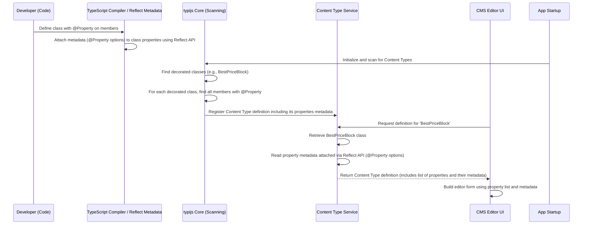

# Chapter 3: Property

Welcome back! In the previous chapters, we introduced [Chapter 1: Content Data](01_content_data_.md), which is the actual information stored in the CMS (like the text for your page title or the image file for your banner), and [Chapter 2: Content Type](02_content_type_.md), which is the blueprint or template that defines the overall structure for a piece of content (like specifying that a "Standard Page" needs a title and a main content area).

Now, let's zoom in on the individual building blocks *within* a [Content Type](02_content_type_.md) blueprint: **Property**.

## What is a Property?

Imagine you've chosen a [Content Type](02_content_type_.md) blueprint, like our `StandardPage` from the last chapter. This blueprint says a Standard Page exists, and it *can* have things like a title and main content. But how do you define *each specific field* like "Page Title" or "Main Body"?

This is where the concept of a **Property** comes in.

A **Property** defines a single, individual field within a [Content Type](02_content_type_.md). It tells the CMS:

1.  **What the field is called:** Both internally (the property name in your code, like `pageTitle`) and in the CMS editor UI (the label the editor sees, like "Page Title").
2.  **What type of data it holds:** Is it plain text, rich text, a number, a date, an image, a list of other content items?
3.  **How it should look in the editor:** Should it be a simple text box, a large text area, a rich text editor, a date picker, an image uploader?
4.  **Any rules for the data:** Is this field required? Does it have a minimum length? (These are validations).

**Analogy:** If the [Content Type](02_content_type_.md) is the blank *Recipe Card Template* ([Chapter 2: Content Type](02_content_type_.md)), then each specific labeled section on that template – like the line labeled "Recipe Title:", the larger box labeled "Ingredients:", or the blank space labeled "Prep Time:" – is a **Property**. They are the individual places where you'll enter the [Content Data](01_content_data_.md) ([Chapter 1: Content Data](01_content_data_.md)).

In typijs-cms, you define properties as members of your [Content Type](02_content_type_.md) class, and you mark them with the special `@Property` decorator.

## How to Define Properties

Let's look at the `BestPriceBlock` example we saw in the previous chapter. It's a great illustration of how properties are defined.

```typescript
// cms-demo\src\app\blocks\best-price\best-price.blocktype.ts (Simplified)
import { BlockData, BlockType, CmsImage, Property, UIHint } from '@typijs/core';
import { BestPriceComponent } from './best-price.component';

@BlockType({ // This is the Content Type blueprint definition
    displayName: 'Best Price Block',
    componentRef: BestPriceComponent
})
export class BestPriceBlock extends BlockData { // Our Block Type class

    // --- PROPERTY 1: Heading ---
    @Property({ // The @Property decorator
        displayName: 'Heading', // Label in the CMS editor
        displayType: UIHint.Text // How it looks: simple text input
    })
    heading: string; // The internal property name and data type

    // --- PROPERTY 2: Subheading ---
    @Property({
        displayName: 'Subheading',
        displayType: UIHint.Textarea // How it looks: larger text area
    })
    subheading: string;

    // --- PROPERTY 3: Description ---
    @Property({
        displayName: 'Description',
        displayType: UIHint.XHtml // How it looks: rich text editor
    })
    description: string;

    // --- PROPERTY 4: Background Image ---
    @Property({
        displayName: 'Background Image',
        displayType: UIHint.Image // How it looks: image uploader/selector
    })
    backgroundImage: CmsImage; // Data type for images

    // --- PROPERTY 5: End Date ---
    @Property({
        displayName: 'The end date',
        description: 'The end date to finish counter', // Optional helper text
        displayType: UIHint.Datepicker // How it looks: date picker
    })
    endDate: string; // Date can be stored as a string
}
```

**Explanation:**

*   Inside the `BestPriceBlock` class (which extends `BlockData` and is marked as a `@BlockType`), each member variable that represents a field the editor should see is decorated with `@Property`.
*   `@Property({...})` is a decorator factory. You pass an object `{...}` to it which contains the *metadata* for this specific property.
*   `displayName: 'Heading'` tells the CMS editor to show the label "Heading" next to the input field for this property.
*   `displayType: UIHint.Text` tells the CMS editor *what kind* of input field to render. `UIHint` is a helper object provided by `@typijs/core` that contains a list of standard strings representing different UI controls (like `Text`, `Textarea`, `XHtml`, `Image`, `Datepicker`). You pick the `UIHint` that matches the type of data and how you want the editor to interact with it.
*   The class member itself (`heading: string;`) defines the internal name (`heading`) that you'll use in your code to access the value, and the expected TypeScript data type (`string`).

When you create a new `Best Price Block` in the CMS editor, the CMS looks at the `BestPriceBlock` [Content Type](02_content_type_.md) definition, finds all the properties marked with `@Property`, and builds a form showing fields for "Heading", "Subheading", "Description", "Background Image", and "The end date", using the specified display types (text input, textarea, rich text, image uploader, date picker). The values the editor enters will be stored as [Content Data](01_content_data_.md) associated with this block instance.

You can also add validation rules to properties using the `validates` array in the `@Property` metadata:

```typescript
// Example showing validation
import { Property, UIHint, ValidationTypes } from '@typijs/core';
// ... other imports and Content Type definition ...

export class ArticlePage extends PageData {
    @Property({
        displayName: 'Article Title',
        displayType: UIHint.Text,
        validates: [ // Add validation rules here
            ValidationTypes.required('Title is required!') // Make this field mandatory
        ]
    })
    title: string;

    @Property({
        displayName: 'Excerpt',
        displayType: UIHint.Textarea,
        validates: [
             ValidationTypes.maxLength(200, 'Excerpt cannot exceed 200 characters.') // Limit character count
        ]
    })
    excerpt: string;

    // ... other properties ...
}
```

`ValidationTypes` provides common validators like `required`, `minLength`, `maxLength`. This metadata helps the CMS editor enforce these rules before saving the [Content Data](01_content_data_.md).

## How Properties Work (Under the Hood)

Similar to [Content Type](02_content_type_.md)s, properties are defined using decorators and their metadata is stored and later retrieved by the CMS.

Here's a simplified flow of what happens when you define properties in your class and the CMS needs to build the editor form:



Let's look at some code snippets related to this process:

The `@Property` decorator itself is responsible for attaching the metadata you provide (like `displayName`, `displayType`) to the specific property (`heading`, `subheading`, etc.) within the class definition. It uses `Reflect.defineMetadata` for this.

```typescript
// core\src\decorators\property.decorator.ts (Simplified)
import 'reflect-metadata';
import { PROPERTIES_METADATA_KEY, PROPERTY_METADATA_KEY } from './metadata-key';
import { UIHint } from '../types/ui-hint';

export interface PropertyMetadata {
    displayName?: string;
    description?: string;
    displayType?: string;
    // ... other metadata like selectionFactory, objectListItemType, validates ...
    [key: string]: any; // Allows for custom metadata
}

export function Property(metadata: PropertyMetadata = {}): PropertyDecorator {
    function propertyDecorator(target: object, propertyKey: string) {
        // 1. Keep a list of all property keys that have the @Property decorator
        const properties: string[] = Reflect.getOwnMetadata(PROPERTIES_METADATA_KEY, target.constructor) || [];
        if (properties.indexOf(propertyKey) === -1) { properties.push(propertyKey); }
        Reflect.defineMetadata(PROPERTIES_METADATA_KEY, properties, target.constructor);

        // 2. Determine default metadata if not provided (like displayType based on type)
        if (!metadata.displayType) {
            // Simplified: In reality, it might inspect design:type metadata
            metadata.displayType = UIHint.Text; // Default to Text if none specified
        }
         if (!metadata.displayName) {
            metadata.displayName = propertyKey; // Default to property name
        }

        // 3. Attach the provided (and defaulted) metadata to the specific property key
        return Reflect.defineMetadata(PROPERTY_METADATA_KEY, metadata, target.constructor, propertyKey);
    }
    return propertyDecorator;
}
```

**Explanation:**

*   The `@Property` decorator function (`propertyDecorator`) is called automatically for each property it's placed on (e.g., for `heading`, then for `subheading`, etc.).
*   `target` is the prototype of the class (`BestPriceBlock.prototype`).
*   `propertyKey` is the name of the property being decorated (e.g., `"heading"`).
*   `Reflect.getOwnMetadata` and `Reflect.defineMetadata` are used to store lists of property keys and the individual property metadata right on the class prototype. `PROPERTIES_METADATA_KEY` stores the array `['heading', 'subheading', ...]`, while `PROPERTY_METADATA_KEY` stores the specific metadata object (`{ displayName: 'Heading', displayType: UIHint.Text }`) for each *individual* property name (`"heading"`).
*   This metadata is passive until the CMS needs it.

The `ContentTypeService` (mentioned in [Chapter 2: Content Type](02_content_type_.md)) is the part of the CMS that reads this stored metadata. When it retrieves the definition for a `BestPriceBlock`, it looks at the class prototype, finds the list of property keys stored under `PROPERTIES_METADATA_KEY`, and then for each key, it reads the specific metadata stored under `PROPERTY_METADATA_KEY`. It packages this information into a `ContentTypeProperty` structure:

```typescript
// core\src\types\content-type.ts (Simplified)
import { PropertyMetadata } from '../decorators/property.decorator';

/**
 * The class contains the property information of a content type
 */
export interface ContentTypeProperty {
    /**
     * The name of property in Content Type (e.g., 'heading')
     */
    name: string;
    /**
     * The metadata of property which be passed via @Property decorator (e.g., { displayName: 'Heading', ... })
     */
    metadata: PropertyMetadata;
}

export type ContentType = {
    name: string // e.g., 'BestPriceBlock'
    metadata: any // Metadata from @BlockType/@PageType
    properties: ContentTypeProperty[] // A list of ContentTypeProperty objects
};
```

**Explanation:**

*   The `ContentType` type represents the full blueprint definition retrieved by the `ContentTypeService`.
*   It includes a `properties` array, where each item in the array is a `ContentTypeProperty` object.
*   Each `ContentTypeProperty` holds the `name` of the property (`heading`, `subheading`) and the `metadata` that was defined using the `@Property` decorator.

This structured information (`ContentType` containing the `properties` array) is what the CMS editor uses to dynamically generate the input form you see when editing a page or block. It knows to create a text field for `heading` with the label "Heading", a textarea for `subheading` with the label "Subheading`, and so on, based on the `displayType` and `displayName` in the metadata for each property.

## Properties and Content Data

Finally, remember [Chapter 1: Content Data](01_content_data_.md)? That's where the *values* live. When an editor types "Summer Sale Banner" into the "Heading" field of a `BestPriceBlock` instance, that string "Summer Sale Banner" is saved as part of the [Content Data](01_content_data_.md) object for that specific block instance.

The property names (`heading`, `subheading`, etc.) defined in your [Content Type](02_content_type_.md) class become the keys you use to access the corresponding values in the [Content Data](01_content_data_.md) object.

If you had a `BestPriceBlock` instance loaded as `currentContent` (like in the `CmsComponent` from Chapter 1), you would access the values like this:

```typescript
// Inside a component rendering BestPriceBlock data
@Component({ /* ... */ })
export class BestPriceComponent extends CmsComponent<BestPriceBlock> {
    // currentContent holds the Content Data for this block instance

    get headingText(): string {
        // Access the value using the property name defined in the Block Type class
        return this.currentContent ? this.currentContent.heading : '';
    }

    get descriptionHtml(): string {
        // Access the rich text value
        return this.currentContent ? this.currentContent.description : '';
    }
}
```

This shows the direct link: the property name defined on the [Content Type](02_content_type_.md) class (`heading`) is the same name used to store and retrieve the value from the [Content Data](01_content_data_.md) object (`this.currentContent.heading`).

## Conclusion

In this chapter, we learned that a **Property** is the definition of a single field within a [Content Type](02_content_type_.md). You define properties in your [Content Type](02_content_type_.md) classes using the `@Property` decorator, providing metadata like `displayName` and `displayType` to control how the field appears and behaves in the CMS editor. This metadata is stored and used by the CMS to build dynamic forms and validate input. The values entered into these property fields are stored as [Content Data](01_content_data_.md).

We now understand how individual content items get their structure (via [Content Type](02_content_type_.md)s) and their specific fields (via Properties). But how are these content items organized in a larger website structure? The next chapter will explore this with **Tree Navigation**.

[Chapter 4: Tree Navigation](04_tree_navigation_.md)

---

Generated by [AI Codebase Knowledge Builder](https://github.com/The-Pocket/Tutorial-Codebase-Knowledge)