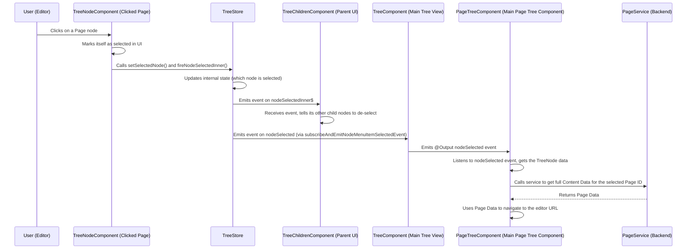
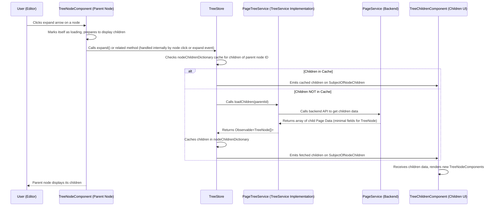

# Chapter 4: Tree Navigation

Welcome back to the typijs-cms tutorial! In our journey so far, we've explored the fundamental building blocks of your content: [Chapter 1: Content Data](01_content_data_.md) (the actual text, images, etc.), [Chapter 2: Content Type](02_content_type_.md) (the blueprint defining what data a piece of content can hold), and [Chapter 3: Property](03_property_.md) (the definition of individual fields within a [Content Type](02_content_type_.md)).

Now you have defined your content structure, created instances of [Content Data](01_content_data_.md) like pages and blocks. But how do you find, organize, and navigate through all these pieces of content within the CMS admin portal? How does the CMS show you the hierarchy of your website pages or the folders holding your blocks?

This is where the concept of **Tree Navigation** comes in.

## What is Tree Navigation?

Think about how you organize files on your computer. You have folders inside folders, and files inside folders. You use a file explorer application (like Windows Explorer or macOS Finder) to see this structure, navigate through it, open files, move them, copy them, and delete them.

**Tree Navigation** in typijs-cms is very similar. It's the feature in the CMS admin portal that provides a **tree-like user interface** to visualize and interact with your content based on its hierarchical structure.

You'll typically see separate tree views for:

*   **Pages:** Showing how pages are nested under each other, reflecting your website's URL structure and navigation.
*   **Blocks:** Showing blocks organized into folders.
*   **Media:** Showing image and document files organized into folders.

This tree structure is crucial for managing relationships between content items (like a child page belonging to a parent page) and keeping your content organized, especially on large websites.

## Key Concepts of Tree Navigation

The Tree Navigation feature in typijs-cms is built using several interconnected parts:

1.  **`TreeComponent`**: This is the main Angular component that acts as the container for a tree view. It represents the *entire* tree panel you see in the CMS (e.g., the whole page tree on the left side). It manages the overall display and connects to the underlying logic.
2.  **`TreeNodeComponent`**: This is a smaller Angular component responsible for rendering a *single node* in the tree – one page, one block folder, one media file. It displays the node's name, an icon, handles click events (for selecting the node), expansion/collapse, and often displays a context menu for actions like 'New Page', 'Delete', 'Rename', etc.
3.  **`TreeNode`**: This is a simple data model (a class) that represents the data needed to display a single node in the tree UI. It holds properties like `id`, `name`, `parentId`, `hasChildren`, `isExpanded`, `isSelected`, etc. It's a UI representation of a piece of [Content Data](01_content_data_.md) or a content folder, tailored for the tree view. You can see its basic structure in `modules\src\shared\tree\interfaces\tree-node.ts`.

    ```typescript
    // Simplified from modules\src\shared\tree\interfaces\tree-node.ts
    export class TreeNode {
      id: string; // Unique ID (matches Content Data ID or Folder ID)
      parentId: string; // ID of the parent node
      name: string; // Name to display in the tree
      // icon: string; // Optional icon class
      // url: string; // Optional URL for pages

      isNeedToScroll: boolean = false; // Should the UI scroll to this node?
      isExpanded: boolean = false; // Is this node currently expanded?
      isSelected: boolean = false; // Is this node currently selected?
      isEditing: boolean = false; // Is this node being edited inline?
      // isLoading: boolean = false; // Is this node loading children?
      isNew: boolean = false; // Is this a temporary new node being created?

      hasChildren: boolean = false; // Does this node have children?
      // parentPath: string; // Path from root to parent

      constructor(init?: Partial<TreeNode>) {
        // Allows creating a TreeNode from a partial object
        Object.assign(this, init);
      }
      // simplified methods omitted
    }
    ```
    **Explanation:** The `TreeNode` class is a lightweight way to hold the state and display information for an item in the tree UI. It doesn't hold the full [Content Data](01_content_data_.md) for the item, just what the tree needs to show and manage it.

4.  **`TreeService`**: This is an **abstract class** (or interface) that defines the contract for *how* a tree component fetches its hierarchical data. Any specific tree (like the page tree or block tree) needs to provide an *implementation* of this `TreeService`. It has methods like `loadChildren(parentNodeId: string)` to get the child nodes for a given parent, and `getNode(nodeId: string)` to get details for a specific node.

    ```typescript
    // Simplified from modules\src\shared\tree\interfaces\tree-service.ts
    import { Observable } from 'rxjs';
    import { TreeNode } from './tree-node';

    // This is an abstract class defining the methods any Tree Service MUST implement
    export abstract class TreeService {
        // Method to load the children of a node
        abstract loadChildren: (parentNodeId: string) => Observable<TreeNode[]>;
        // Method to load details for a single node
        abstract getNode: (nodeId: string) => Observable<TreeNode>;
        // Other tree-related backend actions (cut, copy, paste, etc.) would also be defined here in a full implementation
    }
    ```
    **Explanation:** The `TreeService` acts as a bridge between the generic tree UI components and the specific backend logic for fetching pages, blocks, or media. The `TreeComponent` and `TreeStore` *use* an instance of `TreeService` without needing to know *how* it gets the data, only that it will provide an Observable of `TreeNode`s.

5.  **`TreeStore`**: This is a central state management service (`@Injectable`) specifically for a single tree instance (like the Page Tree's state or the Block Tree's state). It's responsible for:
    *   Keeping track of which nodes are currently expanded or selected.
    *   Caching loaded node data to avoid unnecessary backend calls.
    *   Managing the logic for UI interactions like selecting a node, expanding/collapsing, or initiating inline editing.
    *   Acting as an intermediary: it calls the appropriate `TreeService` to fetch data and then updates the UI components (`TreeNodeComponent`, `TreeChildrenComponent`) using Observables (`Subject`s and `BehaviorSubject`s). You can see this in `modules\src\shared\tree\tree-store.ts`.

These components work together to provide the dynamic, interactive tree view in the CMS.

## How Tree Navigation Works (Solving the Use Case)

Let's consider the use case: An editor clicks on a page in the Page Tree to select it and potentially view/edit its content.

Here's a simplified flow of what happens:



Now, let's look at how expanding a node to load children works:



This shows how the `TreeStore` acts as a central hub, coordinating data fetching via the `TreeService` and updating the UI components (`TreeNodeComponent` and `TreeChildrenComponent`) via Observables.

## Looking at the Code (Simplified)

Let's see how the key components fit together in code.

First, the main `TreeComponent` is a shell that hosts the root `TreeNodeComponent` and the `TreeChildrenComponent` for the root's children. It takes the `root` node and `config` as inputs and emits events like `nodeSelected`.

```typescript
// Simplified from modules\src\shared\tree\components\tree.component.ts
import { Component, Input, Output, EventEmitter, OnInit } from '@angular/core';
import { TreeNode } from '../interfaces/tree-node';
import { TreeConfig } from '../interfaces/tree-config';
import { TreeStore } from '../tree-store'; // Imports the TreeStore

@Component({
    selector: 'cms-tree',
    template: `
        <div class="tree">
            <div class="tree-item">
                <tree-node [node]="root" [config]="config"
                    (selectNode)="setSelectedNode($event)"
                    (menuItemSelected)="handleNodeMenuItemSelected($event)"
                    (submitInlineNode)="submitInlineNode($event)"
                    (cancelInlineNode)="cancelInlineNode($event)">
                </tree-node>
                <tree-children [root]="root" [config]="config"
                    (selectNode)="setSelectedNode($event)"
                    (menuItemSelected)="handleNodeMenuItemSelected($event)"
                    (submitInlineNode)="submitInlineNode($event)"
                    (cancelInlineNode)="cancelInlineNode($event)">
                </tree-children>
            </div>
        </div>
    `,
    // ... styles, encapsulation ...
    providers: [TreeStore] // Provides a new instance of TreeStore for this tree
})
export class TreeComponent implements OnInit {
    @Input() config: TreeConfig; // Configuration for the tree (like menu items)
    @Input() root: TreeNode; // The root node of the tree ('0' for pages/blocks)

    @Output() nodeSelected: EventEmitter<Partial<TreeNode>> = new EventEmitter();
    // ... other Output events for menu actions, inline edit etc. ...

    constructor(private treeStore: TreeStore) { } // Injects the TreeStore provided above

    ngOnInit() {
        // Subscribe to events from the TreeStore and re-emit them as component Outputs
        this.treeStore.nodeSelectedInner$
            .subscribe(node => {
                this.nodeSelected.emit(node);
            });
        // ... subscribe to other TreeStore events ...
    }

    // Called by TreeNodeComponent/TreeChildrenComponent when a node is clicked
    setSelectedNode(node: Partial<TreeNode>) {
        // Passes the selection event to the TreeStore
        this.treeStore.setSelectedNode(node);
        this.treeStore.fireNodeSelectedInner(node);
        // The event is then emitted as an Output in ngOnInit subscription
    }

    // Method to handle menu item clicks, passed to TreeStore
    handleNodeMenuItemSelected(nodeAction: any) {
        this.treeStore.handleNodeMenuItemSelected(nodeAction);
    }

    // Methods for inline node creation/editing, passed to TreeStore
    submitInlineNode(node: TreeNode) { /* ... */ }
    cancelInlineNode(cancelData: any) { /* ... */ }

    // Methods to interact with the tree state via TreeStore
    reloadSubTree(subTreeRootId: string) { this.treeStore.reloadTreeChildrenData(subTreeRootId); }
    expandTreeToSelectedNode(node: TreeNode) { this.treeStore.expandTreeToSelectedNode(node); }
    // ... setSelectedNode method from TreeStore ...
}
```
**Explanation:** The `TreeComponent` is the parent. It receives the initial `root` node and `config`. It provides an instance of `TreeStore` for itself and all its children. It renders the root `TreeNodeComponent` and the `TreeChildrenComponent` to handle recursive rendering. Crucially, it listens to internal state changes emitted by the `TreeStore` (like `nodeSelectedInner$`) and re-emits them as public `@Output` events (`nodeSelected`) that components using the tree (like `PageTreeComponent`) can subscribe to. It delegates most of the interaction logic (selection, menu actions) to the `TreeStore`.

The `TreeNodeComponent` renders a single node. It displays the name, expansion arrow, selection state, and handles clicks and context menus.

```typescript
// Simplified from modules\src\shared\tree\components\tree-node.component.ts
import { Component, Input, Output, EventEmitter, ElementRef } from '@angular/core';
import { TreeNode } from '../interfaces/tree-node';
import { TreeStore } from '../tree-store'; // Imports the TreeStore

@Component({
    selector: 'tree-node',
    templateUrl: './tree-node.component.html', // HTML template with node structure, icons, name, menu
    // ...
})
export class TreeNodeComponent {
    @Input() node: TreeNode; // The data for this specific node
    @Input() config: TreeConfig; // Config inherited from the parent tree

    @Output() selectNode: EventEmitter<Partial<TreeNode>> = new EventEmitter(); // Emits when the node is clicked
    @Output() menuItemSelected: EventEmitter<any> = new EventEmitter(); // Emits when a menu item is clicked
    // ... other inline edit outputs ...

    constructor(private treeStore: TreeStore, private hostElement: ElementRef<HTMLElement>) { } // Injects the TreeStore

    ngOnInit() {
         // Subscribe to TreeStore's nodeSelectedInner$ to update selection state
         this.treeStore.nodeSelectedInner$.subscribe(selectedNode => {
             // Update this node's isSelected state if it matches the selectedNode ID
             this.node.isSelected = selectedNode.id == this.node.id;
             // Optional: scroll into view if needed (handled by TreeStore event)
             if (this.node.isSelected && selectedNode.isNeedToScroll) {
                 this.scrollIntoNode();
             }
         });
         // Subscribe to TreeStore's scrollToSelectedNode$ specifically for scrolling
         this.treeStore.scrollToSelectedNode$.subscribe(scrollToNode => {
             if (scrollToNode.id == this.node.id) { this.scrollIntoNode(); }
         });
         // Initialize node name for inline edit if needed
         if (this.node) { this.nodeName = this.node.name; }
    }

    // Method called when the user clicks on the node
    onNodeSelected(node: TreeNode) {
        // Emits the selectNode event, which is caught by the parent TreeChildrenComponent or TreeComponent
        this.selectNode.emit(node);
    }

    // Method called when the user clicks a menu item for this node
    onMenuItemSelected(action: string, node: TreeNode) {
        // Emits the menuItemSelected event, caught by parent
        this.menuItemSelected.emit({ action, node });
    }

    // Helper method to expand/collapse the node (modifies node.isExpanded)
    expandNode(node: TreeNode) {
        node.expand(); // Toggles node.isExpanded
        // The TreeChildrenComponent listens for this state change and renders/hides children
    }

    // Methods for inline editing (submit/cancel), emits events to parent
    submitInlineNode(node: TreeNode) { /* ... emits submitInlineNodeEvent ... */ }
    cancelInlineNode(node: TreeNode) { /* ... emits cancelInlineNodeEvent ... */ }
}
```
**Explanation:** `TreeNodeComponent` receives its `node` data via `@Input`. When a user clicks, it emits `selectNode`. When a menu item is clicked, it emits `menuItemSelected`. These events bubble up to the parent `TreeChildrenComponent` and then to the main `TreeComponent`. It also subscribes to `TreeStore` events (`nodeSelectedInner$`, `scrollToSelectedNode$`) to update its own visual state (`isSelected`) and scroll if needed.

The `TreeChildrenComponent` is responsible for rendering the list (`<ul>`) of child nodes for a given parent node. It uses `*ngFor` to loop through the `nodeChildren` array.

```typescript
// Simplified from modules\src\shared\tree\components\tree-children.component.ts
import { Component, Input, OnInit } from '@angular/core';
import { TreeStore } from '../tree-store'; // Imports TreeStore
import { TreeNode } from '../interfaces/tree-node';

@Component({
    selector: 'tree-children',
    template: `
    <ul class="tree">
        <li class="tree-item" *ngFor="let node of nodeChildren">
            <!-- Renders a single node component -->
            <tree-node [node]="node" [config]="config" [templates]="templates"
                (selectNode)="selectNode($event)"
                (menuItemSelected)="menuItemSelected($event)"
                (submitInlineNode)="submitInlineNode($event)"
                (cancelInlineNode)="cancelInlineNode($event)">
            </tree-node>
            <!-- Recursively renders tree-children if the node is expanded -->
            <tree-children *ngIf="node.isExpanded"
                [root]="node" [config]="config" [templates]="templates"
                (selectNode)="selectNode($event)"
                (menuItemSelected)="menuItemSelected($event)"
                (submitInlineNode)="submitInlineNode($event)"
                (cancelInlineNode)="cancelInlineNode($event)">
            </tree-children>
        </li>
    </ul>
`,
})
export class TreeChildrenComponent implements OnInit {
    @Input() config: TreeConfig; // Inherited config
    @Input() root: TreeNode; // The parent node whose children are being displayed
    // @Input() templates: any = {}; // Custom templates for rendering

    nodeChildren: TreeNode[] = []; // The array of child nodes to display

    // Outputs to bubble events up to the parent TreeComponent
    @Output() selectNode: EventEmitter<Partial<TreeNode>> = new EventEmitter();
    @Output() menuItemSelected: EventEmitter<any> = new EventEmitter();
    // ... other outputs ...

    constructor(private treeStore: TreeStore) { } // Injects the TreeStore

    ngOnInit() {
        // 1. Subscribe to the Subject in TreeStore for this parent's children
        // This subject is how TreeStore tells this component when children data is available/updated
        this.treeStore.getSubjectOfNodeChildren(this.root.id)
            .subscribe((nodes: TreeNode[]) => {
                 // When new children data arrives, update the nodeChildren array
                this.nodeChildren = nodes;
                // Optional: tell children to update selection state
                const selectedNode = this.treeStore.getSelectedNode();
                 this.nodeChildren.forEach(child => {
                    if (selectedNode && selectedNode.id == child.id) {
                        this.treeStore.fireNodeSelectedInner(selectedNode);
                    }
                });
            });

        // 2. Request children data from TreeStore (which might fetch from TreeService)
        this.treeStore.getNodeChildren(this.root.id).subscribe((nodeChildren: TreeNode[]) => {
            // Once data is received, push it into the subject from step 1
            this.treeStore.getSubjectOfNodeChildren(this.root.id).next(nodeChildren);
        });

        // 3. Subscribe to TreeStore's nodeSelectedInner$ to update selection state of child nodes
        this.treeStore.nodeSelectedInner$.subscribe(selectedNode => {
             this.nodeChildren.forEach(childNode => {
                 // Mark child node as selected if its ID matches the selectedNode ID
                 childNode.isSelected = selectedNode.id == childNode.id;
             });
        });
    }

    // Bubble up the selectNode event from child TreeNodeComponents
    selectNode(node: Partial<TreeNode>) { this.selectNode.emit(node); }
    // Bubble up the menuItemSelected event from child TreeNodeComponents
    menuItemSelected(event: any) { this.menuItemSelected.emit(event); }
    // Bubble up inline edit events
    submitInlineNode(node: TreeNode) { this.submitInlineNode.emit(node); }
    cancelInlineNode(cancelData: any) { this.cancelInlineNode.emit(cancelData); }
}
```
**Explanation:** `TreeChildrenComponent` receives its `root` node (the parent) via `@Input`. It injects the `TreeStore`. In `ngOnInit`, it performs two key actions:
1.  It gets an `Observable` (specifically, a `Subject`) from the `TreeStore` (`getSubjectOfNodeChildren(this.root.id)`) and subscribes to it. This subject is the communication channel from the `TreeStore` *back* to *this specific* component instance, telling it when the children data for its `root` node is available or updated.
2.  It calls `treeStore.getNodeChildren(this.root.id)`. This is the request for the data. The `TreeStore` handles the logic of checking its cache or calling the appropriate `TreeService` implementation. Once the data is ready, the `TreeStore` pushes it into the subject obtained in step 1, triggering the subscription's callback.
Once `nodeChildren` is updated by the subscription, `*ngFor` renders a `TreeNodeComponent` for each child. It also recursively renders `TreeChildrenComponent` if a child node is expanded (`*ngIf="node.isExpanded"`). Events from `TreeNodeComponent`s (`selectNode`, `menuItemSelected`) are bubbled up through this component to the parent `TreeComponent`.

Finally, let's look at a simple implementation of `TreeService`, like `BlockTreeService`.

```typescript
// Simplified from modules\src\block\block-tree.service.ts
import { Injectable } from '@angular/core';
import { Observable, of } from 'rxjs';
import { map } from 'rxjs/operators';
import { TreeService } from '../shared/tree/interfaces/tree-service'; // Imports the interface
import { TreeNode } from '../shared/tree/interfaces/tree-node';
import { BlockService, Block, ContentTypeEnum } from '@typijs/core'; // Imports backend BlockService

@Injectable()
// BlockTreeService implements the TreeService contract
export class BlockTreeService extends TreeService {
    constructor(private blockService: BlockService) { // Injects the backend BlockService
        super();
    }

    // Implementation of loadChildren method from TreeService
    loadChildren(parentNodeId: string): Observable<TreeNode[]> {
        // Call the backend BlockService to get content within the folder (node)
        return this.blockService.getContentInFolder(parentNodeId).pipe(
            // Map the BlockData response from the backend into TreeNode objects
            map((blocks: Block[]) => blocks.map(block => new TreeNode({
                id: block._id, // Use BlockData ID for TreeNode ID
                parentId: block.parentId,
                name: block.name, // Use BlockData name for TreeNode name
                hasChildren: block.hasChildren, // Backend should indicate if a block/folder has children
                // Add other properties needed for TreeNode like content type, icon etc.
                type: ContentTypeEnum.Block,
                contentType: block.contentType,
                isPublished: block.isPublished // Example: could influence icon/style
            })))
        );
    }

    // Implementation of getNode method from TreeService
    getNode(nodeId: string): Observable<TreeNode> {
         // Call backend BlockService to get a single block/folder
         // Convert BlockData to TreeNode if needed, similar to loadChildren
         return this.blockService.get(nodeId).pipe(
             map(block => new TreeNode({ /* map BlockData to TreeNode */ id: block._id, name: block.name, parentId: block.parentId }))
         );
    }
}
```
**Explanation:** `BlockTreeService` extends the `TreeService` abstract class, meaning it *must* provide implementations for `loadChildren` and `getNode`. It injects the actual backend service (`BlockService`) provided by typijs Core. Its `loadChildren` method calls `blockService.getContentInFolder` and maps the resulting `Block` objects (which are types of [Content Data](01_content_data_.md)) into the simpler `TreeNode` structure that the tree UI components expect. The `@Injectable()` decorator with `providedIn: 'root'` or provided in the component's `providers` array ensures Angular's dependency injection works. Notice how `BlockTreeComponent` provides `BlockTreeService` when it's defined: `providers: [BlockTreeService, { provide: TreeService, useExisting: BlockTreeService }]`. This tells Angular that when `TreeStore` (or anything else within this component's scope) asks for `TreeService`, it should get an instance of `BlockTreeService`.

The `PageTreeComponent` (`modules\src\page\page-tree.component.ts`) and `BlockTreeComponent` (`modules\src\block\block-tree.component.ts`) are components that *use* the `cms-tree` component. They set up the root node, the tree config, and subscribe to the `@Output` events from `cms-tree` to perform actions like navigating to the editor or opening confirmation dialogs for delete actions. They also provide their specific `TreeService` implementation (`PageTreeService` or `BlockTreeService`) to the `cms-tree` via dependency injection.

This layered architecture allows the core `TreeComponent`, `TreeNodeComponent`, and `TreeStore` to be generic and reusable, while the specific data fetching logic is handled by the dedicated `TreeService` implementations for different content types (Pages, Blocks, Media).

## Conclusion

In this chapter, we explored **Tree Navigation**, the core feature in typijs-cms that allows editors to visualize and manage their hierarchical content like pages and block folders. We learned about the key components: `TreeComponent` (the overall view), `TreeNodeComponent` (individual items), `TreeNode` (the UI data model), `TreeService` (the interface for fetching hierarchical data), and `TreeStore` (the state manager and orchestrator for the tree UI). We saw how these parts collaborate to handle user interactions like selecting or expanding nodes, often involving fetching data from the backend via a specific `TreeService` implementation and updating the UI state via the `TreeStore`.

Now that we understand how content is organized and navigated in the CMS editor, the next step is to see how the actual input fields for editing [Content Data](01_content_data_.md) ([Chapter 1: Content Data](01_content_data_.md)) are displayed based on the [Content Type](02_content_type_.md) ([Chapter 2: Content Type](02_content_type_.md)) and its Properties ([Chapter 3: Property](03_property_.md)). This is the concept of **Property Rendering (Editor)**.

[Chapter 5: Property Rendering (Editor)](05_property_rendering__editor__.md)

---

Generated by [AI Codebase Knowledge Builder](https://github.com/The-Pocket/Tutorial-Codebase-Knowledge)