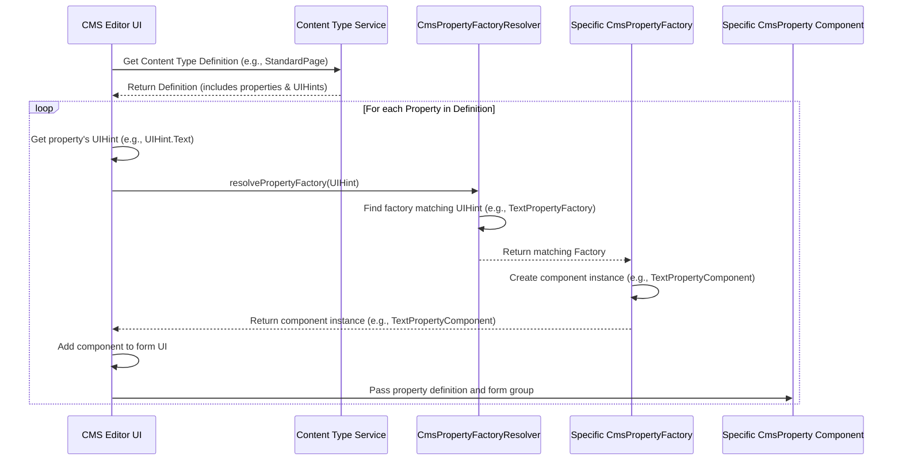

# Chapter 5: Property Rendering (Editor)

Welcome back to the typijs-cms tutorial! In the last chapter, [Chapter 4: Tree Navigation](04_tree_navigation_.md), we learned how to find and organize our content ([Chapter 1: Content Data](01_content_data_.md)) within the CMS using hierarchical tree views based on their [Content Type](02_content_type_.md) structure and properties ([Chapter 3: Property](03_property_.md)).

Now you've selected a piece of content in the tree – say, your "About Us" page. The CMS editor needs to show you a form where you can actually *change* the [Content Data](01_content_data_.md) for that page's properties, like the Page Title and Main Body.

But how does the CMS know *what kind* of input field to show for each property? Should "Page Title" be a small text box? Should "Main Body" be a full-featured rich text editor? Should an "Image" property show a file uploader or selector?

This is where the concept of **Property Rendering (Editor)** comes in. It's about how the CMS dynamically builds the appropriate input fields and controls for each property defined in your [Content Type](02_content_type_.md) blueprint, allowing you to edit the [Content Data](01_content_data_.md) for that specific property.

## What Problem Does Property Rendering (Editor) Solve?

Imagine you have several different properties defined in your [Content Type](02_content_type_.md) classes ([Chapter 3: Property](03_property_.md)):

*   A `title` property that's just simple text.
*   A `body` property that needs a rich text editor (bold, italics, headings).
*   An `image` property that needs an image uploader.
*   A `publishDate` property that needs a date picker.
*   A `relatedContent` property that needs a way to link to other pages or blocks.

The CMS needs a flexible way to associate each of these property *definitions* with the specific Angular *component* that provides the right editing user interface. You don't want the CMS to hardcode logic like "if the property name is 'body', show the rich text editor". That's not flexible for developers creating new property types.

typijs-cms solves this using a pattern involving **UI Hints**, **Property Editor Components**, and **Factories/Resolvers**.

## Key Concepts

1.  **`UIHint`**: We touched on this in [Chapter 3: Property](03_property_.md). This is the crucial piece of metadata you provide in the `@Property` decorator (`displayType: UIHint.Text`, `displayType: UIHint.XHtml`, etc.). It's a simple string identifier that *hints* to the CMS what kind of user interface control should be used for this property. It acts like a label saying "this property needs a text box editor" or "this one needs a rich text editor".
2.  **`CmsProperty` (Abstract Class) and Specific Property Editor Components**:
    *   `CmsProperty` is a base Angular `Directive` that all property editor components in typijs extend. It provides common inputs like `property` (the `ContentTypeProperty` definition from [Chapter 3: Property](03_property_.md)) and `formGroup` (the Angular `FormGroup` that manages the form data for the content item). Any component that edits a single property should inherit from this.
    *   Specific components, like `TextPropertyComponent` or `ContentAreaProperty`, are concrete Angular components that implement the *actual* HTML and logic for editing a property with a specific `UIHint`. They extend `CmsProperty` to get the standard inputs.
3.  **`CmsPropertyFactory`**: This is a service (an Angular `Injectable` class) that knows how to *create* an instance of a specific property editor component (like `TextPropertyComponent`). There is typically one `CmsPropertyFactory` registered for each `UIHint`. Its main job is to match a `UIHint` (`isMatching` method) and create the corresponding component (`createPropertyComponent` method).
4.  **`CmsPropertyFactoryResolver`**: This is the central service that the CMS editor uses. When it needs to render an input field for a specific property (identified by its `UIHint`), it asks the `CmsPropertyFactoryResolver` to "resolve" or find the correct `CmsPropertyFactory` for that `UIHint`. The Resolver looks through all the registered factories and returns the one that matches the `UIHint`.

These pieces work together: the `UIHint` on a property tells the `CmsPropertyFactoryResolver` which `CmsPropertyFactory` to find, and that factory then creates the correct `CmsProperty` component to render the editor field.

## Use Case: Rendering the "Standard Page" Editor Form

Let's see how this works when the CMS editor needs to show the form for editing a `StandardPage`. Recall our simplified `StandardPage` definition:

```typescript
// simplified-standard-page.pagetype.ts
import { PageType, Property, UIHint } from '@typijs/core';
import { PageData } from '@typijs/core';

@PageType({
    displayName: 'Standard Page',
    description: 'A basic page template'
})
export class StandardPage extends PageData {
    @Property({
        displayName: 'Page Title',
        displayType: UIHint.Text // <-- UIHint.Text
    })
    pageTitle: string;

    @Property({
        displayName: 'Main Content',
        displayType: UIHint.XHtml // <-- UIHint.XHtml
    })
    mainBody: string;
}
```

When you select an instance of `StandardPage` in the CMS tree:

1.  The CMS editor retrieves the [Content Data](01_content_data_.md) for that page instance.
2.  It also retrieves the [Content Type](02_content_type_.md) definition for `StandardPage` (using the `ContentTypeService` we saw in [Chapter 2: Content Type](02_content_type_.md)). This definition includes the list of properties (`pageTitle`, `mainBody`) and their metadata, including the `displayType` (`UIHint`).
3.  The editor UI code iterates through the properties:
    *   **For the `pageTitle` property:**
        *   It sees `displayType` is `UIHint.Text`.
        *   It asks the `CmsPropertyFactoryResolver`: "Give me the factory for `UIHint.Text`".
        *   The `CmsPropertyFactoryResolver` finds the `TextPropertyFactory` (which is registered to handle `UIHint.Text`).
        *   The editor asks the `TextPropertyFactory`: "Create the component for the `pageTitle` property".
        *   The `TextPropertyFactory` creates an instance of `TextPropertyComponent`.
        *   The editor places the `TextPropertyComponent` in the form, passing it the `pageTitle` property definition and the main form group.
    *   **For the `mainBody` property:**
        *   It sees `displayType` is `UIHint.XHtml`.
        *   It asks the `CmsPropertyFactoryResolver`: "Give me the factory for `UIHint.XHtml`".
        *   The `CmsPropertyFactoryResolver` finds the `XHtmlPropertyFactory` (which is registered for `UIHint.XHtml`).
        *   The editor asks the `XHtmlPropertyFactory`: "Create the component for the `mainBody` property".
        *   The `XHtmlPropertyFactory` creates an instance of `XHtmlPropertyComponent` (which contains a rich text editor UI).
        *   The editor places the `XHtmlPropertyComponent` in the form, passing it the `mainBody` property definition and the main form group.

This process repeats for every `@Property` defined on the `StandardPage` [Content Type](02_content_type_.md), dynamically building the complete editor form using the appropriate components for each field.



## Looking at the Code (Simplified)

Let's peek at the code components that make this happen.

First, the base class for all property editor components: `CmsProperty`.

```typescript
// core\src\bases\cms-property.ts (Simplified)
import { Input, Directive } from '@angular/core';
import { FormGroup } from '@angular/forms'; // Angular's form management

@Directive() // It's a base class, often used with templates or other components
export abstract class CmsProperty {
    // Input property that receives the definition of the property from the Content Type
    @Input() property: ContentTypeProperty; // From Chapter 3

    // Input property that receives the main form group for the content item
    @Input() formGroup: FormGroup;

    // Derived properties for convenience, based on the @Input property
    label: string; // Display name from property.metadata.displayName
    propertyName: string; // Internal property name from property.name

    // Constructor where label and propertyName are set from the @Input property
    constructor() {
        // This logic is handled in the setter for the 'property' input
    }
}
```
**Explanation:** Any component you create to act as a property editor (like `TextPropertyComponent`) will `extend CmsProperty`. This gives it standard inputs (`property`, `formGroup`) it needs to display its label and interact with the form data.

Here's a simple example of a concrete property editor component, `TextProperty`:

```typescript
// modules\src\properties\text\text.property.ts (Simplified)
import { Component } from '@angular/core';
import { CmsProperty } from '@typijs/core'; // Imports the base class

@Component({
  selector: '[textProperty]', // How this component is selected (e.g., as an attribute)
  template: `
    <div class="form-group row" [formGroup]="formGroup"> // Link to the form group
        <label [attr.for]="id" class="col-3 col-form-label">{{label}}</label> // Use the label from CmsProperty
        <div class="col-5">
            <!-- The actual input field -->
            <input type="text" class="form-control"
                    [id]="id"
                    [name]="propertyName" // Use the property name from CmsProperty
                    [formControlName]="propertyName"/> <!-- Link to the form control for this property -->
        </div>
    </div>
  `
})
export class TextProperty extends CmsProperty {
    // Specific logic or inputs for TextProperty could go here, but for a simple text box, not much is needed
}
```
**Explanation:** `TextProperty` extends `CmsProperty`. Its template uses the inherited `label` and `propertyName`. Crucially, it uses `[formGroup]="formGroup"` and `[formControlName]="propertyName"` to bind the input field to the specific control within the main `FormGroup` that corresponds to this property's value in the [Content Data](01_content_data_.md). When the editor types into this box, Angular automatically updates the value in the `formGroup`.

Now, let's look at the factories. The base `CmsPropertyFactory` defines the common methods.

```typescript
// core\src\bases\cms-property.factory.ts (Simplified)
import { Injector, ComponentFactoryResolver, ComponentRef } from '@angular/core';
import { FormGroup } from '@angular/forms';
import { CmsProperty } from './cms-property'; // Imports the base property editor component
import { ContentTypeProperty } from '../types/content-type'; // Imports property definition type

export class CmsPropertyFactory {
    protected componentFactoryResolver: ComponentFactoryResolver;

    // Constructor takes the injector, the UIHint this factory handles,
    // and the component class it should create.
    constructor(protected injector: Injector, protected propertyUIHint: string, protected propertyCtor: ClassOf<CmsProperty>) {
        this.componentFactoryResolver = injector.get(ComponentFactoryResolver);
    }

    // Checks if this factory can handle the given UIHint
    isMatching(propertyUIHint: string): boolean {
        return this.propertyUIHint === propertyUIHint;
    }

    // Creates an instance of the specific property editor component
    createPropertyComponent(property: ContentTypeProperty, formGroup: FormGroup): ComponentRef<any> {
        // Uses Angular's ComponentFactoryResolver to create the component instance dynamically
        const propertyFactory = this.componentFactoryResolver.resolveComponentFactory(this.propertyCtor);
        const propertyComponent = propertyFactory.create(this.injector);

        // Sets the required inputs on the created component
        (<CmsProperty>propertyComponent.instance).property = property;
        (<CmsProperty>propertyComponent.instance).formGroup = formGroup;

        return propertyComponent;
    }

    // ... methods for handling references (like ContentArea) omitted ...
}
```
**Explanation:** A class like `TextPropertyFactory` would extend `CmsPropertyFactory`. When it's registered, it's told it handles `UIHint.Text` and should create `TextPropertyComponent` instances. When its `createPropertyComponent` method is called, it uses Angular's built-in mechanisms (`ComponentFactoryResolver`) to dynamically create an instance of `TextPropertyComponent` and then sets its `property` and `formGroup` inputs.

Finally, the `CmsPropertyFactoryResolver` is the lookup service.

```typescript
// core\src\bases\cms-property.factory.ts (Simplified)
import { Injectable, InjectionToken, Inject, Optional } from '@angular/core';
import { CmsPropertyFactory } from './cms-property.factory'; // Imports the factory base class
import { UIHint } from '../types/ui-hint'; // Imports UIHint definitions

// Injection Tokens are Angular's way to provide multiple values for the same dependency type
export const PROPERTY_FACTORIES: InjectionToken<CmsPropertyFactory[]> = new InjectionToken<CmsPropertyFactory[]>('PROPERTY_FACTORIES');
export const DEFAULT_PROPERTY_FACTORIES: InjectionToken<CmsPropertyFactory[]> = new InjectionToken<CmsPropertyFactory[]>('DEFAULT_PROPERTY_FACTORIES');

@Injectable() // Mark as an injectable service
export class CmsPropertyFactoryResolver {
    // Inject arrays of registered factories (custom ones and default ones)
    constructor(
        @Inject(DEFAULT_PROPERTY_FACTORIES) private defaultPropertyFactories: CmsPropertyFactory[],
        @Optional() @Inject(PROPERTY_FACTORIES) private propertyFactories?: CmsPropertyFactory[]) { }

    // This is the main method the CMS Editor calls
    resolvePropertyFactory(uiHint: string): CmsPropertyFactory {
        // Look for a factory matching the UIHint, checking custom factories first, then defaults
        let foundFactory: CmsPropertyFactory;

        if (this.propertyFactories) {
            foundFactory = this.propertyFactories.find(factory => factory.isMatching(uiHint));
            if (foundFactory) { return foundFactory; }
        }

        foundFactory = this.defaultPropertyFactories.find(factory => factory.isMatching(uiHint));
        if (foundFactory) { return foundFactory; }

        // Fallback if no matching factory is found (usually defaults to Text editor)
        console.warn(`No Property Factory found for UIHint: ${uiHint}. Falling back to Text editor.`);
        const textFactory = this.defaultPropertyFactories.find(factory => factory.isMatching(UIHint.Text));
        if (textFactory) { return textFactory; }

        // If even the Text factory is missing, something is wrong
        throw new Error(`Cannot resolve Property Factory for UIHint: ${uiHint} and Text fallback failed.`);
    }
}
```
**Explanation:** The `CmsPropertyFactoryResolver` is injected wherever the CMS editor needs to dynamically create property fields. Its `resolvePropertyFactory` method takes a `uiHint` string. It iterates through the lists of registered factories (first any custom ones provided by your project, then the default ones built into typijs) and calls `isMatching(uiHint)` on each. When a factory returns `true`, that's the factory needed, and the resolver returns it. If no specific factory is found, it typically falls back to the basic `TextPropertyFactory`. The editor then uses the returned factory to create the actual component instance.

This pattern allows typijs to be highly extensible. Developers can create entirely new property types with custom editor UIs simply by:
1.  Defining the property in the [Content Type](02_content_type_.md) with a new `UIHint` string.
2.  Creating an Angular component that extends `CmsProperty` to provide the editor UI.
3.  Creating a `CmsPropertyFactory` that handles the new `UIHint` and creates the new component.
4.  Registering the new factory with Angular's dependency injection system so the `CmsPropertyFactoryResolver` can find it.

*(Note: The provided code snippets also include `CmsPropertyRenderFactory` and `CmsPropertyRenderFactoryResolver`. These work using the same factory pattern but are specifically for *displaying* property values on the *front-end* of your website, not for editing them in the CMS. That concept, [Chapter 6: Content Rendering (Front-end)](06_content_rendering__front_end__.md), is covered in the next chapter.)*

## Conclusion

In this chapter, we uncovered the mechanism behind how the CMS editor knows which input field to display for each property of a content item. We learned that the `UIHint` metadata on a property, combined with the `CmsPropertyFactory` and `CmsPropertyFactoryResolver`, allows the CMS to dynamically find and create the correct Angular component (`CmsProperty` descendant) to handle editing for that specific property type. This factory pattern makes typijs extensible, allowing developers to add custom editor controls for new data types.

We now understand how content is defined, how its properties are structured, how it's organized in the CMS tree, and how the editor dynamically builds forms to edit individual properties. The next crucial step is to see how this structured [Content Data](01_content_data_.md) is actually displayed to visitors on the public-facing website. This is the concept of **Content Rendering (Front-end)**.

[Chapter 6: Content Rendering (Front-end)](06_content_rendering__front_end__.md)

---

Generated by [AI Codebase Knowledge Builder](https://github.com/The-Pocket/Tutorial-Codebase-Knowledge)