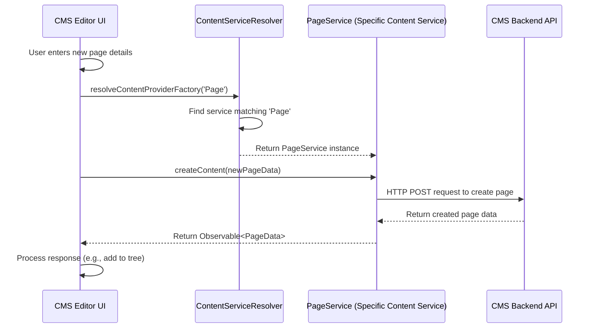

# Chapter 8: Content Services

Welcome back to the typijs-cms tutorial! In the previous chapter, [Chapter 7: Content Loading](07_content_loading_.md), we learned about the `ContentLoader` service and how it provides a simplified way for your application components to fetch content data from the CMS backend API using methods like `get`, `getChildren`, and `query`.

We saw that `ContentLoader` acts as a librarian, hiding the complexity of *how* the data is retrieved. But something still needs to actually *talk* to the backend, understand the API endpoints for different content types, and map the raw data into the structured `ContentData` objects ([Chapter 1: Content Data](01_content_data_.md)) we use in our Angular application.

This is the role of the **Content Services**.

## What are Content Services?

Content Services are specialized services in typijs-cms responsible for handling the direct communication with the CMS backend API for specific types of content. While `ContentLoader` gives you a high-level way to *ask* for content, the Content Services are the workers that know *how* to make the specific API calls for Pages, Blocks, Media files, etc., and process the results.

Think of it this way, building on our library analogy from Chapter 7:
*   The **`ContentLoader`** ([Chapter 7: Content Loading](07_content_loading_.md)) is the main librarian. You ask *them* for the book.
*   The **`ContentServiceResolver`** is like the library's internal directory or sorting system. It figures out *which section* of the library the book belongs to (Pages, Blocks, Media).
*   The **Specific Content Services** (`PageService`, `BlockService`, `MediaService`) are the specialists for each section. The "Page Service" specialist knows exactly which shelves (API endpoints) to check for pages, how to retrieve them, and how to organize the information (map to [PageData](01_content_data_.md)). The "Block Service" specialist does the same for blocks, and so on.

These specific services implement the actual logic for:

*   Getting a single item (by ID or URL).
*   Getting children or ancestors.
*   Running queries.
*   **Creating new content.**
*   **Updating existing content.**
*   **Deleting or moving content.**
*   **Publishing content.**

They extend a common base `ContentService` and are located within the `core\src\services\content` folder.

## Key Concepts

1.  **`ContentService` (Abstract Base Class)**: This abstract class defines the *contract* that all specific content services must follow. It outlines the standard methods for interacting with content (get, getChildren, create, update, delete, publish, etc.). It also requires implementing `isMatching(typeOfContent: string)` to identify which content type the service handles, and `getContentData(content: any)` to convert raw backend data into the appropriate [Content Data](01_content_data_.md) class ([PageData](01_content_data_.md), [BlockData](01_content_data_.md), etc.).
2.  **Specific Content Services (`PageService`, `BlockService`, `MediaService`)**: These are concrete classes that extend the base `ContentService`. Each one provides the actual implementation of the methods defined in the base class, tailored to their specific content type. They know the particular API endpoints and data structures for Pages, Blocks, or Media.
3.  **`ContentServiceResolver`**: As seen in [Chapter 7: Content Loading](07_content_loading_.md), this service is used by `ContentLoader` (and potentially other parts of the CMS) to find the correct specific `ContentService` based on the `typeOfContent` string ('Page', 'Block', 'Media'). It uses the `isMatching()` method of each registered service to do this lookup.

These services form the core layer for interacting with the CMS backend.

## Use Case: Creating a New Page in the Editor

Let's think about how the CMS editor handles creating a new page. When you're in the Page Tree ([Chapter 4: Tree Navigation](04_tree_navigation_.md)), right-click on a parent page, select "New Page", choose a [Content Type](02_content_type_.md) ([Chapter 2: Content Type](02_content_type_.md)) like "Standard Page", and fill out the initial form, the CMS needs to send this new [Content Data](01_content_data_.md) ([Chapter 1: Content Data](01_content_data_.md)) to the backend to save it.

This is where the specific `PageService` comes into play.

1.  The CMS editor UI gathers the initial [Content Data](01_content_data_.md) for the new page from the form the user filled out (e.g., the `name`, `parentId`, `contentType`).
2.  Knowing this is a 'Page', the CMS editor needs to use the service responsible for Pages. It asks the `ContentServiceResolver` for the service that handles `typeOfContent` = `'Page'`.
3.  The `ContentServiceResolver` finds and returns the `PageService` instance (because `PageService.isMatching('Page')` returns `true`).
4.  The CMS editor then calls the `createContent()` method on the retrieved `PageService` instance, passing the new [Content Data](01_content_data_.md) object.
5.  The `PageService` takes this data, constructs the appropriate HTTP request (likely a `POST` request to a `/page` API endpoint), sends it to the CMS backend, and handles the response.
6.  The backend saves the new page in the database and returns the newly created page data (including its generated ID, version ID, etc.) to the `PageService`.
7.  The `PageService` returns this result (as an Observable) back to the CMS editor.
8.  The CMS editor updates its UI (e.g., adds the new page to the tree) based on the successful response.

While you might primarily use `ContentLoader` for *fetching* content on the front-end, the specific Content Services are heavily used *within the CMS editor* for these management operations (create, update, delete, publish).



This diagram shows how the `PageService` is selected via the `Resolver` and then used directly by the CMS editor to perform the creation action. Similar flows happen for updates, deletes, and other actions, calling the corresponding methods (`editContentVersion`, `moveContentToTrash`, `publishContentVersion`, etc.) on the specific service.

## Looking at the Code (Simplified)

Let's look at the core structure of these services.

The base `ContentService` abstract class defines the standard interface:

```typescript
// core\src\services\content\content.service.ts (Simplified)
import { Injector } from '@angular/core';
import { Observable } from 'rxjs';
import { TypeOfContent } from '../../types'; // Type like 'Page', 'Block'
import { Content } from './models/content.model'; // Generic Content model from backend
import { ContentData } from './models/content-data'; // Specific ContentData model (PageData, BlockData)
import { HttpClient } from '@angular/common/http'; // To make HTTP calls

// Abstract base class for all Content Services
export abstract class ContentService<T extends Content> {
    protected httpClient: HttpClient; // Injectable for making HTTP calls
    protected apiUrl: string; // Base API URL for this content type (set in derived classes)
    protected typeOfContent: TypeOfContent; // Set in isMatching

    constructor(protected injector: Injector) {
        // Get HttpClient from the injector
        this.httpClient = injector.get(HttpClient);
        // ... other services like BrowserLocationService ...
    }

    // REQUIRED: Implement to tell the resolver which type you handle
    abstract isMatching(typeOfContent: TypeOfContent): boolean;

    // REQUIRED: Implement to map raw backend Content data to specific ContentData class
    abstract getContentData(content: T): ContentData;

    // Abstract methods for common fetching/management operations
    // Concrete services MUST implement these
    abstract getContent(contentId: string, language?: string, select?: string): Observable<T>;
    abstract getContentChildren(parentId: string, language?: string, select?: string): Observable<T[]>;
    abstract getAncestors(contentId: string, language?: string, select?: string): Observable<T[]>;
    abstract queryContents(filter: any, project?: any, sort?: any, page?: number, limit?: number): Observable<any>; // Simplified return type
    abstract getContentItems(ids: string[], language?: string, statuses?: number[], isDeepPopulate?: boolean): Observable<T[]>;

    // Management methods - concrete services might add more
    abstract createContent(content: Partial<T>, language?: string): Observable<T>;
    // Note: Update/Publish methods often work with specific versions (covered later)
    // For now, simplified representation of update/publish/delete:
    abstract updateContent(contentId: string, content: Partial<T>): Observable<T>; // Example, real method might take versionId
    abstract publishContent(contentId: string, versionId?: string): Observable<T>;
    abstract moveContentToTrash(contentId: string): Observable<T>;
    abstract deleteContent(contentId: string): Observable<T>; // Permanently delete
    abstract cutContent(actionParams: { sourceContentId: string, targetParentId: string }): Observable<T>;
    abstract copyContent(actionParams: { sourceContentId: string, targetParentId: string }): Observable<T>;
}
```
**Explanation:** This abstract class sets the standard. Any class that extends it must provide logic for the `abstract` methods. It also provides common resources like `HttpClient` via the `Injector`.

The `ContentServiceResolver` collects all implementations:

```typescript
// core\src\services\content\content-loader.service.ts (Simplified)
import { Inject, Injectable, InjectionToken } from '@angular/core';
import { ContentService } from './content.service'; // Imports the base ContentService
import { TypeOfContent } from '../../types'; // Type like 'Page', 'Block'
import { Content } from './models/content.model'; // Generic Content model

// Injection Token to get all registered ContentService instances
export const CONTENT_SERVICE_PROVIDER: InjectionToken<ContentService<Content>[]> = new InjectionToken<ContentService<Content>[]>('CONTENT_SERVICE_PROVIDER');

@Injectable({ providedIn: 'root' })
export class ContentServiceResolver {
    // Inject all services provided via the CONTENT_SERVICE_PROVIDER token
    // Angular collects all services registered with this token into this array
    constructor(@Inject(CONTENT_SERVICE_PROVIDER) private contentServices: ContentService<Content>[]) { }

    // Finds the correct service based on the content type string ('Page', 'Block', etc.)
    resolveContentProviderFactory(typeOfContent: TypeOfContent): ContentService<Content> {
        // Find the service whose isMatching method returns true for the given type
        const resolvedService = this.contentServices.find(x => x.isMatching(typeOfContent));
        if (resolvedService) { return resolvedService; }

        // Throw an error if no service is found for the type
        throw new Error(`The CMS can not resolve the Content Service for the content has type of ${typeOfContent}`);
    }
}
```
**Explanation:** The `ContentServiceResolver`'s job is simple: use the `CONTENT_SERVICE_PROVIDER` token to get the array of all specific `ContentService` implementations and find the one that `isMatching` the requested type. This uses Angular's powerful Dependency Injection feature.

Finally, let's look at a specific implementation, `PageService`:

```typescript
// core\src\services\content\page.service.ts (Simplified)
import { Injectable, Injector } from '@angular/core';
import { Observable } from 'rxjs';
import { ContentTypeEnum } from '../../constants/content-type.enum'; // Constants like 'Page'
import { ContentService } from './content.service'; // Imports the base class
import { PageData } from './models/content-data'; // Imports the specific data model
import { Page } from './models/page.model'; // Imports the backend model type

@Injectable({ providedIn: 'root' }) // Makes this service discoverable by Angular DI
// Tell Angular to provide this service also under the CONTENT_SERVICE_PROVIDER token
// This is usually done in a module's providers array:
// { provide: CONTENT_SERVICE_PROVIDER, useExisting: PageService, multi: true }
// Simplified here for clarity, but this is how it gets into the resolver's array.
export class PageService extends ContentService<Page> { // Extends the base service
    protected apiUrl: string = `${this.baseApiUrl}/page`; // Defines the API endpoint for pages

    constructor(injector: Injector) {
        super(injector); // Call the base class constructor
    }

    // Implement the isMatching method - this service handles 'Page' type
    isMatching(typeOfContent: string): boolean {
        this.typeOfContent = typeOfContent; // Set the type (used internally if needed)
        return typeOfContent === ContentTypeEnum.Page;
    }

    // Implement getContentData to map raw Page data from backend to PageData class
    getContentData(content: Page): PageData {
        // Create a new PageData instance using the raw content object
        return new PageData(content);
    }

    // Implement getContent using HttpClient to call the specific page API
    getContent(contentId: string, language?: string, select?: string): Observable<Page> {
         // Use this.httpClient (from base class constructor) to make the GET request
         // Construct the URL using this.apiUrl and the contentId
         // Add query parameters like language
        const query = { language, select }; // Simplified query string logic
        return this.httpClient.get<Page>(`${this.apiUrl}/${contentId}`, { params: query });
    }

     // Implement createContent using HttpClient to call the specific page API
    createContent(content: Partial<Page>, language?: string): Observable<Page> {
        const query = { language }; // Simplified query string logic
        return this.httpClient.post<Page>(`${this.apiUrl}`, content, { params: query });
    }

    // Implement deleteContent using HttpClient
     deleteContent(contentId: string): Observable<Page> {
        return this.httpClient.delete<Page>(`${this.apiUrl}/trash/${contentId}`); // Example: Pages go to trash first
    }

    // ... other specific implementations like getContentChildren, getAncestors, etc. ...

    // Page-specific methods not on the base class
    getPageByLinkUrl(linkUrl: string): Observable<Page> {
        // This is a special method for pages to load by their URL
        // It makes a GET request to a specific '/published/{encodedUrl}' endpoint
        return this.httpClient.get<Page>(`${this.apiUrl}/published/${btoa(linkUrl)}`);
    }
}
```
**Explanation:** `PageService` extends `ContentService`. It defines its `apiUrl`. It implements `isMatching` to return `true` for `ContentTypeEnum.Page`. It implements `getContentData` to create `PageData` objects. And it provides the concrete implementations for fetching and managing pages using the injected `HttpClient`. Notice that it uses `this.httpClient` which it gets from the base `ContentService` constructor. It also includes methods like `getPageByLinkUrl` that are specific to pages and not part of the generic `ContentService` contract.

`BlockService` and `MediaService` follow a similar pattern, extending `ContentService` and implementing the methods with the specific API endpoints and data mapping logic for Blocks and Media respectively.

This architecture provides a clean separation of concerns: `ContentLoader` provides a convenient, high-level interface, `ContentServiceResolver` finds the right handler, and the specific `ContentService` implementations handle the low-level details of talking to the backend API and mapping data.

## Conclusion

In this chapter, we delved into **Content Services**, the specialized layer beneath the `ContentLoader` that handles direct communication with the CMS backend API for specific content types like Pages, Blocks, and Media. We learned about the base `ContentService` abstract class which defines the common contract, the concrete implementations like `PageService` and `BlockService` that provide the type-specific logic and API calls, and the `ContentServiceResolver` which finds the correct service based on the content type. Understanding Content Services is key to knowing how content data is fetched, created, updated, and managed within typijs-cms.

Accessing and managing content is a critical function, and it needs to be protected. The next chapter will introduce the concept of **Authentication** in typijs-cms, explaining how the CMS ensures only authorized users can perform these actions via the Content Services and other backend APIs.

[Chapter 9: Authentication](09_authentication_.md)

---

Generated by [AI Codebase Knowledge Builder](https://github.com/The-Pocket/Tutorial-Codebase-Knowledge)