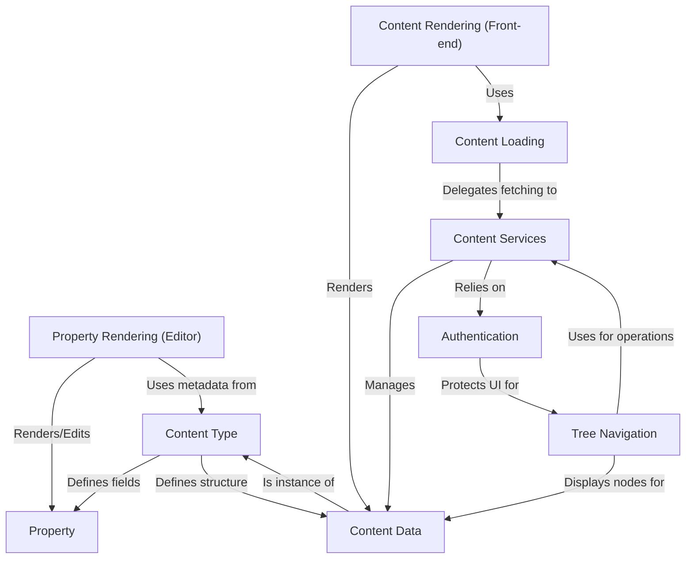

# Tutorial: typijs-cms

This project is a **headless Content Management System (CMS)** built with Angular (front-end) and ASP.NET Core (back-end).
It allows users to define different **types of content** (like pages and blocks),
create and edit the actual **content data** through a user-friendly editor portal,
and then **render** that content dynamically on a separate front-end website for visitors.

**Source Repository:** [None](None)

## Chapters

1. [Content Data
](01_content_data_.md)
2. [Content Type
](02_content_type_.md)
3. [Property
](03_property_.md)
4. [Tree Navigation
](04_tree_navigation_.md)
5. [Property Rendering (Editor)
](05_property_rendering__editor__.md)
6. [Content Rendering (Front-end)
](06_content_rendering__front_end__.md)
7. [Content Loading
](07_content_loading_.md)
8. [Content Services
](08_content_services_.md)
9. [Authentication
](09_authentication_.md)

---

Generated by [AI Codebase Knowledge Builder](https://github.com/The-Pocket/Tutorial-Codebase-Knowledge)